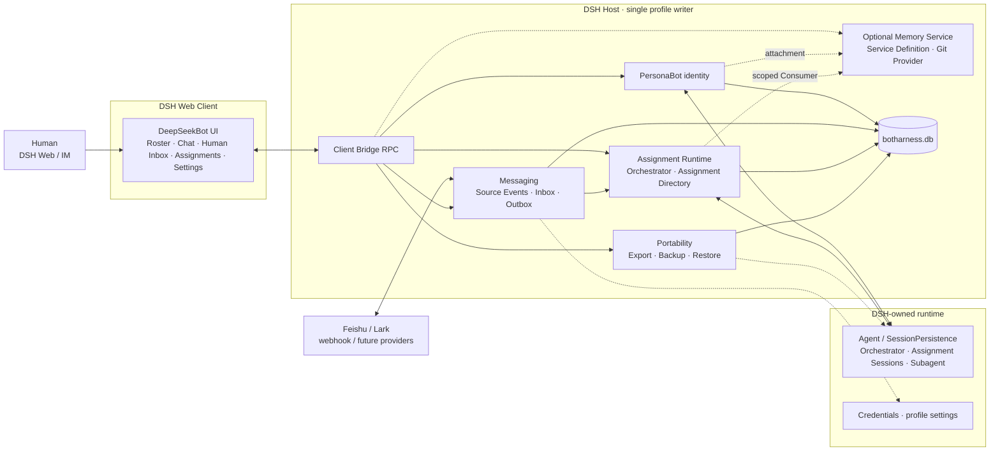
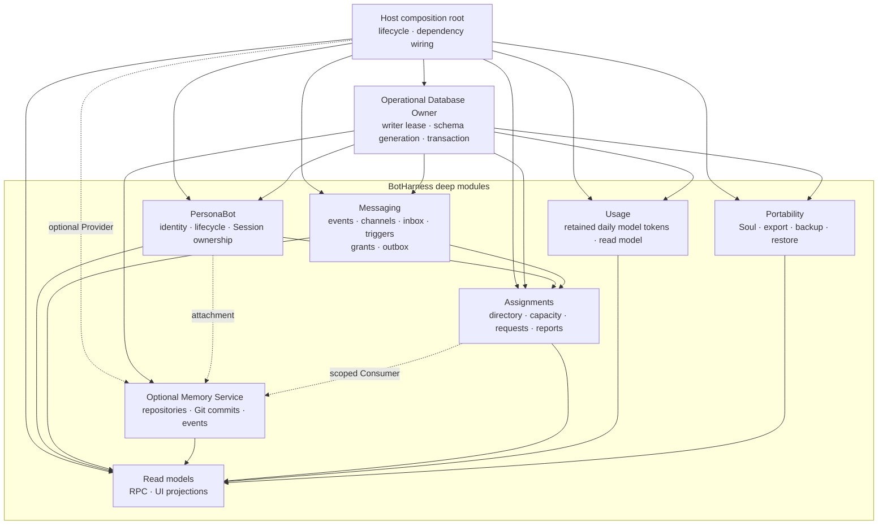
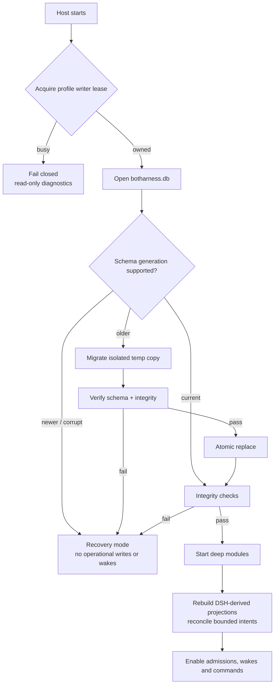
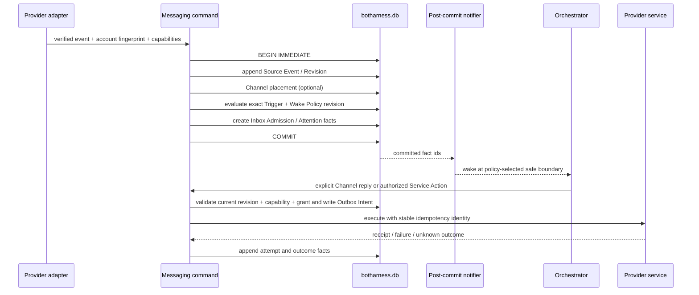
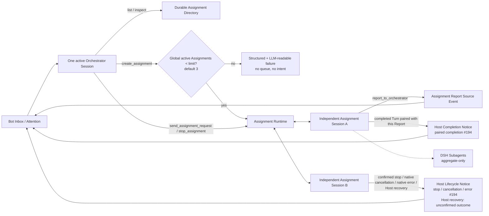
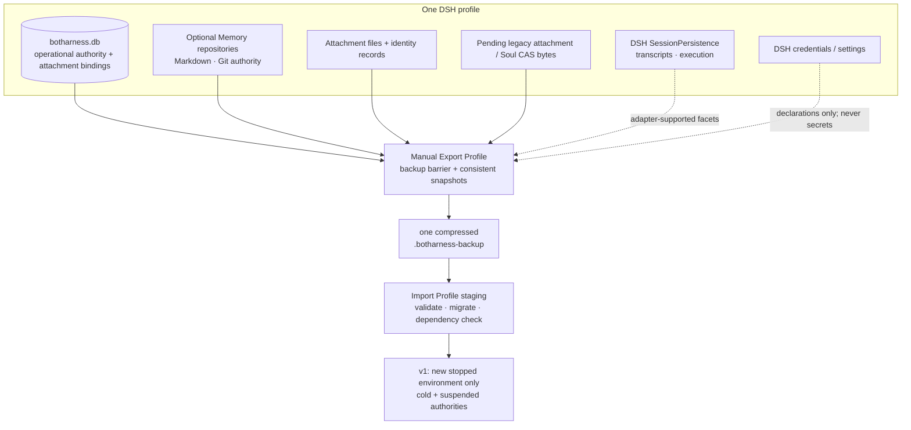
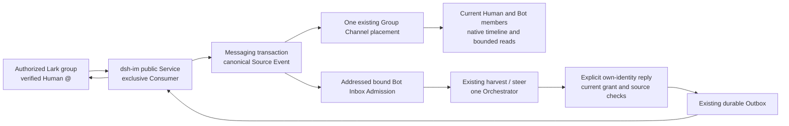

# BotHarness 架构与数据流

#679 将入口收束为 Bot 模式设置左侧的紧凑图标／未读 Chip；折叠侧栏时则在 Bot 模式下方以相同尺寸对齐。展开时仅显示未读数字 badge，最多为 99+；有未读时入口常显，没有未读时仅在 Bot 模式开启时悬停或键盘聚焦才显示，与设置按钮一致；模式关闭时 hover 不显示，也不进入 Tab 顺序；折叠时入口仅在 Bot 模式开启后显示，图标右上角红点表示有未读或待行动；模式关闭时入口隐藏且不进入 Tab 顺序。无障碍名称保留完整未读数量与待行动提示。Client 导航偏好单独记住最后查看的总览／收件箱，不受私聊、模式切换或刷新影响；显式 tab 仍直接打开对应视图。

BotHarness 是 DSH（DeepSeek Harness）之上的插件层，给 Agent 持久产品身份：**PersonaBot**。PersonaBot 用一个 Orchestrator Session 管理 Inbox，并可同时管理多个独立 Assignment Session；Memory 是 optional capability，Persona 是其中的 optional 内容；两者都不是聊天或执行的前置依赖。DeepSeekBot 是首个应用，提供 roster、Bot Inbox、Assignment Directory、委派和 IM 接入。

本文描述 #71 确认后的目标架构。M1 registry、M2 Memory 与 #66 roster storage 已实现；#77 已验证 DSH runtime seams，显式 Session ownership、Messaging、Assignment Runtime、统一 operational database 和可移植性按 #79–#81 分阶段落地。更新：2026-10-03。

Bot 模式首次体验（#1175，[ADR-0147](../adr/0147-onboarding-is-profile-progress-over-canonical-dm-evidence.md)）由 application-defined Onboarding owner 在现有 operational database 的 Schema Generation 71 保存 Profile receipt；只有主动进入模式才准备身份。空 Profile 记录稳定 Bot ID 后通过 Registry/Memory owner 创建 DeepSeek Bot，保存官网固定 Appearance，并经 Channel owner 幂等创建真实 Human DM 与 system welcome。已有 Bot 可复用／选择；归档和删除不会自动恢复。真实 Human 请求与同一 DM 的 Bot 回复，由 Channel 提交事务保留可信 Session ownership／原请求 Source Event 关联，作为完成证据；欢迎卡、失败通知、发送接受、Memory 初始化均不算成功。教程开始／暂停／跳过与历史成功独立；教程是首次进入 Bot 模式时自动开始的多步 driver.js 界面导览（欢迎信 → 消息列表 → 收件箱 → Bot 设置 → 会话头部 → 输入框 → 右侧栏 → 窗口伙伴，缺失锚点自动跳过），关闭即暂停，跳过显式收尾，重开／继续只从 Bot 设置入口触发，不再有常驻内容区横条；预设欢迎消息以 Bot 的第一人称来信呈现（banner、头像、名字与标签，保留产品来源脚注），时间线里该消息的作者显示 Bot 名字（[ADR-0155](../adr/0155-onboarding-tutorial-is-a-floating-tour-replayed-from-bot-settings.md)）；刷新、重启和多 Client 重读 Host 事实，后台核对不改变当前 Channel。未发出的请求只留在当前 Client，恢复后须再次明确确认。窗口伙伴初始化一次并尊重后续本地移除等偏好。完成后的欢迎消息提供可选 Memory 入口（#1200）：Client 复用既有 Memory 查询、文件树及正常阅读／差异视图，自由偏好经原 Human DM 发送链路提交；不新增写入 authority 或完成条件，初始化模板和回复本身均不证明偏好已保存。可选绑定入口（#1203）直接复用 Sidebar 的 Bind app Modal、当前 PersonaBot 的 Messaging snapshot 与原绑定命令；平台目录、凭据设置、官网教程和实际接收状态仍由既有 owner 提供，暂时不绑定不改变完成事实，也不保存第二份绑定进度。

欢迎消息提供能力介绍、每日晚间问候与十分钟定时测试示例，点击后沿用正常 Human DM 请求与现有执行能力。新闻选项由 Host 在 onboarding 查询中投影当前 native 搜索配置和所选 Bot preset 的 `web_search` 可见性，只返回就绪布尔值，不保存第二份配置或凭据。固定 RC1 的已知 DeepSeek 搜索 Provider 与其独立凭据已配置时提供带真实来源链接的今日 AI 新闻；未配置、无法确认或不支持的搜索组合显示通用工作规划示例。配置就绪不保证网络请求成功，实际搜索失败、空结果和不可用必须如实说明。模型保存和问题发送是两次独立操作：单独选择模型不创建问题；因配置受阻的请求保存模型后进入单独的发送确认，关闭或恢复均不自动发送。引导模型配置复用 native model／credential Services，经 Typert/API Gateway 保存并读回 Profile 默认模型；默认勾选后当前 Bot 继承全局，取消勾选则写独立 Model Plan。新 Bot 无独立 plan 时继承全局；保留 model-plan revision 以校验返回继承的编辑。全局修改只影响之后的继承请求，不覆盖固定计划或运行中的 Assignment。模型失败后的“重试这条消息”沿用原 Human 消息与 Admission，经既有 retryability／side-effect gate 拒绝不安全重放，不再追加 Human 消息。

当前 Client UI 由独立 `@botharness/ui` Bundle 挂载，源码仍在 `packages/client`；RC2 的插件图把结尾 `/client` 解释为导出子路径，因此包身份依 [ADR-0066](../adr/0066-rc2-client-bundle-identity.md) 避开该后缀。Client HMR 只暂存当前 Bot/Channel 选择以恢复视图，不复制 Host 中的 PersonaBot、Channel 或消息权威。

产品术语以根目录 [`CONTEXT.md`](/zh/dev/design/context) 为唯一词表；[BotHarness Runtime 架构](/zh/dev/design/bot-runtime) 单独展开 PersonaBot、Bot Inbox、Orchestrator、Assignment 与 DSH execution 的关系。DSH/Cordis 本身的术语和 Plugin 开发决策位于 `/zh/dsh`，不在这里重复定义。

迁移阶段保持可验证：#79 建立 `botharness.db` owner；#885 的 Schema Generation 56 已将 #66 的 roster arrangement 单向迁入 owning SQLite module。旧 `botharness_roster` Storage Domain 仅作一次性输入，校验失败时 roster 只读且返回 `storage-unavailable`，不会当成空排列；成功后排列与 import marker 同一事务提交，旧源保留供恢复参考，正常运行不再打开或读写该 domain。Session ownership 保持既有数据库权威；#886 的 Schema Generation 72 增加恢复收据、逐 Bot 模型授权／激活记录与 Session 内容可用性。

#56 and #137 extend the current roster global slot to `{ pins, hidden?, sectionOrder, topOrder? }`: `pins` canonically orders Channel IDs for both group Channels and PersonaBot DMs, `hidden` omits Channels only from roster navigation while retaining their placement, and `topOrder` mixes section blocks with loose Channels while membership remains owned only by section records. The unary client bridge now has ten arrangement methods, including `topReorder`, `hiddenSet`, and bounded `rosterBatch` (one Host completion notice and one final Client snapshot for multi-select); #885 preserves this order, hidden presentation state, and single-membership invariant in the owning `roster_arrangement` singleton; each command mutates a transient draft and commits the complete arrangement atomically before publication, without dual writes. A missing import marker refuses edits until a valid source is imported; an already populated target without a marker is never overwritten. Sorting remains native DSH Settings, and collapse remains per-Client. 已提交的 roster mutation 会在 Host commit 后发送 `roster/changed` live invalidation；其他窗口只重读权威 roster，不接收也不复制拖拽中的预览状态。

BOT mode 的折叠 rail 复用这份 Channel 排序读模型：置顶项在分隔线上方，其余 DM 与 group Channel 按 section/未分组的扁平顺序排列。`botharness/channels` 额外投影可选 `latestMessage` 供 hover 摘要使用；该字段从当前 Messaging authority 派生，不成为新的持久化权威。

置顶格也是独立的排序 scope：默认继承全局最近更新／手动模式，可用 `ui-bot-mode.sortModes.pinned` 覆盖；拖动置顶卡片会把当前完整顺序（包括被搜索或隐藏过滤的置顶项）冻结为手动模式，通过 `pinsSet` 持久化，不影响 section 归属或其他 scope 的排序。折叠 rail 使用同一置顶顺序。

Hidden Channel 是 application-defined 的可逆 roster presentation state：它会从展开列表、pin grid、搜索与折叠 rail 中消失，但不会改动 Channel、消息、PersonaBot、Memory 或原 placement。破坏性删除仍受 ADR-0037 的 dependency report 与独立确认约束（#138）。

当前 Channel Chat 的实时显示遵循 ADR-0054：正式消息先写入当前持久化权威，再以该 Channel 的单调 revision 发出进程内通知。#143 的时间线读取遵循 ADR-0061：Host 的 `channelTimeline` 用不透明游标提供 latest / older / newer / around 窗口，Client 仅保留一段连续的按提交顺序排列的可见消息；SQLite Channel placement 的游标解释留在 Host。首次打开 Channel 取最新页；有上次已读锚点时，重开会在锚点附近分页并定位；向上补页维持视口锚点，定位旧消息可前后补页并高亮，并可继续向 newer 分页直至最新消息；用户离开底部后，新消息只更新未读提示，不强制滚到底，也不把实时消息拼接进尚有后续页的旧窗口。旧 `channelMessages` 端点暂作兼容。已选 Channel 通过经过 DSH 认证的 `/api/botharness/stream` SSE 接收已提交消息；重连可回放、缺口则从 Host 修复。同一连接还传送 Orchestrator 显式 `channel_send` 工具参数产生的进程内草稿预览：`channel/draft` / `channel/draft-settled` / `channel/draft-abandoned` 带 attempt ID 与独立于持久消息的进程内草稿 revision；连接时先发送完整 baseline，断档则重读 committed。草稿不从历史回放，不进入 Inbox，提交后由正式消息替换，放弃时移除；呈现层可消费草稿，任何不可逆操作只认已提交消息（ADR-0054）。Human send 使用 Client 生成的幂等 message ID；网络失败时本地气泡保留失败状态，Human 可把原文和附件恢复到 composer 后再次确认发送，而 Host 对响应丢失后的同 ID 重试只接受一次 durable append。Orchestrator 普通 final 与 Assignment 输出不等于 Channel 消息；当前正式 Channel 消息由 SQLite Source Event 与 placement 事务提交，旧 NDJSON 历史只在首次升级时单向导入。Group 中经候选列表选中的多个 Bot mention 在同一事务形成独立 Inbox Admission；Bot 处理状态经同一 SSE 流独立投影。已入群 Bot 的 channel_send 可提交稳定 ID 列表；Host 从可信 Orchestrator ownership 得到发送者，读取当前成员与名称生成 mention 标签，并在同一事务为不同目标建立独立 Admission。Bot-authored Group 消息保留因果根和跳数；同根同目标只投递一次，过限消息保留在群里但不再唤醒目标。收件 Bot 可以在同一群回复，重启后 pending/retryable Admission 仍可恢复。 Group 之外，Bot-to-Bot DM 使用确定性的双成员 Channel ID；Orchestrator 的 `bot_dm_send` 或该 DM 内的 `channel_send` 以可信 Session ownership 确定发送者。每次发送在同一事务中提交 Bot DM Source Event、placement、收件 Bot Admission（受因果根去重与跳数上限约束），以及只链接原消息的无正文 Channel Notice。Notice 放在引起这次发送的 Source Event 所在 Channel（群、Human DM 或 Bot DM），该 Channel 不可用时回到发送者 Human DM；同一事务为发送者写入一条已处理的 `bot-action` Bot Inbox 记录。若引起发送的正是这个 Bot DM 本身（两个 Bot 来回回复），消息已在原对话中可见，不再写 notice 或记录。Channel Notice 不计入 Human 未读、回执、活动统计与 Channel 预览，也不为其他成员建立 Admission（ADR-0154）。重启时恢复 pending/retryable 收件投递；Bot DM 默认不进入 Human roster，但在隐藏频道管理器中可发现、只读打开，Human 无发送或重命名权限。
Group Channel 的气泡收件圆环只投影该消息已有的 PersonaBot Inbox Admission，分母是实际收件者而不是群成员总数。入队是「已投递」；运行时 claim 本身仍显示已投递，直到 observed_at 标记消息进入 Orchestrator 回合上下文才显示「处理中」。若 Bot 通过 Channel 查询主动读到消息而没有进入处理该消息的回合，Admission 保持 pending 但 observed_at 非空，投影为独立的「已读」；回合结束是「已处理」，并不意味着发出了回复。明确忽略、可重试失败和需修复失败各有独立状态。每次权威状态变化通过 Channel revision/SSE 通知并重读该投影，不新建第二套已读存储。Bot 发送者不产生自己的 Inbox Admission，也不进入收件人数。Group 的本机 Human 成员以 Host 固定身份、显示名、加入时间及首个可见 revision 保存在 Messaging 权威中；Human 阅读位置按 Channel ID 与 Human ID 共同持久化。既有 Group 从首条消息起可见，旧 Channel 阅读位置迁移到本机 Human。Host 仅对有可见权限的非作者 Human 投影已读／未读，Bot 状态仍只取 Inbox Admission；同一圆饼与明细展示两种语义，不再从浏览器 tab 或作者推断已读（ADR-0078、#347）。Human 已读推进只广播一条携带阅读 revision 的 Channel SSE；重连时从权威已读位置发送 baseline，Client 用消息的 placement revision 更新当前可见窗口，避免阅读大量历史时逐条广播。当前只支持本地一个 Human；跨账号多人 Channel 仍需独立身份与授权设计（#377）。
Channel 的消息引用（#145）只保存同 Channel 的已提交目标 ID；Human 发送与 PersonaBot 显式 `channel_send` 由同一持久化权威校验，跨 Channel/缺失目标不能产生消息。引用作者和截断摘要在时间线读取时由当前历史投影，不复制为另一份持久内容，也不为每条消息单独读取。目标后来不可见则降级为不可点击提示；点击有效引用复用 `around` 窗口和高亮，不改变相邻消息分组与时间语义。

新 Channel 附件（#576，ADR-0100）保存到 profile 管理的独立真实文件，消息持久化 `{fileId,name,mime,size}` 引用。Host 在 append 前校验 profile 归属，查询时从当前文件投影 MIME 与大小，不改写 Source Event envelope；保留的旧 `{hash,name,mime,size}` 通过 generation 39 的 Messaging 绑定解析到独立真实文件，转换前后均校验字节且不改写 envelope；失败保留旧对象可读状态并给出有界修复日志。Composer 的固定上传 key 与消息 ID 分别保障传输和发送重试幂等。认证 Fetch 上传仍走 `/api/botharness/attachment/upload`，新下载以 `channelId + messageId + fileId` 验证归属并用 `no-store` 返回当前字节。Human 文件／图片菜单复用现有 DSH 原生打开能力；Orchestrator `channel_read_image` 使用 `attachment_id`（fileId）或 legacy `hash`，先验证当前成员资格、消息引用、当前 MIME 和大小，再传给 DSH attachment service，模型不接触 Host 路径。引用感知清理保护所有保留 Source Event 的文件身份；不启用自动调度或保留期。详见[双语文件指南](../file-open.zh.md)。

拥有该 Session 的 Orchestrator 可复制 `channel_read`（含通过 `message_id` / `content_cursor` 完整读取的内容）或旧版授权读取结果中的最多 10 个可信附件引用，四个字段原样保留：`{fileId,name,mime,size}`。#577 后旧消息投影迁移后的文件身份；过期 `{hash,name,mime,size}` 结果必须先重新读取所属消息再转发，旧 hash 图片读取仍须带所属消息以解析当前字节。Orchestrator 还可通过 `channel_attachment_import` 明确选择并导入已授权的本地结果文件；不能猜测身份与元数据。DSH schema 将 `size` 声明为整数；Host 继续校验 0–9007199254740991 的安全非负字节范围。固定版本的 DSH schema 不支持 `maxItems` 或数值上下界，因此数组上限由描述与运行时校验共同表达。Group 最多接受 20 个提及 ID，每个都必须是其他活跃现成员。`channel_send` 只有在 Messaging 权威接受写入后才返回紧凑的 `{channelId,messageId}` JSON；省略目标时使用入站 Channel。该结果取代原文本确认；附件身份、profile 归属、当前文件语义、回复目标、delivery-key 重试与因果循环边界继续沿用（[#570](https://github.com/BotHarness/BotHarness/issues/570)）。

应用定义的 `group_leave` Tool 只在规范成员移除提交后返回 `{channelId,left:true,outcome:"changed"}`；Bot 当前不是该群成员时返回 `{channelId,left:false,outcome:"unchanged",reason:"not-member"}`。无变更既包括重复退出，也包括从未加入的群；不推断历史成员身份，不返回未加入群的名称或名单。缺失 Channel 抛出 `group_leave: channel-unavailable`，非群聊目标抛出 `group_leave: group-required`，替代旧的含糊 `left:false` 成功结果；Tool 异常保持为失败。既有 `{channelId,left}` 字段及 Core 返回结构保持兼容，调用方须处理新的无效目标失败。ADR-0073 的同一事务仍承担创建者移交 Human、待处理 Admission 撤销、单条持久离群通知及剩余成员注意力策略；提交后的实时通知警告不否定已提交变更。读写权限立即撤销，因此 Bot 应通过仍可访问的 Channel 向 Human 报告（[#571](https://github.com/BotHarness/BotHarness/issues/571)）。

## 原生 Human 等待的验证边界

[#1036 的有界实验](../research/1036-native-wait-experiment.md) 在固定 DSH
`0.2.0-rc.1` 上证明：独立 Assignment 等待原生工具审批时，Orchestrator
可真实处理并回复无关 Inbox 消息，但没有释放 Assignment 运行许可。
Orchestrator 自己的原生审批或正式提问仍占有当前 Step；Admission 已接收、
`steer` 已排入下一 Step 不等于模型已处理，原调用决定并返回后才处理无关输入。
准确 Session／call 归属及当前 Grant 校验仍由既有 authority 承担，变更／撤销
范围拒绝原操作。[ADR-0045](../adr/0045-orchestrator-manages-assignments-through-a-durable-directory.md#native-human-wait-qualification-2026-10-09)
记录本次资格边界，不改变 ADR-0035 的单一 Orchestrator root 约束。
[#1220](https://github.com/BotHarness/DeepSeekBot/issues/1220) 追踪缺失的受支持原生
continuation 机制；#1036 保持阻塞，#1037／#1038 生产实现尚未交付。

后续[隔离 RC2 实验](../research/1220-native-timed-question-experiment.md) 验证原生 timed
question 可先真实返回 pending，问题保持可回答；同一 Session 可回复无关消息，再通过
带原 call 身份的 qualified Inbox 输入处理稍后答案。这是 Tool 已结束、问题仍持续的机制，
不是挂起未结束调用。[DM 卡片适配](../research/1220-timed-question-card-e2e.md) 以原 Session／call
关联卡片：只有 `ASK_TIMED_OUT` 结束前台等待，卡片仍查询原生 Projection；稍后答案通过
原生 `userQuestions.answer` 提交，显示已提交，直到原生接收后才写入 Channel 回答记录。
稍后提交进入既有 per-Bot Runtime 队列，为同一 live Session 建立新的 application run，保留
原 Source Event 上下文并重验当前归属、DM 与源内容 fence；run 持续到原生 idle，让模型能使用
既有 Channel 工具，不追加普通输入或 Inbox Admission。
进程内映射仅关联已存在的 live Agent／卡片，不是第二个问题权威，也不实现冷恢复。
生产依赖仍为 RC1，timed 模式仅在显式配置的隔离 RC2 Profile 验证。权限审批、容量释放／重获和同群隐私验收
继续阻塞，不从这次 DM 能力实验推断完成。

## 1 · 系统上下文

新附件已遵循 [ADR-0100](../adr/0100-file-open-actions-target-real-host-files.md)：独立上传彼此独立，显式复用身份才共享编辑结果。原生打开指向真实目标；后续消息读取、预览和下载使用当前内容，上传源独立。保存不保留附件历史，不生成 Source Revision、Inbox Admission、通知或 Bot wake。目标缺失则报告不可用，不自动重建。旧 CAS 迁移（#577）按 Source Event 附件出现位置预留可重启恢复的身份，仅在保留依赖未转换时继续保护旧对象；其他 CAS 数据与 Memory Git 行为保持各自语义。

浏览器只通过 RPC 访问 Host read models 和 commands。Provider adapter 只负责验证、规范化和执行能力；它不拥有 Inbox，也不能直接唤醒 Agent。DSH 继续拥有 Agent 执行、SessionPersistence、Subagent 与凭据；BotHarness 不复制这些 runtime 权威。

Assignment 完成报告通过既有 Human Inbox 最新报告、忽略和来源级隐藏事实派生 `informationalCount`，进入同一有 revision 的 Activity snapshot。仅有信息时显示中性的 `i`；红色待处理数字不包含信息更新，同时存在时悬浮／聚焦摘要分别说明数量。打开报告本身不代表确认；忽略或隐藏才清除提示，重启可从权威事实恢复，执行状态不变。

## 2 · Deep modules 与所有权

| Module           | Owns                                                                                                    | Does not own                             |
| ---------------- | ------------------------------------------------------------------------------------------------------- | ---------------------------------------- |
| PersonaBot       | Host-owned ID、display name / role badges、lifecycle、explicit Session ownership                        | DSH Session lifecycle、Memory 内容       |
| Memory           | generic Git-backed repositories、semantic commits、operation events                                     | PersonaBot lifecycle、Inbox、Session     |
| Messaging        | Source Event、Channel placement、Inbox Admission、Attention、Trigger/Wake Policy、Service Grant、Outbox | Agent execution、provider credentials    |
| Assignments      | Assignment Directory、Assignment Request/Delivery Intent、capacity admission、report/lifecycle routing  | DSH transcript、Subagent runtime         |
| Usage            | per-PersonaBot／执行类型／实际模型的保留日统计、usage read model 契约                                   | DSH Session 日志、价格表、金额总账       |
| Workspace Grants | Human 对 DSH Workspace 的授权与撤销、Assignment 创建时的权限快照                                        | DSH Workspace registry、Session 权限实现 |
| Portability      | SoulSnapshot、PersonaBot Export、Profile Backup/Restore/Transfer 协调                                   | credentials、可执行插件、DSH 私有格式    |
| Read models      | 查询、分页、PersonaBot Activity Projection、Human Inbox、UI-friendly projection                         | 业务事实与写入规则                       |

`botharness.db` 是 BotHarness core 的物理事务宿主，不是共享的 generic repository。Memory 内容与 commit 由 optional Git-backed Provider 掌管；每个 deep module 只通过自己的接口拥有表和不变量，跨模块流程由显式 command/port 协调。

Usage 是 application-defined 的保留统计：从 DSH durable SessionEvent 中按实际请求提取 provider／model 与 provider 报告的 input、output、cache-read、cache-write token，按可信 Session ownership 归属 PersonaBot，分别汇总 Orchestrator、Assignment 和 DSH Subagent；同一 Turn 用多个模型时分别入桶，缺失用量标为未知。`botharness.db` 按 `(bot, day, execution role, provider, model)` 保留日汇总，日界取 Host 本地时区；增量折叠必须幂等，普通 Session 删除后不可用剩余日志全表重建或重复计数，彻底清除 PersonaBot 才删除其可识别统计（ADR-0094，#39）。金额由价格表在查询时另行估算，1.0 不落金额总账（#35 留 v1.1）。Browser 只经 read model 查询，不直读 Session 日志或投影表；PersonaBot Profile 的 token 卡是当前消费者（#34 Decisions、#428）。

Usage generation 40 在同一 Operational Database 事务中写入匿名 HMAC 去重凭据与日增量；校准只补记未见调用，不清空保留汇总。凭据不保留原始 Session 标识或逐调用内容。旧汇总迁移为 Bot 级时间基线，升级前无法确认的补计明确留诊断；新调用持久幂等。归档保留用量；Registry Purge 清理汇总、凭据与基线，当前 Bot 创建身份与可信根 ownership 防止旧 Session 重新填入。

首个可运行切片（#499）扩展现有 26 周有界 `profileActivity` 查询，返回实际 provider／model 的日用量、可为未知的报告分项，以及即使某缓存分项缺失仍可确定的 provider 总量。Profile 按 Host 本地日期查看用量，与允许调用的 Model Plan 独立。逐调用切片（#503）独立结算每条追加的 Assistant 调用事件，成功调用使用实际 source，失败调用使用已记录的请求路由；Profile 区分可信 ownership 对应的 Orchestrator、Assignment 和子代理。Session 序号去重实时通知与重放快照，消息替换不产生新用量。Session 删除后的保留统计仍由 #502 完成。 Profile 在现有 26 周公开查询范围内，以一个有界时间选择联动每日用量、实际 provider/model 用量构成和缓存比例图，默认最近 7 天。模型／提供商切换按选中的实际模型 ID 或提供商 ID 汇总，不在行内嵌套另一维度；Host 原始行和折叠的执行详情保留两个标识。模型／提供商行紧凑地显示选中维度的名称与报告总量；图表悬浮提示展示总输入（未缓存输入加缓存读写）、缓存读/输入及输出/报告总量的比例；缺失分项或零分母的比例保持未知。执行类别默认折叠于详细信息（#592）。

筛选查询 `profileUsage`（#507）由 Usage 深模块拥有，经 Typert/API Gateway 提供：真实且非未来的日期最多覆盖 182 天；模型／提供商与执行类别条件同时作用于每日记录与累计汇总，累计值仅忽略日期。Profile 默认近七天，执行类别筛选位于折叠详细信息中；首次打开、改变筛选或手动刷新时查询，不轮询或按时间自动过期，同条件刷新失败明确标为过期，旧条件迟到的响应不会覆盖新筛选。响应包含查询／核对时间、正常／核对中／降级状态、可空未知用量，以及显式明细／选项上限（2,000 行／每维度 1,000 个实际选项）；总量完整，截断图表隐藏。Session 来源是否可用不决定保留统计是否存在（#502）。

Model Preset 的当前模板存储由 Profile SQLite 的 owning module 管理，Schema Generation 54 将旧 JSON 模板一次性校验迁入，保留 ID／revision，并写入包含空源的切换标记；成功切换后旧文件仅保留为恢复参考，不再读写（#883）。Schema Generation 55 将 PersonaBot Registry 的身份、外观快照、访问开关与独立 Model Plan 一次性校验迁入 `persona_bots`，导入标记与记录同一事务提交；旧 `bot.json` 与 Soul 文件保留，但正常读写仅使用 owning Registry module／Profile Writer Lease（#884）。无效登记使 Core 启动失败并释放 lease，不会把坏数据当成空名单；修复保留的旧源后重试。Generation 72 的完整 Profile Backup 保存可复用模板与独立 Model Plan 的现值和 revision，恢复不会重新套用模板（#886）。

Model Preset 是部署本地可复用模板；Human 在 Profile 应用时，PersonaBot 保存独立 Model Plan 快照，后续模板编辑不传播到已应用的 Bot。Plan 固定 Orchestrator 的 provider／model／reasoning effort，并定义 Assignment 可用的精确模型、各模型允许及默认的 effort 和默认模型。Host 在每个执行入口按当前 Plan 验证选择，而 DSH SessionEvent 记录实际调用：Orchestrator 的变更在当前 Turn 结束后生效，已有 Assignment 保留当前路由，之后的显式切换按最新 Plan 校验；新建 DSH Subagent 默认继承仍获允许的父路由，否则选当前 Assignment 默认并告知父 Agent。不可用或有歧义的路由停止请求，交由 Human 修复，不静默回退。Model Preset 与 Model Plan 可进入保持身份的 Profile Backup，不进入 SoulSnapshot 或 PersonaBot Export（ADR-0027、ADR-0093，#488）。

当前命名模板保存在 `botharness.db` 的 `model_presets` 表（#883，取代 #498 初始 JSON 存储），应用后的独立快照及修订号保存在 owning Registry 的 SQLite 记录中（#884），后续模板修改不会自动替换。Profile 经现有 Host Bridge 读取 DSH 当前注册的 provider、model 与 effort 能力，并在创建及应用时校验确切路由；Orchestrator 的 Agent-scoped Model Selection 在每个新 Turn 前读取最新快照，不修改 DSH 部署默认值。DSH 请求头仍是实际调用路由的事实来源（#498）。

后续切片允许 Human 修订命名模板而只改变未来应用的值与模板修订；Profile 的紧凑切换按当前模板复制新 Bot 快照，手动改一个 Bot 的 Orchestrator 路由则清除模板来源标记、保留 Assignment 默认值并增加 Bot 计划修订。Host Bridge 在写入前验证现有 DSH 路由，正在执行的 Turn 持续使用其已组装选择，下一 Turn 才重新读取 Bot 快照（#501）。

新建 Assignment 的模型选择由当前 Bot Model Plan 管理：Human 在 Profile 保存精确 provider／model 集合、各模型允许及默认的 effort 和整体默认路由，Host Bridge 在写入前对照 DSH 当前 Model Catalog 校验并递增 Bot 计划修订。Orchestrator 通过 `list_assignment_models` 读取该集合，再在 `create_assignment` 中省略选择以使用整体默认值，或指定获准的模型与 effort；Host 在认领 Session 和启动工作前拒绝越界选择。选定路由随 Assignment ownership 记录保存在 `botharness.db`，并通过该 Assignment 独有的 DSH Agent-scoped Model Selection 进入真实请求；读取 Assignment 或 Host 重启不会把选择改为后来更新的 Bot 默认值。这个切片不修改 Orchestrator 路由或 DSH 部署默认值（#504）。

PersonaBot 的 Agent scope 提供 `bot_subagent`、`bot_subagent_fork` 和 `list_bot_subagent_models`；Host 在每次启动子代理时从该 Bot 的最新 Model Plan 验证路由，并用 DSH LLM Service 预检可用性，再交给 DSH Subagent Service 创建真正的子会话。Bot scope 拒绝绕过计划的原生 Subagent 工具调用。省略路由时，获准的父路由被继承；已从当前计划移除的旧 Assignment 路由改用当前 Assignment 默认值，并在工具结果中告知父 Agent。子代理沿用根会话的 Workspace Grant 与工作目录；DSH 子会话原生的 `never` 审批策略不放宽根会话的模式约束（#508）。

Model Route Readiness 在 Profile 查询及 Orchestrator／Assignment 新 Turn 入口读取同一 PersonaBot Registry。旧 `model` 字符串只有在 DSH Model Catalog 唯一匹配且路由配置有效时才迁移为独立 Model Plan；有歧义或缺失则保留旧值并等待 Human 选择，绝不拼接部署默认 provider。修复状态即时计算，不是第二套策略存储。请求前校验精确 provider／model／effort；provider 在真正执行时拒绝凭据则通过 DSH `turn/end` 和现有 Channel Session failure 通知给出修复指引。成功应用 Model Preset 后移除旧字段，保持 Agent preset 不变，下一次 Turn 使用修复后的路由（#500）。

application-defined Memory Service 使用 `Consumer → Service Definition → Provider` capability seam。每个 PersonaBot 都有一个 Git-backed Memory Repository，Orchestrator Session 固定以它为 working directory。当前检出的工作树文件立即是记忆，无论是 Markdown、代码还是二进制文件。Agent 通过原生文件、搜索、Shell 与 Git 能力读写仓库；没有面向模型的 Memory CRUD 工具。新建 PersonaBot 时可选择空白记忆，或由 Host 检查 Git 并以 HTTPS/SSH 地址在暂存目录克隆远端仓库；克隆成功才建立 Bot，远端当前分支及文件立即成为记忆（#298）。私有仓库使用 Host 已配置的 Git 凭证，不经创建页面收集密钥；已有 Bot 仍通过原生 Git 整合远端仓库。外部仓库应合并、替换或放到其他位置若有歧义，Orchestrator 经 DSH 原生 Ask Question 询问 Human。分支、合并与冲突由 Git 决定；Git 改变工作树后，同一 Session 立即看到新文件，但该 Session 已冻结的 Soul 与 Core Memory prompt 不追溯更新（ADR-0060）。Memory 根目录的 `SOUL.md`（Soul）与 `MEMORY.md`（Core Memory）在 Session 首次组装 prompt 时冻结为同一份快照注入，只在 compaction 边界整体刷新；各自受每 Bot 可配置的字符上限约束，超限时截断并明确提示。旧 `PERSONA.md` 在每次 Host 启动时幂等迁移为 `SOUL.md`，读取仍兼容旧名（ADR-0134）。跨设备延续沿用同一路径：Orchestrator 按 Human 请求用原生 Git 与 Human 自配置的远端同步，新设备以 Git URL 创建新的 PersonaBot；不操作 Git 的所有者使用 Profile Backup，而不是 Host 持有的同步服务或一键同步（ADR-0084）。

[ADR-0140](../adr/0140-the-host-falls-back-to-a-managed-git.md) 规定 Git 的来源：Host 每次启动时解析 Git，可运行且不低于 2.28 的系统 Git 优先；否则使用 Profile 中的 Managed Git。找不到、macOS 占位程序与版本过低都算不可用。进入 Bot 模式时先检查，不可用时只给一个「安装 Git」按钮并禁用创建与导入。Managed Git 是按 deepseekbot 版本固定版本号与 SHA-256 的便携构建，先从 `media.botharness.ai` 镜像、再从 GitHub 下载，无需管理员权限；使用它时 Host 把其目录加到 DSH 进程 PATH 最前，让 Orchestrator 的 Shell 也能用同一个 Git。SSH 导入地址克隆失败时，Host 自动转换为对应的 HTTPS 地址重试一次并告知 Human。

Memory Service 拥有 repository identity 和 lifecycle、可信 Session ownership、受限的 UI 查询，以及审计/恢复检查点。成功回合后，它可以把观察到的状态与可信 Source Event、Session 上下文记录下来；观察不会暂存、提交或隐藏工作树文件，也不推断 Git 内容的作者。当前文件与历史以 Git 仓库为权威，数据库 ledger 只是辅助记录。Memory Service 为每个 PersonaBot 保存一个 commit 游标：回合开始时静默对齐当前 HEAD，回合成功收尾后，把 HEAD 可达而游标不可达的每个 commit 交给 Channel 写成一条 `memoryCommit` Channel Notice（放在该回合的 Cause Channel，不可用时回到 Human DM），并为该 Bot 写一条已处理的 `memory-commit` 记录，随后推进游标；同一 Bot 的同一 sha 只记录一次（ADR-0154）。PersonaBot DM 的 Channel sidebar 分为「记忆文件」和「记忆演化」：前者以可展开目录树展示当前工作树，选中文件后在 Channel body 只读查看文本或二进制提示；后者展示所有本地分支及可达提交的 Git graph，选中 commit 查看完整 diff。当前差异默认按「新记忆／已有记忆的更新」对文件去重，切换并持久保存 Git 术语后，显示可折叠的未暂存、已暂存和未跟踪分组及状态标识。打开视图时定时读取、窗口重新聚焦时立即读取外部编辑，侧栏折叠标题栏也有刷新按钮；查询不暂存或提交（ADR-0088）。Human 文本保存服务仍先比较当前 HEAD，再显式生成 Git commit；普通导航不提供页内编辑。Memory 文件查询阻止访问 `.git` 控制路径及指向仓库外的符号链接，但不限制 Git 可保存的文件类型。旧 Repair 归档与检查点记录仍保留兼容；普通未提交改动不会阻止下一回合或强制修复（ADR-0068）。

恢复检查点额外记录分支、HEAD、暂存区与工作树，并用隐藏的 Git ref 保留对象。观察记录区分 Host 扫描、Agent 会话上下文和明确的本地 Human 命令；后者使用与 Channel membership 相同的 Host-owned `local-human` 身份，不能区分共享 Host 凭据的多人。Human 在记忆演化页选择检查点并确认恢复；Host 校验当前状态与检查点引用，在副本中准备目标状态，完整归档原仓库后切换。未被观察的中间状态无法恢复；Git ignored 文件留在完整归档中（ADR-0097）。

Memory 外部打开沿用 ADR-0100 的交互，#574 实现当前 Memory 首片：显示路径的区域可点击弹出菜单，密集文件树提供右键菜单和键盘／触屏可到达的入口，合适位置提供带 Tooltip 的图标按钮。普通文件选择仍进内置阅读，目录选择仍展开。首片覆盖 Workspace 的 Memory Repository 路径及当前 Memory 文件／目录，#575 扩展已授权的普通 Workspace 路径，后续扩展 PR #435 的消息附件 chips，不识别任意正文路径。Memory Service 在 Host 从 PersonaBot 仓库根解析相对路径，沿用 `.git`、越界与符号链接检查；其他来源由各自 owning module 解析，不开放通用任意路径 authority。Client 沿用 DSH Typert／API Gateway seam 消费原生打开能力，不运行拼接 Shell 命令。目录菜单取 DSH 探测到的应用，文件菜单取默认和注册关联应用，首片不加自定义程序或持久默认应用设置。

普通 Workspace 路径复用同一 Client 菜单，但提交 PersonaBot slug 与 Grant ID，由 application-defined Workspace Grant Store 的 `requireActive` 在 Host 检查拥有者、撤销状态和当前 DSH Workspace Registry 身份，重新解析 canonical 目录。显示路径不承担 authority；失效、移动、未注册或缺失目录会拒绝。打开前再次校验，菜单只列 Host 探测到的目录应用，能力不可用时只保留复制 Host 路径。打开不修改 Grant、Session cwd 或访问权限，也不创建 Session；不提供目录下载（#575）。

原生打开始终作用于 DSH Host 所在电脑，Tailscale／Cloudflare Tunnel 只提供连接而不证明 Client 与 Host 同机。菜单明确目标和能力不可用原因；文件另提供下载到浏览器设备及复制 Host 路径，二进制／超大文件不因内置预览受限而失去打开和下载能力。下载后的编辑不自动回写远端，首片不做目录下载或历史 Memory 文件导出。

Memory Service 在 Host 启动、Orchestrator 回合前，以及本地 DM 或群提及并入活动回合前比较各 Bot 当前分支、HEAD、未提交文件内容和 Git index，与数据库中的每 Bot 观察检查点求净变化。首次观察只建立基线；之后在单次事务中写入有界路径摘要的 `memory-change` Source Event、该 Bot 的 Inbox Admission，并推进检查点。事务失败不推进基线，重启后重试；相同状态重复扫描不重复投递。启动扫描只入 Inbox，不主动唤醒 Agent；下一次普通回合在同一 Inbox 上下文领取并处理。Event 不推断编辑者，也不复制文件内容；Agent 需要时用原生文件和 Git 工具查看。并入消息时发现的净变化随消息在下一个安全步骤进入同一回合的 Inbox 上下文，成功投递才标记已观察，并随回合成功或失败处理；拒绝并入时保留待处理，供后续普通回合领取。回合结束更新剩余状态的基线，不额外通知，也不推断回合中变更的编辑者。离线期间改动又复原的中间过程无法从最终文件状态推断。`SOUL.md` 或 `MEMORY.md` 变化可在 Event 中提示，但冻结的 Session 快照不变（ADR-0092、ADR-0134、#350、#352、#464）。

## 3 · Host 启动、迁移与 recovery

一个 DSH profile 同时只允许一个 BotHarness writer。所有 module migration 合并成单调递增的 Schema Generation；迁移只在临时副本上完成，校验后原子替换。打开、迁移或完整性检查失败时进入 recovery mode，不回退到 NDJSON、storage domain 或内存写入。

## 4 · Messaging 事务与外部副作用

Source Event 是内容唯一权威；Channel 和 Inbox 都只保存关系。Reply 使用可信 Reply Route 自动选择来源 provider；主动发布属于 Service Action，需要 Provider Capability，以及该 Bot 对应用可触达会话的会话条目，或作为后备的 Human 保存目标 Service Grant。SQLite 事务只覆盖本地事实；外部副作用使用 Outbox Intent、幂等标识和有界 reconciliation，不宣称 exactly-once。不可证明的结果进入 `unknown-outcome`，由 Human 处理。

Wake Policy 决定何时让 Orchestrator 看见新 attention：当前 step 完成后的安全边界、当前 turn 结束后，或 idle 时启动新 turn。普通外部消息不打断正在执行的 model/tool step；只有 DSH 明确支持且策略授权的控制路径才能 steer。就绪的 attention 按回合收割：忙碌期间新到的事件只把就绪集合置脏，当前回合结束（即空闲）时由一次 harvest turn 消费全部就绪项；主动 steer 只用于直接 @ 与 DM（ADR-0077）。

### Lark 接收与回答反馈（ADR-0149）

新会话首条消息的 Admission 通知异步等待受校验的回复连接就绪，避免连接建立期间丢失接收反馈；不阻塞收件确认或模型唤醒。SDK HTTP 异常中的明确权限拒绝归为失败；修复不重写或补发既有未知尝试。

Messaging 在 Source Event 与 Inbox Admission 提交后异步尝试原消息的 `GLANCE`，只在该来源的 canonical Reply Outbox 成为 `provider-accepted` 后尝试 `DONE`。两个状态由应用定义；原内容、Admission、Outbox 继续是各自唯一权威。可选的 checked Provider Service Capability 重查账户指纹、Registration、独占 Consumer、来源会话／Thread／发送者及当前授权。旧 Provider 缺少能力时保持正常收发。

反馈 attempt 元数据保存在既有 Source Event payload，完成记录引用原 Outbox；管理 snapshot 暴露最近状态，不复制消息内容。写入前持久化 attempt，超时／未知／重连／重启均不自动重试；有界异步调用不阻塞接收、模型或回复。静音仍可产生 silent Admission，屏蔽阻止新 Admission；静默结束、委派完成、待确认问题及无关输出不表示已回答。平台接受不表示 Human 已读或样式已经验证。详见 [ADR-0149](../adr/0149-lark-feedback-follows-admission-and-accepted-reply.md)。

### 绑定的应用接收默认流量（ADR-0142）

接收以外部身份 Binding 为键，而不是保存的目标。启用的 Binding 把应用的默认流量（私聊和合格的群 @）接收进绑定 Bot 的 Inbox。会话的第一条被接收的消息，会与其 Source Event、Inbox Admission 在同一事务中提交一个隐式会话条目（`messaging_grants` 中 `origin: 'implicit'` 的行），使 Outbox fence、群策略、Channel Bridge 路由和撤销仍挂在同一个锚点上。Binding 的新会话模式（`auto` 或 `ask`）及其上限（每小时 20 个新条目、500 个活跃、200 个等待）决定新会话被接收还是等待处理。屏蔽按 Bot、应用指纹、会话类型和 ID 持久保存；静音只推进 `preferenceRevision`，不改动条目的 Outbox revision。一个 Bot 可以绑定同一平台的多个应用，每个应用仍只属于一个 Bot。Client 中，应用的会话列表管理这些条目并显示已有的 Channel Bridge 路由（新建同步正在围绕外部连接器重新设计），「外部连接器」列出这些路由并保留保存目标的 Service Grant，作为 Provider 无法列出或直接发往会话时的高级后备。

外部应用的准备步骤由官网教程维护，既有 **绑定应用** 弹窗提供对应语言的教程链接，不再显示独立 Lark 配置引导卡片。Driver.js 保留为应用内部控件定位工具，不承载平台配置说明。绑定、接收与回复结果仍来自既有 Provider／Host 权威；打开教程不产生授权或发送，也不新增引导存储。

### 首条外部出站路径（ADR-0101）

[ADR-0127](../adr/0127-product-artifacts-compose-an-independently-versioned-im-provider.md) 提议在开发用 fork 政策之外增加产品分发路径：打包的 `deepseekbot` 固定 Core、Client、Browser、Computer 和独立版本的 `@botharness/im-provider`，通过同一 Bundle Patch 激活全部六个组件（[ADR-0160](../adr/0160-deepseekbot-default-bundles-browser-computer-and-im-provider.md)）。Provider 保留 SDK、凭据、存储身份及公开 Service；Core 保留所有 application-defined authority。构建校验不可变输入、重建运行时来源和 tarball 完整性。原生优先从 CLI 安装位置解析 Bundle，因此产物验收使用独立安装的官方 CLI，避免误用开发链接。初始不连接账号；重复的 standalone Bundle 在启动前被拒绝。Provider 随产品更新。此构建路径不发布 npm、不自动资格验证其他平台，也不免除 Human QA 和生产启用门槛。参见[打包验收指南](../product-im-installation.md)。 产品 Provider 的来源、DSH 版本和运行时摘要独立于开发版固定值；改变产品输入需要递增自身版本并重做实际安装验收（[#868](https://github.com/BotHarness/BotHarness/issues/868)）。

PersonaBot Profile 的 IM 连接经现有 Typert/API Gateway 选择账号和已测试目标，再由 Human 建立 Binding 与单目标主动发送 Grant。application-defined Messaging Provider Registration 由 Consumer Fiber 持有，Binding／Grant／Outbox 使用同一 `botharness.db`。接受和执行都复核活跃 Bot、Grant、Registration、认证账号 fingerprint 和目标内容 digest；删除、改址或账号变化要求显式重新授权。先提交 Intent 和 attempt-start，再调用 provider，结果只记平台接受、明确失败或未知；重启不重发 pending／in-flight，未知结果留待 Human 核对。

生产适配需要 dsh-im 公开、版本化的 `describeBot`／`sendChecked` 契约，以在账号 transition 中验证平台身份并冻结已授权路由。这是待上游接受的小型扩展；已发布 `4.32.0` 不满足该契约，BotHarness 默认禁用这条出站 authority。隔离开发可通过 `dev-instance --im-provider` 安装 [ADR-0104](../adr/0104-isolated-im-profiles-pin-a-qualified-temporary-provider-fork.md) 指定的临时 fork 完整 SHA，并在启动前校验运行时代码 digest；这不代表上游已发布或生产启用。dsh-im 仍持有 SDK／连接／凭据与原设置入口；BotHarness 不读取其私有 JSON，不接管 standalone Session 路由。#12 通过公开 `consumeInbound` 独占接收显式授权群内的文字 @：Messaging 先提交 bridge-message Source Event 与独立 Bot Inbox Admission，commit 后确认，再沿既有 group-mention harvest／steer 唤醒 Orchestrator。来源不需要本地 Channel placement，模型从 Inbox 了解接收身份、发送人及 group／thread／root／parent；`bridge_read` 读本地已保存来源，`bridge_reply` 仅接受来源 ID 与正文，Host 推导本 Bot 的有效身份与原回复路由，复用 Outbox 后调用公开 `replyChecked`，不镜像到 Human DM。撤销、归档、consumer 丢失、旧 Grant revision 都不能授权未来收件或尚未开始的回复；重启不重发未知 Outbox。外部来源 turn 不扩展 Memory acceptance 的来源授权，也不自动写入 Memory。详见 [ADR-0106](../adr/0106-exclusive-im-intake-commits-bot-inbox-before-acknowledgement.md)。 #612 的 `bridge_context` 通过同一 Inbox 来源和 Bot 身份调用公开 `historyChecked`，区分群列表、附近 ±5 分钟 Chat 时间窗与可信 Thread 列表；Host 按 JSON 预算仅将完整返回内容 reconcile 到 canonical Source Event，并记录有界读取 metadata。普通历史不建立 Admission、不触发 wake；已经存在且实际返回的 Admission 沿用当前 turn 的成功／失败处理。Provider 返回的显示名仅补充同一 canonical 身份；发送人和 @ 人员 ID 保持身份依据。Inbox 沿用 harvest 的 Message／Source Event 引用格式，上下文返回可用的姓名和 @ 关联，缺失姓名时回退 ID。Human 来源详情显示读取记录与最近一页，不自行读取远端。

### Lark 管理员配对（ADR-0136）

[#1027](https://github.com/BotHarness/BotHarness/issues/1027) 的 application-defined 配对 owner 使用 Messaging 所属的 Operational Database，以当前 PersonaBot、外部身份 Binding、Provider 认证的真实用户及原始私聊路由固定授权范围。已绑定 Lark 身份在既有独占 Consumer fanout 上保留账号级控制入口：纯文本 `/pair` 先提交申请再确认，不创建普通 Source Event、Bot Inbox Admission、模型唤醒或 Memory 写入。普通消息仍需自己的接收授权；删除聊天路线不关闭配对入口，也不产生普通 DM 接收权限。Client 显示实际接收器是否就绪。

首次能力只能由认证 Web Human 显式勾选并按当前申请 revision 审核；定位码不能兑换权限，首位申请者不会自动成为管理员。能力仅覆盖当前 Bot 的批准、拒绝、回答及保存规则资格，不扩展 VPS、原生 DSH API、其他 Bot 或审批人管理。每次使用重查当前 Binding、Bot、真实 actor、能力和状态；暂停期间不可用，永久撤销后重新配对必须重新审核。该切片交付配对与 Web 审核，IM 审批／提问控件仍由后续切片接入原生权威。参数、恢复及审计边界见 [ADR-0136](../adr/0136-lark-pairing-is-reviewed-bot-scoped-operational-authority.md)。

### Lark 普通角色与自动申请（ADR-0164）

[#1373](https://github.com/BotHarness/DeepSeekBot/issues/1373) 沿用 Messaging owner 与 Operational Database，新增普通 External User Role、默认关闭的发送者限制和 `conversation` purpose 配对；既有 `management` purpose 的 `/pair` 显式能力保持独立。普通角色先支持自然语言行为权限与空管理能力，不新增 DSH 原生 RBAC，也不宣称隔离邮件、代码或任意 Shell 资源。配对按当前 PersonaBot、App Binding/fingerprint 与 Provider 认证的 Lark open ID 限定，可跨允许的 DM/群复用，但不跨 Bot/App/平台或重新绑定继承。Host 在默认接收、显式 Bridge、会话接入、共享来源及模型消费处逐 Bot 校验资格；不同作者的角色不合并。

未配对的受限 DM/群 @ 先持久提交有界审核元数据，不保存旧指令正文、不建立请求 Source Event/Inbox Admission、wake 或 Task。认证 Web Human 在 Bot DM Channel sidebar 经既有 API Gateway/Client seam 选择角色并按 revision 审核。批准先提交，再通过当前独占 Consumer 的受检查回复能力发送固定重问通知；只允许新的有效消息进入原有模型回复/Outbox 路径。通知尝试在外部调用前记录，未知结果不盲重试；接收回调先返回，避免与 Provider 账号队列死锁。撤销立即关闭后续资格及尚未执行的相关 Admission，既有历史保留。Generation 78、迁移和边界详见 [ADR-0164](../adr/0164-lark-chat-pairing-is-reviewed-current-binding-authority.md)。三个只读目录与完整首轮真人反馈仍由 #1374 交付，角色编辑/重新分配与显式开放群/被动上下文分别保留 #1375/#1376 的真人依赖。

### Lark 私聊审批（ADR-0141）

[#1029](https://github.com/BotHarness/BotHarness/issues/1029) 将已提交的工具审批发往 Web 显式选择的已配对管理私聊；通知路由及回执由 Messaging owner 在现有 Operational Database generation 60 保存，完整请求／决定仍归 canonical Channel 与 native Session。通知、决定接受、原生执行结果和卡片更新分别投影。现有独占 Consumer fanout 单独处理官方 SDK 卡片操作，不建立普通 Source Event、Inbox 或 Memory。公开的受检查 Provider capability 负责原始私聊／实际发送人、自己的卡片回执和平台写入前 fence；Host 校验实际点击者的当前 Bot／Binding／fingerprint／配对能力与 revision、目的地、request↔receipt、完整操作及原生执行者。允许一次／拒绝重入现有工具审批 broker，Web 与 IM 共用一位胜出者，执行前再次核验撤权与完整参数。回调确认不等于批准，批准不等于成功执行；重启使旧卡片失效，未知发送结果不重发。该切片不保存规则、不处理群审批／原生问题，也不释放 native wait。见 [ADR-0141](../adr/0141-lark-private-approvals-rejoin-the-native-owner-through-checked-controls.md)。

### Bot 之间的 Channel 协作（ADR-0065）

Orchestrator Session 中注册的 `group_attention_get` 与 `group_attention_set` 是 DSH model-facing Tool，消费 BotHarness Host 的 application-defined Channel capability；Host 从该 Session 所属 PersonaBot 确定 actor，并在读写时复核当前 Group membership。未保存的 Group 偏好只读为 digest 5 条／30 秒、revision 0；Human Bridge 写入和 Bot Tool 写入共用 Channel record 中的 `wakePolicies`，每次实质变更在同一 SQLite 事务里追加不可改写的 actor／时间／revision 审计事实。审计表只存历史，不作为第二套当前偏好；Admission 在消息提交时固定有效策略与 revision，不会随之后的编辑回写。

#366 把 Human DM、Bot DM、群内提及、普通群消息、入群邀请与申请流程、Assignment 报告及生命周期的内建来源规则写成每个 PersonaBot 本地的不可改写修订事实。Host 在建立新 Inbox Admission 的同一事务里读取对应规则并保存来源规则 revision／wake 快照；既有 Admission 不回填。普通群消息的来源默认值沿用 5 条／30 秒 digest，适用的 per-Channel `wakePolicies` 覆盖仍保留在 Group Channel record；Assignment 进度报告仍按报告状态与回复请求决定是否即时唤醒。资料页经 Host Bridge 查询所有有效规则、修订及最后修改者。来源类别修订与 Channel 覆盖分属不同作用域。

#370 的 `source_attention_get/set/reset` 是仅对所属 PersonaBot 可见的 Orchestrator Tools，Human Profile 通过 Typert/API Gateway Bridge 编辑同一 `bot_source_policy_revisions` 修订权威。v1.0 可编辑提醒强度的来源为 `assignment-report`（`conditional`／`immediate`）与 `group-ordinary`（`immediate`／`digest`／`mentions`／`silent`，汇总条数及间隔有界）；两者始终 `admit`。`human-dm`、`bot-dm`、`group-mention` 始终接收并即时唤醒；Human Bridge 与所属 Orchestrator 的 `source_attention_set/reset` 可编辑／恢复 `delivery: steer | turn`，默认 `steer`。直接来源要求 `wake: immediate` 和显式 delivery，拒绝汇总参数；其他可编辑来源拒绝 delivery。Host 在投递唤醒时读取当前 delivery；Admission 保留入队时的 wake 与修订。`group-invite`、`group-join-request`、`group-join-decision`、`assignment-lifecycle` 保持即时工作流通知；其中与 completed Report 明确配对的成功执行通知只搭乘收割，不重复触发同一因果唤醒（ADR-0077）；其余来源没有安全的延后／静默收割语义，因此规则只读，Bot Tool 与 Human Bridge 都拒绝其修改。删除可编辑覆盖以带 Human／Bot actor 的新修订恢复内建默认，不删除历史；后提交的 Admission 才读取新修订。Orchestrator 真正启动时为所纳入的来源类别追加不可改写的 wake-attempt 事实，近七天计数从这些事实投影，而非把 Admission 数或汇总阈值当作唤醒次数。Group Channel 的普通消息覆盖继续独立存于 Channel record，优先于 PersonaBot 来源默认值；冻结规则按 ADR-0076 延后。

Attention 已交付契约（ADR-0070/0074/0077、#364）：四档偏好均为普通群消息保留该 Bot 的 Inbox Admission。`mentions` 不自行唤醒，但同群直接 @ 可带入有限的待处理上下文；`silent` 不自行唤醒，也不搭乘 @，只在 Bot 显式读取时进入本轮。群聊触发 harvest 时同时选择触发消息附近的上下文与最早待处理的一段；单群至多 100 条，并受整轮文本/token 预算约束。提示中明确省略数量与继续读取位置，未选中消息保持待处理，后续合格轮次继续从最早处推进。`channel_read` 只把实际返回并进入本轮的 Admission 纳入处理集合：进入本轮显示处理中，成功结束才已处理，失败显示需修复。内部 observed 保留审计用途，不新增常用“完成”工具，也不把 Human 打开 Channel 当作 Bot 处理。#362 的通用多来源 Inbox Trigger 与 Attention 聚合仍待后续切片。

当前 #47 首个高流量 Group 切片把每位成员的普通消息 Wake Policy 写在 Channel record；该 preference 归 Bot 所有，Bot 可用自己的工具读写（含 count/interval），Human 可在成员侧栏查看并覆盖；四档：`all`（每条普通消息即时成为 attention）、`digest`（N 条 / T 秒汇总；默认）、`mentions`（只有直接 @ 到达）、`silent`（记录但不唤醒、也不搭车，只能显式读取）（ADR-0074）。任一模式下，普通消息作为 Source Event 与该 Bot 的 `group-ordinary` Inbox Admission 在同一 SQLite 事务中提交，Admission 固定当时的 policy revision；即时模式逐条就绪，汇总记录阈值，mentions 与 silent 记录空阈值。未保存偏好时采用 digest 的默认阈值，保留已保存的模式与 revision。直接 @ 走独立的即时 Admission，不等待汇总。Host 在达到数量或时间上限后把该 digest 批次标记为就绪；忙碌期间新到的即时项不再各自排队，只标记就绪集合，当前回合结束或空闲时由一次 harvest turn 消费全部就绪项（ADR-0077）。直接 @ 与 DM 默认 steer：有活动回合时在下一个安全 step 注入，否则并入下一次 harvest。重启从 pending/retryable Admission 重建计时，收割只把实际纳入 Orchestrator context 的 Admission 标为处理中，回合成功结束才标为已处理；Bot 通过 `channel_read` 明确读取到的普通群消息也加入该回合，成功后标为已处理，失败则需修复，未返回的消息保持待处理；是否向 Channel 回复仍由 Bot 决定。静默收件为普通消息保留待处理 Admission，但不设置汇总阈值，不自动唤醒，也不进入 harvest；只有显式 `channel_read` 才会进入本轮处理，直接 @ 仍即时。归档中的 Bot 在消息提交时不产生新的 Inbox Admission；群消息与其他活跃 Bot 的收件仍独立提交。唤醒处理按 Source 类别而非平台分类：外部平台在 Bridge 边界归一化为 Source Event，运行时只认 Source 类别与 admission reason（ADR-0075）。Bot 自管自己的 attention policy（来源类别规则 + per-Channel 覆盖 + count/interval），Human 可覆盖；冻结规则按 ADR-0076 延后，安全闸门不属于 policy。通用多来源 Attention 聚合与 Inbox Trigger 仍待后续切片。

五个应用自定义 attention Tools 使用现有逐 Bot 的来源策略与 Channel preference Provider。`source_attention_set` 省略 `sourceClass` 时默认 `assignment-report`，仅允许 `conditional|immediate` 且不能传 digest 参数；`group-ordinary` 允许 `immediate|digest|mentions|silent`，只有 `digest` 接受 digest 参数。计数与间隔使用整数 schema，由 Host 强制执行 1–100 与 1–3600 秒边界，省略时保留有效设置。逐 Channel 的 `group_attention_set` 在所有模式下保留可选 digest 设置。Source reset 恢复内置规则，不清除 Channel override，也不改变历史 Admission。读取、编辑和重置返回有效值、修订、最后编辑者/时间及有界七日 source wake 计数；非法组合在策略写入前失败。

当前 Bot-scoped botAttention Bridge 查询直接从 Inbox Admission、Source Event、Channel placement 与 Assignment Directory 投影有界页，按 Source Event 时间与 ID 排序，返回状态、发送者、摘要以及可用的 Channel 消息或 Assignment Session 引用；它不另建收件内容。Assignment Report 与 Source Event 在同一事务中形成该 Bot 的 Inbox Admission，并带报告状态；报告进入 Orchestrator 回合时记录观察，回合完成后标记已处理，是否向 Channel 回复由 Bot 决定。重启后未观察的到期报告可唤醒一次，已进入回合却中断的报告显示需要修复。Human–PersonaBot DM 的 Channel sidebar 在有事实时显示 Bot Inbox entry，按来源 Channel 或 Assignment 分组，待处理项展开，已处理和明确忽略的历史折叠；Bot 在收到或读取某条 Channel 消息后可用 `inbox_ignore` 明确忽略，决定写在同一 Admission 上并保留消息历史；普通回合完成但不回复仍是 handled，阅读本身不自动写入长期 Memory。点击来源消息复用 Channel timeline 的 around 定位，点击 Assignment 报告打开事项详情。Group Channel 不显示该 entry；Human 查看侧栏不改变 Bot 的观察事实（ADR-0070、#47、#152）。

Human Inbox 的首个可运行切片在 Bot mode 左侧栏的 Messages 上方提供独立入口，默认显示待 Human 处理的群聊加入申请、仍存活的原生提问和工具审批；#546 已交付的未读视图将群聊及 Bot→Human DM 按 Channel 汇总，信息视图保留无 Channel 的事项完成报告。提问项只在 DSH 原生请求仍等待 Human 答复，工具审批项只在 BotHarness 审批请求仍存活、且 Channel 内没有答复、取消或审批决定时出现；打开后定位到对应私聊卡片。事项的最新报告为 `waiting-human` 且 open ask 仍存活，或报告为 `blocked` 且尚未解决时，Human Inbox 从 Assignment Directory 投影同一条按 Session ID 稳定标识的待办；状态升级为受阻时更新摘要与报告来源，不重复建项。Orchestrator 回复后事项运行期间暂隐藏该项；若事项再次空闲或出错但没有新的解除受阻报告，待办继续显示。打开后进入该 Bot 私聊并展开事项详情；完成报告或停止事项后待办消失。事项完成报告则按最新 Source Event 投影到“仅供了解”，Human 可打开来源或忽略该份报告；忽略决定单独保存 Source Event ID、决定与时间，新报告仍会出现，不复制 Inbox 内容。Host 从 Channel record 中的待处理申请、Source Event/Channel placement 以及 Human 的 Channel read position 投影列表，不另存 Inbox 内容；批准或拒绝沿用 Group 决策事务，已了解沿用 Channel 已读位置。查询按时间与稳定 ID 分页，并把游标绑定到分类、Bot/Channel 过滤条件与排序方向；Client 在切换范围时丢弃旧响应。Bot 的 Channel Admission 进入 needs-repair 时，同一权威按受影响 Bot 与 Source Event 投影一条待办；Human 可打开 Bot Inbox 或来源消息，来源 Channel 已删除时降级到 Bot Inbox，修复状态解除后待办消失。Workspace Grant 请求也从 Bot DM Source Event 投影为待办；新提交的回复只有带有效 Grant 引用才会清除，历史已存储的本地化授权文字回复仍按兼容规则识别；unknown-outcome、rebind 与 readiness 等原因仍待各自的 typed Attention facts（ADR-0071、#126）。

[#687](https://github.com/BotHarness/BotHarness/issues/687) 切片让事件展开、行动执行和准确来源跳转彼此独立。只有点击整行才打开 Inbox 详情；工作区行动把权威请求上下文载入既有选择器，回复、提问、审批和 Assignment 行动使用原生 Modal 回应表单。重新打开工作区选择器时重查权威状态；这些控件沿用既有 Host 命令，不把决定权复制到 Client。

#547 切片允许本地 Human 在 Human Inbox 查看捕获的群聊或 Bot DM 未读消息、展开相邻上下文并原位回复。Channel owner 按该 Human 的可见范围返回 timeline，并在发送时再次验证回复目标；Inbox 复用现有 `channelSend`，只提交一条带来源消息引用的 Human Source Event。草稿与重试身份仅是 Client 临时状态；Inbox 刷新或发送失败保留草稿，未修改内容的重试复用同一消息身份。看到具体来源内容推进其权威已读位置，展开未读摘要不推进。来源及已确认回复均保留准确的 Channel 消息导航。

#550 切片允许 Human 在 Inbox 同一来源上下文面板中查看并决定实时工具审批，复用 DM 审批卡及既有 `toolApprovalStatus`／`toolApprovalDecide` Bridge 命令。认证 Host 再次检查来源请求和实时授权范围，提交权威 Channel 审批决定，并只恢复对应原生调用。批准、拒绝或过期后该请求离开待行动投影，其他 Bot 的请求保持独立，默认最久等待优先。成功或过期失败后 Client 刷新 Inbox 与独立行动提示，并从保留的旧分页中移除已确认解决的项。有界附近消息与准确来源跳转沿用现有 Channel timeline 边界，不新增审批存储或生命周期；已处理历史由 #553 投影。

#553 从已提交的 typed Human 回应 Source Event，经 Channel placement 关联原始提问、审批、Grant 请求或 Assignment 报告，投影已处理历史。同一请求 Source Event 只保留第一份权威回应的历史行，携带请求、回答、回应时间、Bot 与来源 DM；不复制消息、不增加历史表。游标绑定类别、Bot、Channel 和排序；阅读消息或忽略完成报告不产生已处理行动。Assignment 原生 Inbox 接收答复后才移除 Human 待办；仅收到 Human DM 保留转发地址和未解除待办；旧 blocked ask 已有权威 Human 答复时，后续明确报告建立新请求。历史上下文独立查询准确回答，不依赖请求附近各两条消息或已过期的实时 broker 推断已处理状态。Client 丢弃旧筛选结果，每次刷新最多重查三页、每页 50 项；更多记录可沿刷新后的游标再次加载。Assignment 上下文高亮准确报告，「查看 Session」进入原始 DSH Session，「查看答复」定位所属 DM 的准确回答。

#551 在同一 Inbox 来源面板支持实时原生提问，复用来源 DM 提问卡的准确问题、选项与自定义输入，以及既有 `userQuestionStatus`／`userQuestionAnswer` Bridge 操作。拥有请求的 Channel question broker 校验实时 Orchestrator、目标与答案，提交一次权威回答并恢复原生请求。Client 与工具审批共享决定后的刷新，从保留分页移除已确认回答或过期请求，其他 Bot 保持独立。有界上下文与准确来源跳转沿用既有 Channel timeline，请求生命周期及已处理历史仍归各自既有边界。

### 本地 Human 名称目标设计（ADR-0103）

本地 Human 在一个 DSH Profile 内有一个可选默认显示名，在 BotHarness 插件设置中编辑，未设置时使用 `Human`。Human 参与的每个 DM 或 Group Channel 都可用 **Human Channel nickname** 覆盖默认名，通过 Channel 头部菜单中的「我的昵称」编辑。清除昵称恢复继承；修改默认名只影响没有覆盖值的 Channel。这支持 Human 与不同角色聊天时使用不同称呼，本次只保存昵称，不增加角色背景、另一个 Human 账号或另一份 Human Inbox。

既有应用自定义 Messaging 权威拥有默认名与 Channel 覆盖值。Host 按 Channel 昵称 → Human 默认显示名 → `Human` 解析名称，浏览器 tab 不拥有独立副本。名字修改经既有 Typert／API Gateway seam 指向 Host-owned 本地 Human。既有成员记录中的默认 `Human` 不视为用户主动设置的 Channel 昵称。Channel 作者名、成员、提及选择器、收件明细及 Human Inbox 上下文使用同一有效名称；Bot 获得的 Channel 成员及新组装或明确查询的消息上下文也使用它。昵称不授予权限，也不提供角色扮演指令；既有 DSH SessionEvent 与已组装的模型输入仍保留执行历史。

Human 与 PersonaBot 的提及保存带类型的稳定目标，在显示时解析可见标签，包括历史消息。Human 名称取消息所属 Channel 的当前有效名称，Human Inbox 中也按来源 Channel 解析；PersonaBot 名称取其身份的当前名称。已知目标优先使用当前名字；目标不可用时可保留记录的标签作为展示回退，绝不按名字改指另一个目标。普通文本不会被重新解释为可信提及。Source Event 内容与原提及范围保持不变，显示标签长度变化不修改持久 offsets，也不产生 Source Revision、新通知、Bot Admission 或 wake。

名字允许重复，包括同一 Channel 中的 Human 与 PersonaBot 同名；成员与提及界面区分 Human／你和 PersonaBot，并保留目标 ID。Channel 昵称始终标记同一个 Human ID，阅读位置、行动与提及仍归同一份 Human Inbox。外部账号映射与多人登录留待后续 Bridge 工作。默认名路径使用 Messaging 的 `local_human_names` 记录及受信 `humanIdentity`／`humanNameSet` Bridge 操作；Channel 摘要投影当前 Human 成员，作者、回执和可信提及按其与 PersonaBot 当前身份解析名称。Bot 的 Channel 读取在原消息旁提供带类型的 `actorNames`，仍受既有输出预算约束。名称提交沿用 roster 实时通知，不产生 Channel placement 或注意力事实。各 Channel 覆盖使用 Messaging 的 `channel_human_nicknames`，以 Channel ID 与 Human ID 为键；`channelHumanNameSet` 检查当前 Human 参与资格，拒绝只读 Bot-to-Bot 观察。DM／群聊头部菜单经现有 Bridge 编辑或清除覆盖。明确昵称即使文字与默认名相同也独立保存；清除覆盖后恢复继承（#622）。按 ID 引用提及可参考 [Slack 官方提及语法](https://docs.slack.dev/messaging/formatting-message-text/)；Channel 昵称覆盖来自本地 roleplay 使用场景。

### 活动中心目标设计（ADR-0098、ADR-0099）

#548 切片从已加入 Group 的 Source Event 与同 Channel placement 的 `replyTo` 关系投影「回复我」：只包含 Bot 对本地 Human 可见消息的直接回复，仍绑定该 Human 的成员可见范围。每条回复使用 Source Event ID 稳定标识，按最近活动排序并允许 Bot／Channel 过滤，已读后保留浏览并从权威读位置计算未读标识。个人回复不重复进入「其他未读」Channel 汇总，入口未读总数仍统计所有不同的未读 Source Event。两个 Client 窗口及 Host 重启均从同一查询重建。原位回复和准确来源导航复用 #547 路径；上下文按原始时间顺序展示作者、头像、时间及回复目标，可展开有界相邻消息，宽屏采用列表与上下文并列，窄屏堆叠。

#549 切片将个人视图扩展为「提及与回复」。Orchestrator 通过 `channel_list` 发现当前 Group Human 成员，再用 `channel_send.mention_human_ids` 指定其稳定身份。Channel owner 验证当前成员关系，在已有 Source Event payload 内提交 Human 目标与显示偏移；普通文本不提供身份。一条 Bot 消息同时提及并直接回复本地 Human 时，个人视图只列一项，未读总数只计一次。现有 `replies` RPC category 和 Source Event item 身份保持兼容，可信提及用 `channel-mention` 区分。两种原因共用最近优先排序、Bot／Channel 筛选、已读状态、有界时间序上下文、原位回复及准确导航。Human 提及元数据不改变 Bot Admission 或 Wake Policy；范围仍是单一本地 Human，不新增全体 Human 广播或账号配置。

#123 审批提示切片通过现有版本化 Activity 快照及实时流独立发布正数 `attention.approvalCount`，不改变执行状态。process-local 来源是拥有原生工具审批的 broker：仅在权威 Channel 卡片提交后计数，决定、取消、scope 失效或 Fiber 销毁时，先移除提示再恢复 Tool 答案。侧栏、输入框与总览头像共用这个有界数量；请求身份及原始载荷仍只留在所属审批界面。新 Host 没有 live 审批，重启不从历史请求卡片复活提示。其他 attention 类别及明确 waiting-on-Assignment 留待后续切片。

首个总览切片（#541）通过 `botharness/activityOverview` 读取现有 Human attention 投影的完整明确行动数，并连接 PersonaBot Registry、根 Session 归属、当前 activity 和 DSH 原生 live Agent 状态。首个切片当时将原生提问／审批等待和空闲 Assignment 的未答请求显示为等待或受阻；当前总览则将 Human 待办与执行状态分开，如上文所述。只有 live 且 thinking／working 的根 Session 进入正在执行列表，重启后不把旧日志的执行状态当作当前运行。视图拥有每五秒的查询刷新及卸载清理，离开视图后的旧响应不会覆盖新状态；无新增数据库表或执行权威。

Bot 模式用一个「活动中心」入口承载「总览」和个人「收件箱」两个视图；前述 Human Inbox 段落记录已交付的首批投影，以下是后续目标。总览给出未解决的明确 Human 行动数、各 PersonaBot 实时状态，以及正在执行模型或工具的 Orchestrator／Assignment Session；点击 Bot 进入其私聊，点击任一 Session 退出 Bot 模式并打开 DSH 原始模式中的对应 Session。等待、受阻与空闲不计为活跃 Session。今日 Channel 活跃度按已提交消息数统计，主图逐 Channel 区分 Human／Bot，展开后按发送者查看；全局及逐 Bot token 用量可看近七天趋势，不按 Channel 猜测归因；Memory 展示逐 Bot 近七天已提交变更次数和当前未提交提示。各卡片消费各自权威的读模型，不另建消息、用量或运行事实账本（#34、#39、#424）。

收件箱面向当前本地 Human；已读事实按 Human 身份寻址，为将来多 Human 留出同一语义，但本切片不交付多账号。明确待行动、提及与回复、其余未读、信息更新和已处理历史分开呈现。待行动只计仍需 Human 决定或解除阻塞的 typed 请求，按等待最久排序；提及及未读按最近活动排序。繁忙 Channel 的未读折叠为一个 Channel 摘要，提及可定位准确消息；原生 Channel 尚无 Thread 子对话，不按 Thread 分组。展开摘要不推进已读位置；实际看到具体消息，或明确标记已读时，才在权威 Channel 读位置推进到相应消息。活动中心入口数字只计去重后的未读 Source Event，另用独立提示表示未解决行动；同一消息即使关联多个 Bot、兼属报告或提及，也只在 Human Channel attention 里出现一次，多个 Bot 分别提出的真实请求则各有行动卡。

行动卡在收件箱内显示问题、选项或输入框与简短可展开来源上下文；Human 可沿用来源处相同的授权命令直接回答，也可跳转原消息。已失效或被他人解决的卡片不允许继续提交；处理后从待行动移入可筛选的已处理历史，仍链接权威请求与回答。群组可回应请求须显式指明合格 Human 范围，首份有效回答解决同一请求，不暗含全员提及。#126 下一条 tracer 先交付本地 Human 的 Group 未读汇总、准确来源定位和已读；Human 提及／回复与 Inbox 内回应分步扩展。当前 ChannelMention 只记录 Bot，Human 提及需新的可信目标身份。跨 Bot 总览由 #541 交付，Bot Inbox 仍只负责选中 PersonaBot 的事件时间线。

Human 在 Group 中选择「@所有 Bot」时，Host 在发送时把当前 Channel 的活跃 Bot 成员解析为逐个直接提及：只提交一条 Channel Source Event，每位目标 Bot 获得与手动单独 @ 相同的 Inbox Admission、attention 与 wake；发送前向 Human 显示实际目标人数。它既不访问其他 Channel 的 Bot，也不允许 Bot 使用该快捷广播，不引入新的 Wake Policy。此输入能力由 #542 单独交付，不改变上述 Human 未读去重。

Bot-to-Bot DM 是两个 PersonaBot 参与的真实 `dm` Channel。Bot A 通过可信 Session ownership 以自己的 Actor 身份向 B 发送消息；Messaging 在同一权威中提交 Source Event、Channel placement 与 B 的 Inbox Admission，Bot-hop guard 限制循环，A 不接收自己的输出。Human 可以只读打开此类默认不在 roster 显示的 Channel，但不会成为第三位成员。A 每次向非 Human DM Channel 发出已提交消息时，引起这次发送的 Channel（群、Human DM 或 Bot DM；不可用时为 Human–A DM）都会出现居中的 Channel Notice，指向这次发信与可查看的对话，而不复制正文；A 的 Bot Inbox 同时得到一条已处理、永不唤醒的记录（ADR-0154）。

应用定义的 `list_bot_contacts` Tool 在所属 Orchestrator 的 Agent Scope 中读取同一 PersonaBot Registry。`query` 对名称、完整简介及稳定 ID 做不区分大小写的子串搜索，最多 200 字；也可直接浏览，默认每页 20 位，`limit` 为 1–50。将 `nextCursor` 原样作为 `cursor`，保持 query 不变；游标绑定所属 Bot 和规范化筛选，结果按稳定 ID 的 ordinal 升序排列。分页读取当前资料：名单及匹配状态不变时续页不重复、不漏人，改名不改变 ID 排序，移除／暂停者不再返回；游标之前的新建或新匹配身份需要重新搜索。结果包含 `botId`、最多 128 字的名称和最多 160 字的简介预览，并显式标记截断；含续页信息的完整 JSON 页最多 12,000 个 UTF-16 字符，因此可少于请求条数。仅传 `bot_id` 可读取单个活跃同事最多 1,000 字的简介预览。资料始终是非可信数据，不提供 Soul、私有 Memory 或凭据；重名用 ID 区分。返回的 `botId` 可原样用于 `bot_dm_send`、群邀请与 mention，发送时仍由 Messaging 重查目标活跃状态及群成员权限；发现过程不引入第二份目录或权限权威（[#568](https://github.com/BotHarness/BotHarness/issues/568)）。

Human–A DM 里选中 `@B` 会在 Human 消息中持久保存 B 的稳定 ID 与文字范围；Host 在 A 的 Orchestrator 回合组装输入时重新读取 B 的当前名称与最多 400 字的简介，并把它们作为有界联系人资料提供给 A。重名靠 ID 区分，改名采用当前资料，已归档或失效的目标在发送时被拒绝；手打或粘贴的 `@名字` 只是普通文字。此操作不唤醒 B 或改变 DM 成员；只有 A 后续显式发送 Bot-to-Bot DM 消息才触发 B 的 Inbox。Group Channel 中 Human 或已加入的 Bot 可 `@` 已加入的 Bot；一条消息仍只有一个 Source Event，每位目标 Bot 独立获得 Inbox Admission。Bot 创建 Group 时，Host 从 Orchestrator ownership 确定创建者，初始成员只有该 Bot；创建者可邀请活跃非成员 Bot。邀请状态存于同一 SQLite Channel record，创建待处理邀请、无 Channel placement 的 system Source Event 和受邀 Bot 的 `group-invite` Inbox Admission 在一个事务内提交。邀请携带可信的 Bot 协作跳数和受邀 Bot 的创建时间，跨 Bot 唤醒不重置循环限制，删除后重建的同名 Bot 也不能继承旧邀请。受邀者收到自己的 DM 上下文中的邀请 prompt，但在接受前没有 Group read/send 权限；接受把 membership 与邀请状态同时更新，拒绝不增加成员。Bot 模式提供默认开启的 Group 邀请自动接受（ADR-0073）：设置由原生 Profile Config `botharness-client.autoAcceptGroupInvites` 持久保存，Client Fiber 将其实时读取器绑定到拥有邀请事务的 Core；只影响新邀请。开启时同一事务写入成员关系、accepted 邀请、system Source Event 与 handled Admission，并记录 `respondedBy=profile-policy`，不启动唤醒、不伪造 observed；关闭时保留上述逐邀请决定，Bot 的接受或拒绝也在同一事务结束邀请 Admission。启动时依据已有 accepted／declined 邀请补齐旧 Admission 的终态，避免重投或重启重复唤醒。重复邀请与重复同向决定幂等，归档目标时取消待处理邀请，重启时恢复仍待处理的 Admission。创建者可改群名、移出其他 Bot 成员；任一已入群 Bot 可用 `group_leave` 自行退出，成员关系在同一 Channel record 中更新，读写权限立即撤销，待处理群消息不再唤醒它；若创建者退出，Bot 管理权消失、成员界面标明由 Human 管理，其余成员与历史仍保留。Bot 自主退出或任何现有移出成员操作，都会在同一事务中提交一条 Host 撰写的群内成员变动消息，分别记录“离开”和“被移出”的类型与正文，供留在群内的人查看，并给每位仍在群内且活跃的 Bot 建立独立的普通消息 Inbox Admission，记录各自当时的 Channel 注意力偏好；退出者没有 Admission。all 可即时唤醒，digest 到达数量或时间条件后唤醒，mentions 可随之后的直接提及进入回合，silent 仅在显式读取时处理。进入回合的成员变动提示标明 Channel system，Bot 可按需回复。提交后的界面实时发布与 Bot 唤醒彼此独立；唤醒通知失败时运行中的 Bot Runtime 按有界退避重试持久 Admission，重启后仍由启动扫描恢复。Human 的群聊侧栏将成员名单与群管理分区：成员区标题的加号打开可搜索的邀请弹窗，带待办数字的铃铛打开邀请与入群申请处理弹窗；成员行左键打开 Bot 私聊，右侧菜单或右键菜单提供私聊、消息提醒策略弹窗与移出群聊。群管理区只呈现群头像、群名，次级菜单提供解散命令；Human 裁切 1:1 头像后将有界 WebP 图像写入同一 Channel record，Host 仍校验图像。邀请仍通过同一 Channel 邀请事实及 Bot Inbox Admission；Human 独占整群逻辑删除命令。关闭自动接受时，Human 发起的邀请在 Bot 接受前不授予群访问权限；删除撤销成员访问，保留 Source Event 等运行证据而不作破坏性清除。首个 Group Human `@` 切片是 #254，后续协作切片由 #278 组织。

Human 在自己的 PersonaBot DM 输入框中从 `#` 候选选中 Group，消息才记录稳定 Channel ID 与选中文字范围；Human 已发消息中的引用可点击进入该 Group。Host 在该 Bot 的 Orchestrator 输入中重查当前名称，非成员只收到 ID、名称和是否已加入，不读取成员或历史，普通手打的 `#名称` 没有引用身份。Bot 可在该 Human DM 所触发的回合用 `group_join_request` 请求加入选中的 Group；请求本身不会改变 membership。待处理申请保存在同一 Channel record，Bot 创建者收到独立的 system Source Event 与 Bot Inbox Admission，Human 在成员区通知弹窗可批准或拒绝，创建者可用 `group_join_decide` 决定。首个决定与成员更新、申请者的结果通知在本地事务中提交；申请者收到结果后才能按现有成员规则使用 `channel_read` 和 `channel_send`。重试、重启、改名、同名群都使用稳定 ID；归档申请者或删除群会取消待处理申请（ADR-0069、#292）。

应用定义的 `group_rename` 与 `group_remove_member` 工具只返回已提交 Channel 的简短确认：`channelId`、当前 `name` 与 `outcome`（`renamed` 或 `member-removed`）；移除成员还包含 `memberBotId`。确认中不含头像、邀请／入群申请历史、成员列表或提醒策略。所属 Host 命令仍检查当前 Bot 创建者及成员身份，通过 Channel authority 提交；Human bridge 继续返回完整呈现记录。改名持久化未返回记录时，工具明确失败。查看当前已加入的 Channel 与成员身份应使用 `channel_list`，不能把命令确认当作群快照。

`group_create` 确认新建的 `channelId`、当前 `name` 与 `outcome: created`。`group_invite_bot` 确认已检查的 `channelId`、`inviteId`、`inviteeBotId`，并以所属命令返回的实际邀请状态作为 `outcome`，不假定所有结果都为 pending。`group_invite_respond` 返回同样的引用与实际决定状态，并附当前群 `name`。这些确认不包含内部身份版本时间戳或无关的 Channel 呈现状态。拒绝邀请不授予成员、读取或发送权限；重复相同决定保持相同引用，冲突、旧身份、已取消或未获授权的决定保留所属命令的错误。

`group_join_request` 确认当前 Human DM 已选中的 `channelId`、`requestId`、`requesterBotId` 与所属命令实际返回的申请状态 `outcome`；`group_join_decide` 返回同样的引用和实际决定状态，并附当前群 `name`。申请确认不要求非成员群出现在已加入的 Channel 查询中，也不授予读取或发送权限。确认不包含完整群记录、成员列表、头像、提醒策略或内部身份版本时间戳；首个决定、成员更新和申请者通知仍由同一 Channel authority 提交。重复同向决定保留相同引用且不再次通知，冲突决定、已归档或旧身份申请者、失去管理权的创建者继续由所属命令拒绝。

Orchestrator 的应用定义 channel_list 工具从当前 PersonaBot 的 Session ownership 派生身份，只返回其已加入的 Group、Human DM 和 Bot DM；可按名称、Channel 类型、稳定 Bot 成员 ID 筛选并分页，结果带当前成员身份。它是 canonical Channel record 的授权查询 Consumer，不创建第二份成员目录。Bot 用返回的稳定 Channel ID 调用 channel_send；发送时仍重新检查当前成员资格，旧查询结果不会授予访问权。应用定义的 channel_read 查询在成员校验后对该 Channel 的完整有序消息历史应用正文、作者及日期过滤，再返回有界游标页；回复预览仍解析自原消息，不因过滤失去引用。`channel_read(scope=joined, text=...)` 对当前已加入的 Channel 进行跨频道正文搜索，结果按时间与稳定 ID 排序并分页；成员关系变化会使旧游标失效。原先仅扫描每个 Channel 最近 200 条的 `channel_search` 工具已移除，Bot 不再面对两个含义重叠的搜索入口。

应用定义的 Channel 查询工具枚举 `type: group|dm`、`scope: channel|joined` 和 `author_kind: human|bot|bridged|system`，所属 Host 仍防御非法值。`channel_list(channel_id=...)` 在全部过滤后没有可访问匹配时返回 `{channels: [], outcome: no-accessible-match}`；未知、不可访问或与其它过滤不符的目标使用同一确认，不泄露存在性，普通空搜索仍返回 `{channels: []}`。`channel_read(scope=joined)` 必须有非空白 `text`，不能同时指定 `channel_id`；`author_bot_id` 只能与省略或 `bot` 的作者类型组合。日期界限包含端点，日期形式 `YYYY-MM-DD` 的下界为 UTC 当日零时、上界包含整个 UTC 日；不可解析或倒序范围失败。游标仍绑定原过滤，跨已加入 Channel 查询还绑定当前成员集合；读取仅观察实际返回的消息。两个工具的 `limit` 保留 number 与既有兼容行为：默认 20，向下取整后夹取至 list 的 1–100 或 read 的 1–200。固定 DSH 0.2.0-rc.1 转换器支持 integer，但不支持 minimum/maximum；本票不收紧已有小数和越界输入。

模型侧 `channel_read` Consumer 使用 Host 所有的可行动消息投影，在精确 ID observation 前对完整序列化结果施加 12,000 个 UTF-16 code unit 的输出预算（ADR-0102）。投影去除 Human receipts、deliveries 和 Channel revision，保留完整正文、回复、可信附件及行动引用。因预算未返回的消息仍为 pending，并提供绑定原过滤的继续游标；首条超长消息提供 `message_id` 完整内容读取路径。有界 JSON 片段绑定当前投影的哈希及偏移，每次复查成员资格，只有同一活跃 turn 接收到完整连续内容后才加入消费集合。Human Channel / Inbox canonical records 和 bridge 呈现保持不变。

### 外部 CLI 的在线请求与回复

应用定义的在线 CLI 依照 ADR-0159，每次从当前 Host 启动令牌换取内存 cookie，经既有 DSH HTTP unary carrier 调用 Typert Bridge；不另设监听器、凭据缓存或数据库旁路。发送先由 Registry 查询确认 Bot，再由 Channel owner 建立 DM，使用 `human-UUID` 消息 ID 提交；重试去重仍归 Host。新增 `channelSendStatus` 只读查询复用 `source_events`、`inbox_admissions`、`channel_output_origins` 和 `session_ownership`，按原请求 Source Event、同一 DM 与 Bot 所有的 Session 返回已提交回复和当前处理状态，不以时间窗口或最新一条消息猜测对应关系。问题／审批卡片、通知及失败不算回复；超时保留回执供查询，不自动重发。工具审批、正式问题、工作区授权和发布状态沿用各自 Host owner；无新增耐久表或权限权威。见 [CLI 指南](../bot-cli.zh.md) 与 [#1317](https://github.com/BotHarness/DeepSeekBot/issues/1317)。

依照 [ADR-0162](../adr/0162-online-cli-management-keeps-explicit-host-authority.md)，显式 Host 选择扩展到 Registry 创建／查询、Model Preset／Plan 与 Channel 发现。Zip／目录由 CLI 上传调用者本地字节，经已有 authenticated Bot Zip import owner 验证和创建；Git 获取仍在 Host 执行。创建和模型应用是分阶段 owner 操作，部分失败保留已知身份，未知结果不自动重试；连接失败不切换到离线 Profile。attention、Session 与 activity 查询只读既有投影，提供有界调试摘要；测试脚本经同一业务 CLI 驱动精确请求与持久回复，并可显式调用删除 owner 的 preview/confirm/retry 清理本轮身份，保留 Memory。writer lease 不构成 RPC 全局串行锁，各 owner 的版本／HEAD 与幂等契约保持独立。见 [#1363](https://github.com/BotHarness/DeepSeekBot/issues/1363)。

### CLI 的 IM 应用授权

应用定义的 CLI Consumer 通过既有 Messaging Service 的 `messagingApps` 发现已资格验证的 Provider setup descriptor，再经同一个已认证 DSH HTTP carrier 调用原生 Connection Fetch Registry 的 `dsh-im/app-setup` endpoint。该 Provider 拥有授权 attempt、过期和原生账号／凭据持久化；CLI 只保留一次调用的内存 cookie，不创建额外 store 或生命周期。飞书凭据和微信验证码仅从 stdin 进入目的明确的 `setup.credentials`／`setup.verify` payload；stdout 只投影经过校验的非敏感状态、二维码、账号引用与指纹。微信扫码由 Human 在手机确认，再用同一 attempt 查询；IM 应用授权不选择 PersonaBot 或建立 Messaging Grant。见 [ADR-0161](../adr/0161-cli-im-authorization-keeps-provider-attempt-authority.md) 与 [#1318](https://github.com/BotHarness/DeepSeekBot/issues/1318)。

## 5 · Orchestrator 与 Assignment control plane

Human 不负责创建或选择执行 Conversation。Human–PersonaBot DM 是 Human 与该 Bot 直接对话的入口：消息先成为 Source Event，经 Bot Inbox 交给 Orchestrator；Orchestrator 再决定直接回复，或在授权与 capacity 内创建、复用和管理多个 Assignment Session。普通 Orchestrator assistant final 只留在 DSH SessionPersistence；只有显式 Channel messaging command 才产生 Human-facing Channel message。该 command 从可信 Session ownership 推导 PersonaBot Actor，并验证目标 Channel membership，不接受模型自报 bot id 或 author。右侧「会话」只投影明确归属该 PersonaBot 的独立 DSH 根 Session，包括 Orchestrator 与 Assignment，不展示 Subagent；归属与角色来自 Session Ownership，标题、工作区及实时运行状态来自 DSH 原生 Session 目录，不以 cwd 推断归属（ADR-0072）。

Workspace Grant 是 application-defined 的持久授权记录：Human 通过 DSH 的 Host 目录选择器或绝对路径输入添加一个现有文件夹，由 DSH Workspace registry 解析真实路径，再为 PersonaBot 创建 Grant。Orchestrator 的 cwd 始终是自己的 Memory Repository；它可读写 Memory，并可读取所有当前有效 Grant 的项目目录，只在 Human 为该 Grant 明确开启 Orchestrator 写入权限后可写项目目录，不能自行创建 Grant 或开启自己的写入权限。每个 Assignment 选择一个有效 Grant，固化 Grant ID、Workspace ID、单一 primary cwd 与权限快照，只能读写所选目录。撤销 Grant 会阻止两个角色后续的文件访问及该 Grant 的新事项创建、请求和恢复；历史 Session 不因重新授权而复活。授权列表中 Memory 是固定内部目录，项目目录可添加、撤销，撤销不会删除 DSH Workspace 或磁盘文件。DSH 原生 workspace-write 仅限制部分写入并不隔离读取，且可能允许临时目录写入。BotHarness 在最终 Tool guard 对 DSH 原生 read、read_image、write、edit、str_replace_editor、glob、grep 的路径按当前 Grant 校验：Orchestrator 可读 Memory 与所有有效 Grant、可写 Memory 与 Human 明确开启 Orchestrator 写入权限的 Grant；Assignment 只可读写固化的单一有效 Grant。Shell、terminal 等无法从参数证明文件范围的原生工具在 `tools/pre-execute` 暂停当前调用，经 DSH `approval/request` 在 PersonaBot DM 展示完整输入，由 Human 对这一次调用批准或拒绝；仅 Orchestrator 在真实 Memory 根目录运行字面量 `ls -la` 或 `pwd` 是可直接核对的只读目录检查，直接放行；批准不等于目录隔离，调用可能访问授权目录之外。缺少、取消或无法展示的审批均拒绝。批准后最终 guard 仍重查当前 Session 和 Grant，并消费仅属于这次调用的批准标记；撤销会让待审批卡立即失效且不能再批准，已开始执行的调用可能完成，撤销阻止之后的 Assignment 调用。Human 可在审批卡保存 Tool Approval Rule：精确规则匹配工具名与完整输入，宽规则只适用于同一 Bot、角色及有效 Grant 范围内的不透明原生工具；每次命中仍经 DSH `approval/request` 给出独立的 `allowed-once` 审计，撤销规则或改变 Grant 范围后不再命中。每个 PersonaBot 的 Assignment Access Preset 默认为 `workspace-write + ask`；Human 经二次风险确认可为**之后新建**的事项启用 `danger-full-access + never`。该模式不改变 Orchestrator 或已有事项，也不取消事项创建及后续调用所需的有效 Grant；它让危险事项在该前提下绕过路径与不透明工具审批（ADR-0067）。

当所需项目尚无有效 Grant 时，Orchestrator 可通过专用工具在自己的 DM 提交一条持久授权请求卡；该工具只能请求，不能发放 Grant，也不会预建 Assignment。Human 在卡上用 Host 目录选择器选定文件夹后，现有 Workspace Grant authority 校验并写入授权，再由 Human 的明确回复成为 DM Source Event，唤醒同一个 Orchestrator Session。回复携带经 Host 核验的请求消息 ID 与有效 Grant ID；Human Inbox 从请求和回复 Source Event 投影一条待办，普通回复不解除，授权回复解除。包括历史请求在内，仅有关联有效 Grant 的已提交结构化回复解除授权待办；原始文本保留，普通“已授权”文案不作为授权证明。Inbox 与来源 DM 复用同一目录选择及授权操作，提交事务重新核验请求与 Bot Grant，两窗口只能提交一条有效回应。Orchestrator 重新列出有效 Grant，随后才用选中的 Grant 创建 Assignment；卡片和授权记录是不同的持久事实。普通 Assignment Ask 仍先回到 Orchestrator。Orchestrator 遇到 Human 未指明的 Memory 分支选择时，调用 DSH 原生 `ask_user_question`；BotHarness 在该 Agent 作用域的 `user-questions/request` waterfall 中提交持久 Channel 提问卡，Human 的选项或自定义回答经同一 DM 回到原生 Service，使同一 Session 继续。卡片保留来源 Session，回答和取消各有持久消息；停止、重启或旧请求不得再次回答。明确目标直接切换，不提问。Assignment 不直接向 Human 使用此原生工具，仍通过 Orchestrator 转问。

右侧是 Channel sidebar（ADR-0053）：group Channel 显示成员与 Channel 管理 entries，Human–PersonaBot DM 显示该 PersonaBot 的 entries（会话、Memory、Bot Inbox、Computer 等）；entries 由统一注册 seam 提供、可折叠、按声明顺序排列，注册描述符可提供 Lucide 图标名称与显示设置组件；侧栏顶部齿轮集中渲染当前可见 entry 的显示设置，会话范围／布局保持 per-PersonaBot 浏览器偏好、记忆术语保持全局浏览器偏好，未注册或不可用时直接不显示而不是占位。Chat 始终是中间的 Channel body。「会话」默认平铺当前 Orchestrator 与活跃、待关注的 Assignment，「全部」保留已停止的历史 Session；Human 可切换平铺或按工作区折叠分组，每个 Bot 的范围、布局与折叠选择仅保存在本浏览器。点击行使用 DSH 原生 `UiWorkspace.openSession` 打开对应 Session，而不是维护一份只读事项详情。归属该 Bot 的根 Session 可通过原生标题栏及 Session 菜单返回 Bot 私聊；空闲时左侧标题前显示 Bot 头像，运行状态及日程标记仍优先显示。Assignment Directory 继续持有 Grant、续接、报告、停止、并发及审计事实。

Channel sidebar 的编辑模式只折叠当前呈现而不改写展开偏好，拖动／方向键只改变草稿；完成保存同类 scope 的顺序，取消丢弃草稿，恢复默认也属于草稿。浏览器本地分别保存所有 PersonaBot DM 共用的顺序与所有 group Channel 共用的顺序；未显示／未注册的稳定 ID 保留位置，新 entry 按注册顺序附加。切换选择或关闭侧栏丢弃编辑状态，授权撤销仍经原有 expandable seam 清除禁止展开的状态；排序不写 Host 或 Memory（[#721](https://github.com/BotHarness/BotHarness/issues/721)）。

项目显示偏好与排序共用浏览器本地 scope 和编辑事务：完成以一次偏好更新保存二者，取消一起丢弃，恢复默认布局按注册顺序显示全部可用 entry。隐藏项目仍列在编辑模式中，可通过显示按钮恢复；全部隐藏时设置入口仍可访问。正常模式不挂载隐藏项目的内容，但保留 header 的权限监听，让授权撤销继续清除禁止展开的状态；未注册 ID 保留显示偏好，新注册 entry 默认显示。隐藏不改变 Host 权限、执行或 Memory（[#809](https://github.com/BotHarness/BotHarness/issues/809)）。

显示设置二级菜单临时只展开对应 sidebar entry 供预览；连续选择保持菜单打开并立即更新原有显示偏好，关闭菜单恢复先前的展开呈现而不写入展开偏好，权限 gate 仍然生效；切换选择丢弃预览（[#807](https://github.com/BotHarness/BotHarness/issues/807)）。

Memory files 与 Memory evolution 的读取缓存仅属于 Client 的 Bridge action owner 和 Channel，最多保留 30 个 Channel；关闭／展开及后台刷新继续展示上次成功结果，首次成功之前使用 skeleton。成功空结果也是已加载状态；失败通过轻量提示与 Retry 恢复，重试中保留提示，成功后清除。切换 action owner／Channel 时重新挂载读取资源，旧请求不得更新新 scope；缓存不成为持久 Memory／Git 权威（[#719](https://github.com/BotHarness/BotHarness/issues/719)）。

点击 Human–PersonaBot DM 头部头像打开 **PersonaBot Profile**（ADR-0085）：compact 的 **Profile popover** 只显示 Human pin 过的 **Profile Card**，其中「查看详细」把 Channel body 暂时换成 **Profile view**（替换聊天历史与 composer），退出即回到 Chat；Profile view 同时是 Display name 与 Avatar 的编辑入口。Profile Card 由新的 client 侧 Cordis registry 注册（有序、可增删、scope-aware），1.0 内置 token 用量、事件活跃、Memory commit 活跃与累计值卡片；pin 集合是 client-local 的全局呈现状态，未知或不可用的卡片不显示。Channel sidebar 完全不受影响；Group Channel 头部打开同一 Profile popover／Channel-body view，但只显示 Group scope 卡片：Host 从该 Channel 已提交消息分页聚合近 26 周的每日消息数与按 author 分组的活跃度，经 Typert／API Gateway 交给 Client；Human／Bot 作者分别呈现，群管理仍在独立 Channel sidebar。DM Channel 只使用 PersonaBot Profile（#424）。自定义 Avatar 是有界 data URL 存在 owning Registry 的 SQLite 记录中（旧 `bot.json` 仅用于一次性迁入）（512×512 WebP、解码 ≤128 KiB、magic-byte 校验、拒绝远端 URL），经带缓存校验的认证读取 route 提供，缺失或损坏时确定性回退 identity-seeded Blobatar（ADR-0086）。创建 Bot 以及 Display name、岗位或 Avatar 变更后，Registry 把同一份呈现写进该 Bot Memory 的 `.botharness/bot.json`（像素配方、上传图片 `.botharness/avatar.*` 或 seeded 配方），只提交 `.botharness/`，其余键保留；Host 启动时为缺少该文件的 Bot 补齐。分享后 Bot 市场读取它，显示与侧栏一致（#966）。

模型配置目标在 Profile 顶部提供紧凑的预设切换，详细的单 Bot 快照编辑置于活动图表下方的折叠区或弹窗；用量图表默认显示最近 7 天，可在现有 26 周查询范围内切换时间范围（#592）；独立的长期累计与筛选查询由 #507 提供。Profile 的实际模型用量与配置的可用模型分开呈现，后者不冒充已经发生的调用（#488、#39）。

Computer 是 profile 级共享资源（ADR-0051、ADR-0082）：Profile 的 **Computer Target** 在 Bot settings 中选择本机或容器，新 Bundle 默认本机，旧的无 target 配置保留 Docker 行为。Computer Provider 管理内部目标策略，官方 `ctx.computerUse` 的单一 Provider 注册不变（ADR-0079）。macOS 本机使用 Host 上校验固定版本的 `cua-driver mcp --direct --embedded`，继承运行 DSH 的应用的 TCC 权限，完全不探测 Docker；Human 显式检查安装及辅助功能/屏幕录制权限，直接在自己的屏幕上完成登录。本机没有 viewer、归档迁移或空闲停机；容器仍使用 `docker exec` stdio MCP、Selkies viewer、持久卷与导出/导入。目标通过原生 configForms 持久化，volatile 更新关闭旧驱动并停止旧目标，清空工具目录与会话授权；等待 Human 的审批绑定目标版本，不能批准另一个目标的桌面操作。

只有 Human 为某个 PersonaBot 打开 **Computer Access** 时，精选的观察/动作/验证工具与目标对应的指引才注入它的 Orchestrator 与 Assignment 会话作用域；每个会话的首次动作经 DSH 原生审批询问 Human 一次（profile 开关可自动允许），每次观察与动作都以脱敏的 **Computer Audit** 记入 `logs.db`（ADR-0080）。Computer 未准备好或权限被拒绝时工具返回可读错误，不威胁 Host 启动。

Browser 同样是 profile 级共享资源（ADR-0089）：随 `deepseekbot` 默认安装的 `@botharness/browser` Bundle 运行受管的 **Bot Browser**（每个被分配的 browser profile 一个实例；默认共用一个 profile，命名 profile 按需启动、独立空闲停，ADR-0096）——优先复用机器上已装的 Chrome/Edge 加专属 profile（`$DSH_HOME/botharness/browser`），机器上没有可用浏览器时按需安装 version-pinned Chrome for Testing（`$DSH_HOME/botharness/browser-chromium`），CDP 端点收在 loopback，Human 可在窗口里登录一次。只有 Human 为某个 PersonaBot 打开 **Browser Access** 时，工具与指引才注入它的 Orchestrator 与 Assignment 会话作用域；只读的 `browser_open` 与 `browser_observe` 已交付，每个会话的首次动作走与 Computer 相同的原生审批（profile 开关可自动允许），每次观察与动作以脱敏 **Browser Audit** 记入 `logs.db`；每个 Bot 拥有自己的 **Bot Tab**（共享窗口里的后台标签；标签归属是可见性作用域，不是安全边界，ADR-0095）。Browser entry 已提供该 Bot 标签列表与焦点预览、`browser_screenshot`（只作为 model attachment，绝不进审计）与 Human **Browser Pause**（暂停该 Bot 的动作与模型截图，Human 始终可直接操作窗口）；模型截图从入队到原生附件处理完成都检查该 Bot 的控制版本，Pause/Resume 或 profile 切换会拒绝未完成的旧截图；交互工具（click/type/press_key/scroll/wait）与多标签管理（`browser_tabs` list/open/select/close、后台标签、空闲收窗）已交付，ref 过期以"重新观察"错误收场；原生鼠标与键盘输入在 CDP Session 内准备焦点，不唤起前台窗口；导航与动作后的页面就绪检查要求相隔一个轮询间隔的两次完整状态，使用 15 秒截止时间，持续未就绪时返回错误而非成功，并要求先观察再决定是否重试可能已执行的动作。浏览器未运行时工具返回可读错误；profile 导出留待后续阶段。

Local Browser 的 `localDriver` 可显式选择默认 `current` 或试用 `agent-browser`（[ADR-0124](../adr/0124-local-browser-drivers-share-host-authority.md)）：两者共用 Browser Provider、专属持久 browser profile、Chrome 启停与 Human 窗口。候选仅在私有 IPC 内以锁定版本的原生进程连接这个受管 CDP 端点，按 profile 串行选择精确 target，ref 绑定当前 DOM 身份，绝不通过同名元素或相邻标签恢复。Browser Access、拥有者 Session、原生审批、Pause、Audit 和模型附件仍由原 Provider 管理；切换驱动撤销旧授权并等待旧实例清理，取消会停止候选与其 Chrome。Container 可独立选择 `containerDriver=current`（默认）或 `agent-browser`（#768）：同一个 Host 原生候选进程通过现有专属 Container CDP 中继连接，转发原有已认证共享 Viewer；有界上传 staging、截图、Human 输入前 Pause 和全屏仍遵守原有权限。正常停止 Container 时先有界请求 Chrome 正常关闭，再清理已验证归属的桌面，以保留刚写入的 profile 数据；清理失败仍阻止替换。Stop 在清理前撤销共享该 profile 的全部 Bot 注册与授权；原生审批绑定具体 Session 注册，晚到的 Human 预览由 Bot 失效版本拦截。空闲标签关闭撤销对应 Bot，空闲 runtime 关闭撤销整个 profile；清理失败保留共享执行屏障，直到后续空闲清理重试或 Human Stop 成功。日常浏览器模式保留各自驱动。Local 与 Container 的真实 PersonaBot 对比结果分别记录在 #767、#768，默认值不变。

Managed Browser 观察在原有精确引用旁提供有界的非敏感字段值及适用控件状态。可选 Local 候选驱动保守压缩完整 AX 骨架并保留页面／弹窗语义；包含原始控件值时保持 AX 原文，避免误删多行值。两种表示均不改变 Browser 授权和引用身份 ([#787](https://github.com/BotHarness/BotHarness/issues/787)).

Browser Target 通过原生 Profile 设置选择 Local、Container 或 Daily Browser（ADR-0114／0116），默认仍为 Local。Container 使用固定 digest 的官方 Chrome 镜像、资源上限、命名 profile 独立且带所有权标签的 volume 与内部 CDP，独立于 Computer。Browser 和 Computer 的独立 Client Bundle 编译复用 `packages/client/src/client/remote-viewer/` 的纯展示组件，无 Computer runtime 依赖：容器画面在侧栏默认只读，Human Open 展开同一连接的全屏 Viewer，复用接管、状态、缩放和收起交互。Browser 确认 Host Pause 后才允许输入；关闭操作或收起全屏保持 Pause，恢复 Bot 需要明确 Resume。共享 Viewer 全屏期间，侧栏 overlay 提升层级，避免侧栏开关遮挡全屏收起控件。切换 target、profile、viewer 地址或关闭 Access 均撤销当前 UI 输入权限。Target 切换撤销 Session 授权、待审批作用域、ref 与标签归属，等待 runtime 成功停止后才允许新动作；显式上传经有界文件复制，空闲停止保留数据，不挂载 Host 目录。日常浏览器的只读借用切片见下一段。
本地 Browser 接管复用同一套 Viewer 家族（[ADR-0163](../adr/0163-local-browser-takeover-reuses-computer-viewer-family.md)，#1322）：Host 以 `/botharness-browser/viewer/local/` 直供本地帧缓冲（截图轮询成流，CDP screencast 只留给 Bot 侧 observe/screenshot），Client 仍走共享 `remote-viewer`。点击、滚动与键盘输入经 Viewer 端点进入当前 Bot Tab（提交后的文本经 `Input.insertText`，IME 在 Human 设备上组字），输入要求 Pause；小视口默认触控板模式（滑动移动虚拟光标、轻点点击），可切直点。验证步骤走 ask-permission 接管：`browser_takeover` 先暂停并签发一次性链接（至多 10 分钟，带说明），Human 在 Viewer 横幅里 Done / Could not finish，Bot 在 `await` 里做服务端页面状态校验后 Resume（旧引用失效，必须重新观察）。键入的秘密只记字符数，审计（mint/accept/input/complete/expire 含完成原因）与会话录制只读、无删除口。

Daily Browser（[#741](https://github.com/BotHarness/BotHarness/issues/741)，[ADR-0116](../adr/0116-daily-browser-tabs-use-explicit-ephemeral-borrowing.md)）通过 MV3 扩展显式借用一个 Human 标签页，仅注册 `browser_observe`，保留 Browser Access、可信 Session ownership、原生首次动作审批和既有审计。Browser Service 拥有进程内的一次性配对码、绑定扩展 Origin 的令牌、固定 tab／URL 的临时 lease 与 observation deadline；不建立持久授权库。认证 Client 创建 Bot 配对码；扩展经仅 loopback 的 WebServer prefix 兑换，先展示 Bot／当前页面，再经 Human 单独 Share。只有批准的观察才通过 activeTab／scripting 读取 main document 的有界可见文字和控件名称，不读输入值、Cookie 或其他标签页，URL／documentId 拒绝跨文档结果。侧栏显示当前只读借用与 Return；归还、任何导航／刷新、关闭标签、Access 撤销、Target 切换、Host 关闭或失联会拒绝 pending observation、撤销动作审批，重启不恢复借用；Human 标签保留。扩展只使用 loopback host permission、activeTab、scripting、session storage 和 alarms，不依赖 Computer 或启动 Human 默认 profile。[安装与操作指南](../daily-browser.zh.md)。

日常 Chrome 的明确控制是独立的 `daily-control` Target（ADR-0121，#766），不升级 `extension` 只读借用。现有 Browser Tool Provider 仍拥有 Access、可信 Session ownership、原生审批、Pause、Audit 和注册生命周期；独立 Subprocess 运行固定版本官方 Playwright 扩展连接器。Human 先在官方扩展选择一个已有页面，再在 Browser entry 单独允许控制该文档。Bot 只得到 observe、type 和 ref-based click；每次观察的 refs 绑定原始 DOM 节点，Resume 必须重新观察。连接捕获的 Page 不跟随标签组或其他页；主文档导航／刷新、关闭、断连、归还、Access 或 Target／profile 变化、Host 退出撤销进程内授权和在途结果，重启不恢复，Human 标签保留。Computer 授权独立；[安装与操作指南](../daily-browser.zh.md)。

显式 `profile-control` 通过第一方受限扩展持久配对一个 Human Chrome Profile；Browser Access 与原生 Session 审批分别生效。只能操作普通网页；配对哈希持久化，但引用、选择、待执行命令和 Session 授权不恢复。多个 Bot 操作串行；导航使引用失效，暂停等待已发出操作结束。见 [ADR-0123](../adr/0123-daily-chrome-profile-control-is-an-explicit-persistent-pairing.md)。

Browser entry 的 header Access 开关控制展开：关闭即折叠并锁定，开启在同一次交互中展开。平面标签列表置顶 Provider 当前 Bot Tab，并显示标题与 URL。跟随开启时预览 Bot 当前工作页；关闭时固定当前画面所对应的 target，直到 Human 选择另一个已归属标签。预览只读取 observation，不改变 Provider 的当前标签与 Agent 控制；Pause 仍是独立的 Host command。

Human 的「打开 Bot 浏览器」通过现有进程内 per-Bot 标签页 Provider：唤起仍存活且归属此 Bot 的预览页（或当前页），恢复最小化窗口；Human 预览其他页时不改变 Bot 当前页指针。已关闭的归属页被清理，优先复用仍存活的归属页，否则创建一个归属此 Bot 的空白 Human 标签页。重复打开与 Bot 操作共用 per-Bot 队列并复用该页，不唤起或登记共享浏览器 profile 中其他 Bot 的页。Human 前台聚焦与 Agent 后台操作保持独立。

临时关闭 Browser Access 会撤销 Agent Scope 工具注册并取消该注册的在途调用；正在等待的调用及时结束，已发出的 CDP 操作等待自身完成后返回撤销错误，队列中的旧调用即使权限重新开启也不会执行。调用者取消信号同样保留，不放弃底层尚未完成的操作；Provider 的进程内标签归属与当前页指针保留，重新开启后工具可继续使用原工作页。显式停止／重置会清空这些记录；此连续性限于同一个 browser profile，标签归属不跨 Host 重启持久化。

修改 browser profile 分配时，Core 通过应用定义的 Host Service 调用现有 Browser Provider reset command。Client Profile combobox 合并 PersonaBot record 中已分配的名称与 Browser observation 返回的已存 profile 目录名；目录读取不创建 runtime、不跟随符号链接，也不另建目录清单存储。输入已有名称可选择，新名称通过明确的创建项分配；失焦与 Escape 不保存。Profile 名称先在既有 Host 保存接口验证；保留路径段 `.` 和 `..` 在写入 PersonaBot record 与调用 reset 前被拒绝，当前标签与 Pause 不变。runtime 对已存无效名称继续回退默认 profile，正常名称中的点仍被允许。切换的 Bot 在使用新 runtime 前清空旧的进程内当前页／标签归属记录与 Pause 状态；Browser Access 与 Session 授权仍各自独立。其他 Bot 的标签归属与旧 profile 的浏览器数据保留。重置记录有界生命周期诊断，切回原 profile 时不持久化或重新登记旧 target。

同一 browser profile 的并发首次调用等待同一次 Browser 启动；启动失败后可重新尝试，不生成第二个实例。Human 关闭当前 Bot Tab 后，下一次工具调用清除失效的进程内归属与当前页，并提示使用 `browser_tabs list` 选择另一页或 `browser_open` 恢复（#463）。

`browser_upload` 使用 Host 文件向当前 Bot Tab 附件字段挂载文件：文件 input 的 ref 精确选择该字段，上传按钮的 ref 在 CDP Session 内拦截原生 chooser，并使用实际 `Page.fileChooserOpened.backendNodeId`，不会猜测其他附件字段；省略 ref 使用第一个 `input[type=file]`。chooser 监听按 CDP Session 隔离，超时或失败后解除监听与拦截；文件不存在、无输入或按钮未打开 chooser 均返回可读错误。Browser Audit 只记录 ref、文件 basename 与大小，失败摘要隐藏传入的完整 Host 路径；发布前仍须 Human 明确确认。

Browser Tool Provider 在同一调用完成路径中记录成功与失败，包含授权、Access、Pause 及 Resume 后重新观察检查的即时拒绝；队列入口拒绝与运行失败仍各只记录一次。Browser Audit 使用注册时的 Bot、Session 及可信 Session ownership 的角色归属，写入现有 `logs.db`；输入只记录字符数、上传只记录文件名，不另建日志存储或读取接口。

Pause/Resume 在现有进程内 Provider 状态中失效该 Bot 的可操作观察。页面点击（ref 或坐标）、输入、按键、滚动及上传，必须先完成一次在当前控制状态变更后开始、且 Pause 未开启时成功返回的观察；读取失败、Pause 期间的读取以及旧的在途读取均不能满足此要求，截图也不能替代观察。Open 与标签管理保留以恢复缺失页面；Access 开关保留重新观察要求，显式 Profile 重置则重新开始标签归属。其他 Bot 各自独立。

Assignment Session 是 DSH independent root，以 DSH `sessionId` 为 canonical identity；Continuity Key 只是 PersonaBot-local alias。Orchestrator 通过六个工具 `list_assignments`、`inspect_assignment`、`create_assignment`、`send_assignment_request`、`wait_for_assignment`、`stop_assignment` 管理它们。Assignment Agent 只能用 `report_to_orchestrator` 向 Orchestrator 回报；其 Agent Scope 没有 Channel send capability，普通 final 也不会写入 Channel。v1 没有 Assignment-to-Assignment 直连、广播或等待队列。

带地址的答复只在原生 Inbox 接收后清除所捕获的原问题；pending followup 不等于投递成功。可证的准备失败保留问题、权限／模型快照和空闲重试路径；原生投递结果不明或重启保持修复可见、不重放。仅收到 Human DM 不隐藏未解除待办或生成已处理历史；可证失败后可在原来源明确重试。旧答复不能清除新问题（#812）。

Assignment Runtime 的并发上限覆盖整个 Host 的所有 PersonaBot（默认 3），同时约束新建、按 Session 恢复空闲事项和按 Continuity Key 复用。恢复前先同步占用原有 Assignment Directory 的 working 名额，再交给 DSH；运行中的事项接收更新不增加名额。满额时返回 `assignment-capacity`、当前数量、上限和可重试标记，不启动执行、不清除待答问题、不改变模型或权限快照。事项停止确认前仍占名额；释放名额后，Orchestrator 可重试同一 Session，不引入等待队列（#811）。

#1037 有界切片只在无后代、无执行中工具且无已批准待执行调用的 Assignment 等待 Human 审批时释放 live 运行名额。持久 activity 仍为 working，process-local executionWait 区分 waiting-human 与 waiting-capacity；最多 32 个等待中的 Assignment Session 使用独立上限。Human 决定提交后，原生 outcome 或下一模型 Step 必须先取得当前运行名额，实际工具执行前再次检查归属、Grant、原 Source Event 与准确操作。新建和空闲恢复仍在满额时立即拒绝；中止、停止与冷恢复均不重放原调用。同一 Orchestrator 的权限 continuation 与群聊隐私仍单独保持 gate。见 [ADR-0045](../adr/0045-orchestrator-manages-assignments-through-a-durable-directory.md#live-approval-waits-and-running-permits)。

Human 在 Bot 模式设置中将此 Profile 级上限调整为 1–32。DSH 原生 Settings schema 的 Volatile field 由 Profile Config Editor 持久化；UI Plugin 的 Host Fiber 将 live reader 绑定到 application-defined Assignment Runtime，并在 dispose 时释放绑定。Client 只展示 Host 确认的保存值；Runtime 在每次新建或恢复空闲事项的准入时读取当前值。保存后立即影响后续准入，重启后保留；降低上限不中止已有执行，直到使用量低于新上限才允许启动新工作（#825）。

待处理 Workspace Grant 请求通过同一持久 Human-action 查询进入独立 Activity attention。只有经过校验的 Grant 关联 Human 回复、Inbox 忽略或来源 DM 移除才清除计数；普通授权文字不会清除。重启从已提交 action 重建计数，不伪造执行状态。

报告超过 2 KiB 时，Assignment Runtime 在提交 Inbox Admission 前把完整文本交给 DSH Spill Service 保存，并只将前缀预览、字节数、不透明 locator 与 provider 的检索提示写入 Assignment Directory、Source Event 和 Bot Inbox；单份报告上限为 1 MiB。Orchestrator 的 `inspect_assignment` 可通过 DSH Session Query 读取该事项最近四条原生日志事件（最多 12,000 个字符），也可指定 `report_offset` 从已接收报告的原生 `tool/call` 事件每次读取至多 2,000 个字符，并通过 `nextOffset` 继续；两种读取均先核实事项归属，返回查询条数、实际读取量与估算 token 成本。Spill Service 仅负责保存且 locator 对消费者不透明；Orchestrator 即使不能直接读取本地 Spill 路径，也能通过 Session Query 找回该报告，不额外建立一份全文报告数据库。

Agent 可自行选择发送内联报告，或先写入其工作区文件并报告路径；超长内联报告由 Host 自动处理，不触发额外提问。

当前 `stop_assignment` 通过 DSH `Agent.cancel({ kind: "user" })` 取消活动回合并清空待执行输入；BotHarness 先持久记录「停止中」，待 Agent 静止后在同一事务里记录「已停止」和 Host 来源的 Lifecycle Notice。通知进入该 PersonaBot 的 Bot Inbox，Orchestrator 可在私聊报告停止结果；未观察的通知在 Host 重启后恢复，已交给 Orchestrator 但在运行中中断的通知标为 needs-repair，以免重复执行不确定的副作用。停止的事项不再接收请求或迟到报告，其 Continuity Key 可用于新 Session；取消不销毁 DSH Session 历史。成功完成路径读取可信 DSH `turn/start` 的编号并记录在独立 Assignment Report 的 payload 中；原生 `turn/end` 确认成功后，Host 仅为同一所属 Session、同一 Turn 的 completed Report 追加一条幂等完成通知，保存该报告 Source Event ID 与结束 seq。报告保持 Bot 来源，通知保持 Host/system 来源；Bot Inbox 只读查询返回 Turn 和关联报告 ID。配对通知搭乘报告触发的收割或下一次真实 Turn，不单独唤醒，也不因报告已处理而伪造通知已观察／已处理；重启仍保持这一规则，正文同时保留报告语义与 Host 完成事实及各自来源引用（[ADR-0077](../adr/0077-turn-time-harvest-consumes-the-ready-attention-set.md)）。progress-only Turn 不产生完成配对通知。Human 通过 DSH 原生 Session 控制取消活动 Assignment 时，adapter 仅从已提交 reason=aborted 的 turn/end 读取可信 Turn/end seq；Runtime 在同一事务内投影 error、释放 Continuity Key，并按所属 Session／Turn／native-turn-aborted cause 幂等写入 Host/system Lifecycle Notice 与 Inbox Admission。它沿用即时收割，保留原 Report，不伪造成功配对或自动重试；通知与原报告分别可导航，已处理通知重启不重放。Orchestrator stop 路径抑制原生取消回调，继续只发已确认 stop 的通知（[ADR-0045](../adr/0045-orchestrator-manages-assignments-through-a-durable-directory.md)）。已提交的原生 error Turn 沿用同一失败结算事务，以 failed／native-turn-error 区分来源；adapter 只传可信 Turn/end 身份，不把原始错误写入通知。Runtime 释放 Continuity Key，保留进度 Report，独立即时收割一次，不生成成功配对、自动重试或替代 Assignment；已处理事实冷重启不重放。Host 启动时把仍为 working／running 的 Directory 行在同一事务内转为 error、释放 Continuity Key，并沿已保存来源策略纳入一条 System interrupted／host-recovery 通知。正文说明旧执行结果未确认，不推断原生 Turn/end 身份或报告配对；保留原报告，既有收割可唤醒 Orchestrator 一次，但不自动恢复 Assignment。状态转换和已处理事实再冷重启不重复通知或收割。准入前失败仍是独立边界，#194 尚待完成的视觉验收记录在 issue。

Assignment Request 的 `context-update`、`next-step`、`next-turn` 分别映射到经过验证的 DSH inject、steer、followup seam；普通请求不 cancel 当前 step。跨 SQLite/DSH 边界只保留最小 Assignment Delivery Intent，重启时有界 reconciliation；歧义进入 `needs-repair`，不扩张为通用 workflow engine。

### 5.1 · PersonaBot activity、事件与 renderer

DSH 失败的 `turn/end` 仍是执行事实权威；BotHarness 在所属 Orchestrator 或 Assignment 回合结束并判定失败后，由 Host 向对应 PersonaBot DM 提交一条带 role、Session ID、错误码、可用 HTTP status、简短错误详情和事项上下文的 application-defined failure notice。该消息是面向 Human 的持久通知，不把 SessionEvent 全文或工具日志复制成第二套执行历史；Client 把它渲染成可读的失败卡，刷新后从 Channel authority 恢复。Orchestrator 的 Human Source Event 仍依原有 retry/reconciliation 语义处理，失败通知不等于完成该 Source Event。

DSH SessionEvent 是 durable execution authority；BotHarness 不复制 tool call 或 assistant output 为第二套 Session fact。explicit Session Ownership 把 Session 归属到 PersonaBot 及 `orchestrator` / `assignment` root role，PersonaBot module 再把这些事实与 live liveness 折叠成一个可重建的 Activity Projection。Browser 首先经 Typert/API Gateway 查询 projection，随后消费带单调 revision 的 live update；revision 断档时重新查询，而不是由 Client 自己推导状态。

PersonaBot 活动通过公开 `activitySnapshot` 查询与认证 `scope=activity` SSE stream 交付同一份 Host 拥有的快照（`generation`、单调 `revision`、每个 Bot 的聚合状态）。每次连接先发送完整 baseline，实际聚合状态改变后推送完整快照；重连无需重放第二套活动历史。Client 原子地向置顶、普通行、rail 头像及 DM 输入框应用同一快照，拒绝同 generation 内的旧 revision，并防止过期 roster 响应覆盖当前活动。退出 Bot mode 或隐藏页面时关闭活动连接。 Activity Client 在进入时查询 baseline，修订跳号时重新查询。stream 失败或不可用时，每 10 秒最多一次重试并查询既有 `activitySnapshot` 权威，单次查询时限 5 秒；收到有效 live frame 后停止备用刷新。慢 Activity stream 只保留一个排队的完整快照，后续变化合并到最新快照，不重放原始执行事实。退出 Bot mode、隐藏页面或 Plugin disposal 会取消定时器、请求和订阅；旧 Host generation 的迟到响应不会覆盖新的 live baseline（#121）。执行状态由显式 Session Ownership 和现有 DSH SessionEvent Projection 提供，不来自 roster 轮询或本地发送标记（#120/#536）。 Channel stream 建立连接时还补发已见 cursor 前最多 100 条消息的当前回执，补足 HTTP 快照与实时连接之间的窗口；不引入轮询或第二套 Admission 权威。

application-defined `botharness/personabot/activity` Cordis Event 在 projection 改变后以 `emit` 发出，供 Host 内的 Live2D、3D 或其他 Plugin 同步。Orchestrator 活跃时负责呈现；当它明确 `waiting-on-assignment` 时，活动来源切换为 Assignment：同类 tool kind 使用对应 effect，多类并行回退到通用 `working`。waiting、blocked、approval 与 informational attention 单独投影，不进入可配置 priority。

PersonaBot Output Committed 已由 canonical Channel writer 的成功提交回调提供：可信 Runtime 传入本次调用的 Session／Source origin，Host 校验显式归属后发布应用定义的 `botharness/personabot/output-committed`。载荷是冻结的公开正文／格式与 PersonaBot、Session、Channel、消息、修订及回复／来源引用白名单，不复制工具／审批卡或私有上下文；origin 不持久化、不进入 SSE。重复／冲突、回滚、模型增量和重启重建不通知。当前 Cordis emit 不隔离 callback 错误，因此同一 EventsService 的 emit dispatch 逐消费者安全调用，Promise 不等待且失败仅记录固定诊断；Consumer Fiber 销毁自动清理，不另建 listener registry、日志权威或 browser API。订阅方法见 [Output guide](../dev/guides/personabot-output.md)。

Tool activity notification 只广播 `toolKind`、可选 `toolName`、SessionEvent reference 与 Tool 显式声明的 `publicDetail`；完整 arguments/result 由受控 Capability 按引用读取。Channel output commit 后另发 PersonaBot output notification，TTS 与说话动画消费该 public output，而不是任意 Tool 参数或尚未提交的草稿。 当前 `publicDetail` 是 Tool Provider 在其实际注册的 DSH Tool Definition 上通过应用定义 `withPublicToolDetail` 显式提供的同步声明；Host 不从原生 call-card title/rawInput 推断公开文本。文本限制为 160 字符的非空单行，控制字符与双向格式符拒绝，失效或抛错时省略；并发声明不一致时省略，已有 revisioned Activity 与认证 Gateway 传递同一字段。浏览器标签页 Provider 只返回固定操作文案，不公开 URL、标题或 tab identity。

工具 Activity 的首个切片（#122）由待执行 `tool/call` 与配对的 `tool/result` 投影事实，经 Agent Scope 内已注册工具的 presenter 解析类别。Activity 快照只保留有界类别与已注册名称；presenter 标题、原始输入、路径、diff、参数和结果均留在原生 Session。并发同类保留效果，不同类别回退通用工作；一个结果不会隐藏尚未结束的调用。每次投影变更先提交一个 revision，再发布应用定义的 process-local `botharness/personabot/activity` Cordis 通知与完整 SSE 快照，同状态的工具变化也会通知。侧栏 hover/focus 与输入框读取同一安全摘要，键盘展开在每个活跃 Session 的独立卡片内显示最新安全活动，展开区不重复 Bot 名称；既有 motion 偏好控制相同效果。最新记录由同一 Host 投影拥有，携带进程内 opaque 显示 key、可信角色、可选的原生 `session/title` 名称、Host 观察时间与 revision，经 snapshot/SSE 同步；名称最长 1,024 字符，拒绝控制或双向格式字符，创建、改名和重建都读取相同的已提交标题事实。输入框展开区是透明浮层，只有全宽 Session 卡片保留背景；桌面名称与状态同行，窄屏换行，Assignment 使用原生名称并省略过长文字。按实测展开高度给最新消息留出空间，避免遮住审批操作，较早历史仍可滚到透明区域后方。同角色 Session 仍分别显示，完成或销毁后移出，idle 时不留记录，Host 重启后原子重建当前基线。显示 key 不是原始 Session ID，也不是完整详情查询授权；不保留八条历史，不持久化或回放 Session transcript，不包含参数、结果或 reasoning。授权 opaque 完整详情通过 Host-only `botharnessActivityDetails.read(reference)` Capability 读取，角色优先级聚合仍归 #123。 当前执行来源由已记录的 Session Ownership 的 root role 与 Subagent provenance 推导，Activity 聚合字段公开主会话、任务会话、子代理三个类别及各类正在执行工具的会话数，展开区的 per-Session 最新记录另以 opaque key 区分各个活跃 Session；同一会话多个工具只计一个来源。角色分布通过现有 revisioned snapshot、Cordis 通知和相同安全摘要交付，原始 Session 标识、路径和工具数据不会进入该来源字段。该来源信息不改变当前状态或效果选择，角色优先级仍由 #123 完成。

活动中心总览读取与侧栏／消息框相同的 Host Tracker 执行选择及有界工具摘要。原生问题／审批卡片和其他 Human 待办保持独立的 `hasAction`／待办数投影，不改写 SessionEvents，也不以 waiting／blocked 覆盖执行。活跃归属根 Session 卡片沿用原生执行事实和运行中根过滤。原生问题的 live owner 在请求卡提交后向同一 Tracker 发布 `questionCount`，与 `approvalCount` 分别保留；Avatar 数字显示两者之和，悬浮说明区分来源。回答、取消、Agent dispose 和 Plugin close 从 owning pending map 清除，Host 重启不重放历史待办。Assignment waiting-human／blocked 待办复用 Human Inbox 的同一权威查询、回复／隐藏／停止条件，事务提交后派生到 Tracker 的 `waitingHumanCount`／`blockedCount`，不把报告状态写成 Session 执行状态；冷启动重建未解决的持久化报告。所有计数使用同一个 Avatar 数字和独立本地化说明。application-defined `wait_for_assignment` Tool 通过 Runtime 等待已提交报告或执行结束，使用原生 Tool AbortSignal，限时 1–120 秒。当 Orchestrator 的全部活跃 Tool 调用都属于明确等待操作时，共享执行选择呈现所属 Assignment；若 Orchestrator 仍有其他工作则保持优先。等待 lease 为 process-local，由报告、完成、取消、超时或 Runtime close 释放，不从历史 Tool 名字推断或重放。其他共享 attention 仍属于 #123 后续切片。

Client 通过一个 Avatar module 在侧栏行、响应式 Pin Grid、消息、顶部和 composer activity row 中呈现同一 projection。默认 Blobatar media 可在 thinking/working 时运动；自定义图片保持静止，由外层 Activity Frame 表达状态；group Channel 可用最多三个头像与 `+N` 的 facepile。Human Inbox 则统一投影 Channel Attention 与 PersonaBot Attention，并按 action-required / informational 分类；#546 从持久 Channel placement 与按 Human 身份保存的 read position 投影未读数；同一 Source Event 只计一次，入口另示待行动提示。

Tool detail Capability 默认拒绝所有 Consumer。部署 Human 在 `botharness-core.activityDetailConsumers` 显式列出受信任的 Host Plugin runtime name；Cordis Service caller Context 提供实际调用方 Fiber，只有处于 ACTIVE 的允许 Consumer 才可读取。它是受信任 Host Plugin 之间的部署授权边界，不是同进程恶意代码沙箱。服务不注册 Browser RPC 或 Fetch 详情端点；opaque reference 本身不授予权限，也不是 Session 显示 key。每次读取审计 Consumer、结果与字节数，不记录 reference、原生 Session ID、参数或结果。

共享状态与 Tool 摘要优先选择活跃 Orchestrator Session，安全的展开列表仍保留双方 Session；Orchestrator 结束后恢复展示剩余已归属 Session 的活动。#123 首片不推断等待标记或建立新的 attention 生命周期；明确等待现由 Runtime 拥有的有界操作提供；其他正交 attention 仍属后续契约。

引用表只保存指向原生 SessionEvent 的 process-local locator，最多 256 项，有效期五分钟；请求时校验当前归属及归属模块的进程内单调 repair revision，再从存活 Session 的 canonical snapshot 读取精确 Tool arguments 与配对 result（包括原生 meta），返回独立 JSON 副本，完整数据超过 64 KiB 时拒绝。归属改变、原生事实消失、Turn 边界、Session disposal、projection rebuild 或 Host disposal 均使旧引用失效；无持久 payload 副本或 replay。已完成 Tool 的 Consumer 可在当前 Turn 内使用此前收到的引用读取结果，Activity 则继续只显示当前待执行工具。

### 5.2 · 可编辑 Avatar（已接受设计，待交付）

[ADR-0118](../adr/0118-editable-avatar-appearance-is-independent-of-activity.md) 记录 Human 已确认的设计目标：人物插画与抽象小角色两个 Avatar Family 共用真实 Bot-state 语义与过渡规则，各自适配部件和姿态。保存的有版本 Avatar Appearance 配方归 PersonaBot owning module；执行与 Human attention 消费现有 owning projection；逐帧姿态和过渡时间归 Client renderer，不写 SessionEvent、不改保存造型，也不另建状态聚合。首版编辑目标包含细分发件与有界五官几何参数；抽象角色可短暂变成有界点阵／符号，配件暂时收起、稳定姿态恢复时完整回来；小头像的动作更短、更克制，大形象更丰富。保存配方与派生静态快照；缺少兼容部件／协议版本时保留配方、显示原外形快照，并明确暂不可编辑／播放角色动画，独立活动提示继续消费真实事实。候选渲染路线是现有 React Client 内的受控 SVG、稳定节点与有界姿态采样，不预先引入新动效依赖。首个切片先验证编辑、保存、重读、真实工作动作与独立 attention（依赖 #123 owner 已交付的共享合同），第二家族复用语义合同；完成／错误动作后续另定结果作用域。shared native Human attention 继续由 #123 owner 提供，explicit waiting-on-Assignment 不由头像推断。

[#751](https://github.com/BotHarness/BotHarness/issues/751) 的首条人物路径使用 Registry 的 `setAppearance`：受控、严格版本化的部件与十六进制颜色配方和 Host 由同一 SVG 派生的 512×512 PNG 在一次原子写入内保存，SHA-256 revision 绑定配方与快照。DTO 只携带配方／revision 与既有快照 URL；图片覆盖或移除会清除 composed 配方。Client 的 Profile 草稿在 Save 前不写入，侧栏和大图消费同一保存配方；稳定 SVG 节点上的 Web Animations 只持有有界局部姿态，真实 activity 切换会重新定向，减少动画、隐藏、离屏和卸载取消资源。Host 光栅化依赖仅在保存时执行，不进入 Client Bundle；第二家族、细分发件／五官和缺版本兼容回退仍由后续切片验收。

### 5.3 · 窗口伙伴（已接受设计，待实现）

[ADR-0144](../adr/0144-window-companions-consume-owned-activity-and-scoped-output.md) 与 [规格 #1135](https://github.com/BotHarness/BotHarness/issues/1135) 记录 Q1–Q23 共识。Human 主动从 Bot 行右键或 Channel header 的具体 Bot 入口选择“显示为窗口伙伴”，与 Channel 置顶独立；通过官方 RC 的 shell overlay Slot 跨 Harness 页面显示既有半身 Avatar。Client companion owner 持有当前 Client × DSH Profile 的选择、每 Bot 来源/范围/漫游偏好，以及所有伙伴共享的卡片层数/保留数量设置；不更改 Registry 的身份/外观、Memory 或 Channel pin。伙伴像素视图省略画布底色与方形头像框背景，呈现透明人物轮廓；既有侧栏头像与保存配方不变，透明区域仍保留可用 hit area 和独立 attention。图片/缺失 rig 快照不自动抠图。底部漫游、拖拽、受窗口边界约束的位置和锚定像素气泡属于呈现层，逐帧姿态不跨 RPC。

消费路径为 owning Registry/Activity Projection/canonical Channel → 认证 Typert/API Gateway 与有界 live/query adapter → 独立 companion Client owner → 既有 Avatar 与卡片。当前 Activity Client 退出 Bot mode 会关闭消费，当前 SSE 只有单 Channel 输出流；伙伴的独立生命周期和按 Bot 跨 Channel 输出合同是待实现工作，不由现有页面组件顺便提供。Host 内其他 Plugin 继续查询同一 Activity Service 并消费 application-defined Cordis 通知；不存在伙伴 UI 到 Activity authority 的反向写入。

每 Bot 独立开关 Activity 标签、DM、群聊消息，默认开、开、关。Companion Visibility 默认“Bot 和我都在的 Channel”，另有“仅我和 Bot 的 Channel”与“所有 Bot 加入的 Channel”；Bot–Bot DM 在第三档归 DM 开关。只展示当前 Bot 的已提交输出并标识来源 Channel/DM 双方。第三档需要面向受信 Human Consumer 的 Host-owned Bot 输出只读合同，范围限制在被选 Bot 的 authored output；不能删除通用 timeline 成员检查、授予模型新权限或读取其他作者的完整历史。点击原 Channel 仍检查 owning 读边界，不能访问时解释限制。

首次选择/Client 或 Host 重启建立 Host 一致的新消息基线，不重播旧输出，直接查询当前 Activity；短暂后台/断线仅有界恢复本轮基线后尚未播出的消息，canonical identity 去重并拒绝旧 generation 响应。关闭来源清卡片与待播，重新开启或新合格 Channel 从当前基线继续。进程内 output-committed 只是通知，不能充当持久 cursor；查询成本与队列都必须有界。气泡到期/移除不更新 Channel read position。独立 Human attention 即使所有播放关闭仍保留并导航到 owning 活动/Human Inbox，不从计数编造正文或审批控件。

每 Bot 一张当前活动卡加独立并行逐字消息卡，默认折叠 3 层、最多保留 20 张未到期卡；全局设置可调整。hover/focus 展开稳定列表，暂停漫游与到期，已显示文字继续播放，新增内容只计数、退出后有界合并；长文预览、列表滚动，基本气泡避让。无自动 +N 折叠或钉选数量上限，Human 通过拖动、暂停漫游、移除调整。归档保留静态伙伴与标记、删除清选择；reduced motion、freshness、上传图片静态 media 和版本快照降级沿既有 Avatar 合同。先完成真实 Host→Client 的一个像素伙伴 Activity/DM 与操作/恢复切片，Human 验证后扩展多个 Bot、群聊与三档范围；闭合/半开/张开文字节奏嘴型作为随后 BotPixel 兼容扩展。独立桌面窗口、fork 分发与全身动作不属于此目标。

[ADR-0150](../adr/0150-window-companion-requests-use-their-live-owners.md) 记录 Human 在 #1178 接受的 attention 扩展：伙伴显示真实 owning Tool Approval 的当前待处理请求并可直接决策，独立于普通输出的播放开关和范围。审批正文来自现有 live owner 的已提交请求，不由 attention 计数或旧 Channel 历史重建；原规格保留历史边界。

生产 feed 通过 Fiber 拥有的可释放 attachment 观察 `ChannelToolApproval`，在已确认选择快照中投影当前已提交请求；首次钉选、重连都不需要重播历史。`CompanionRequests` 将待处理请求放入有总数提示的常驻滚动区域，独立于装饰气泡容量；普通消息暂缓逐字与到期，显示等待数量。复用 `ToolApprovalCard`、原生控件和既有审批 RPC，只有明确匹配 Bot/DM/Session/call 且 live 的 companion target 可脱离当前 Channel；普通聊天选择检查保留。提交前重新读取状态，Host 仍验证规范请求和 native caller；竞争决定只能一次生效。断线禁用、状态读取失败可重试，拥有者结算或撤销后快照移除请求并恢复键盘焦点，Host 重启不从耐久请求历史重建 live 权限。

依赖切片 #1179 将既有 `ChannelUserQuestions` owner 接入同一 feed，并在 `CompanionRequests` 中增加正式提问变体。`UserQuestionCard` 与 Chat、Human Inbox 共用，保留全部问题、选项说明、单选／多选和自定义文字。当前回答草稿不受普通消息和悬浮影响，不另建持久化；明确匹配 Bot/DM/Session 且 live 的目标在提交前重新读状态，可在其他 Channel 仍被选择时直接回答。规范拥有者校验、提交且只接受一次，再恢复原 native request。普通问句不生成交互控件，新 Host 不从历史重建待答问题；审批 attention 与导航保持独立。

### 5.4 · 形象物种与自绘部件（部分已实现）

[ADR-0148](../adr/0148-avatar-species-and-custom-parts-extend-one-pixel-rig.md) 在不新增 rig 的前提下扩展像素 Avatar Family。Avatar Species（人类、精灵、哥布林、矮人、兽人、猫、狗、狐狸、兔子、熊、花）是像素胸像骨架上的基底：轮廓、耳朵、鼻子或吻部、建议身体色与可接受部件；动作、锚点、说话嘴型与伙伴透明轮廓保持共享。头发拆为可分别上色的分片，新增穿过头发的头饰槽（前后两层）。当前物种无法显示的选择保存并隐藏，不被替换。

Custom Part 是有界像素网格，每格引用外形颜色或固定色并带明度档位，因此随外形换色。BotPixel 负责其类型、校验、渲染与纯函数绘制算法；PersonaBot 所属模块把副本嵌入 Avatar Appearance，DSH Profile 中由 Host 管理的 Part Library 以内容哈希身份和来源保存可复用部件。导出的 PersonaBot 携带其部件；单个部件以内嵌数据的 PNG 流转。眼睛、眉毛和嘴不可自绘，眨眼与说话帧仍由 rig 负责。

新 PersonaBot 记录全域名字种子版本；没有该记录的 PersonaBot 保持仅人类的种子。使用物种、新槽位或 Custom Part 的 recipe 提升 asset/schema 版本，旧 Client 显示保存的快照；既有 recipe 渲染不变。首个切片验证哥布林、左右侧发分片与一个自绘头饰，从编辑器到 Part Library、再到 Window Companion，并经过导出/导入。

目前已实现：哥布林、精灵、矮人、兽人和花物种，左右侧发分片，胡子，中世纪服装与头饰，全域种子（#1210、#1212–#1214），第一条 Custom Part 路径（#1211），自绘头发（#1238），自绘其他部件（#1240）、部件文件分享（#1215），完整绘制工具（#1216），每片头发单独配色与内置头饰（#1217），普通 PNG 导入和派生编辑（#1219），以及带毛色花纹的动物物种（#1218）。asset version 4 新增前发、后发和呆毛颜色、单根呆毛，以及与配饰并存、可放内置头饰或 Custom Part 的头饰位；只有 Human 编辑这些项时编辑器才把 recipe 升到 version 4，并把作为配饰戴着的头饰移入头饰位。自绘的前发、侧发或后发会替换对应的内置部件，原来的选择仍会保留；其中发色的像素会像内置头发一样上阴影，所以编辑时从当前样式压平成的格子开始。自绘头饰的 recipe 是 asset version 3。Part Library 是 `avatar-part-library` 模块的 `avatar_part_library` 表（schema generation 73），以部件内容哈希为键，并保存名称、来源和父部件。Client 编辑器通过 `partLibraryList`、`partLibraryAdd`、`partLibraryExport` 和 `partLibraryImport` 四个桥接方法使用它；`part-file` 把单个部件编码为 ×8 预览 PNG，部件数据放在 `botharness-part` tEXt 块中，整个部件库导出为这种 PNG 的 zip，导入时校验每个块的 CRC 并按内容去重；导入 Bot 时其外形穿戴的部件以 `imported-bot` 来源加入部件库，作者为该 Bot 的显示名；编辑器提供带变亮／变暗明暗笔的铅笔、橡皮、四连通填充、按 Shift 锁定角度和正方形的直线与矩形、限定在区域内并带 4×4 或 2×2 Bayer 抖动的明暗渐变、可重新随机的 ±1 明暗杂色、Alt 点击或长按吸管、所有工具的中线镜像、前后两层、每次操作一步撤销（触屏双指撤销、三指重做）、触屏偏移光标和 1× 预览；每个工具的格子都由 BotPixel 计算，结果仍是外形颜色加明暗档位。外形嵌入部件副本，因此部件会随 `.botharness/bot.json` 和 Bot Zip 一起带走。`part-image` 解码部件尺寸（或整数倍放大）的普通 PNG，经 `partLibraryImport` 报告颜色数，`partLibraryImportImage` 保留最常见的颜色（最近色、不抖动），以 `imported-image` 来源存为固定颜色的格子；带部件库父部件保存的部件来源为 `derived`，并以 `parentAuthor` 记录父部件作者。

## 6 · 持久化、导出与恢复边界

| Data                              | Authority                                                                        | Portability                                                            |
| --------------------------------- | -------------------------------------------------------------------------------- | ---------------------------------------------------------------------- |
| operational facts                 | `$DSH_HOME/botharness/botharness.db`                                             | consistent SQLite snapshot inside manual profile backup                |
| operational logs (debug timeline) | `$DSH_HOME/botharness/logs.db` (lightweight owner, rebuild-empty)                | excluded from backup; emailable as-is                                  |
| optional Memory repositories      | Git-backed Memory Provider                                                       | selected SoulSnapshot / PersonaBot Export / profile backup             |
| attachments                       | Host-managed files, identity receipts and Messaging bindings; pending legacy CAS | current referenced files and identity mappings                         |
| Soul bytes                        | content-addressed files                                                          | dependency-closed selected bytes                                       |
| Session transcript / execution    | DSH SessionPersistence                                                           | only through a verified DSH export adapter; otherwise declared omitted |
| credentials and DSH settings      | DSH services                                                                     | never copied; restore creates suspended rebind requests                |

v1 只有两个备份动作：Export Profile 生成一个 self-contained `.botharness-backup`，Import Profile 选择一个文件。没有自动备份、scheduler、catalog、retention 或 incremental chain。Restore 总是在隔离 staging 中验证；成功后 PersonaBot 仍为 cold，provider authority suspended，Workspace/model/plugin dependencies 必须在目标机重新解析并由 Human 明确激活。

#886 的 v1 实现使用 application-defined Portability coordinator；各 owning module 提供历史 Memory 定位、当前附件引用闭包与恢复时的挂起转换。Database owner 在现有 Profile Writer Lease 下阻止事务写入并执行 `VACUUM INTO`；`ContentPurge.withCheckpoint` 覆盖同步快照与受管文件捕获。文件在捕获前后核对身份、时间、大小和 SHA-256，集合变化、缺失引用、超出资源／屏障时限均拒绝发布；屏障释放后压缩并完整校验。包保留 deleted identity 的 retained Memory，只有 canonical erasure proof 才允许省略；源 Git 授权配置替换为安全默认值，恢复后 hooks 隔离。当前界限为 DSH `0.2.0-rc.1`、60,000 entries 与 512 MiB；底层 Session 内容无已验证 adapter，明确标为 unsupported。

Settings 只经现有 Connection Fetch seam 预览、下载、检查文件与操作目标就绪度，不接收目标路径或替换正在运行的数据。受信任本地 `botharness-profile restore` 命令仅接受不存在的新目标；在 sibling staging 中校验路径／hash／SQLite／Generation、取得 Writer Lease、应用真实 Purge checkpoint、重定位 Memory，再一次提交。可执行 Bundle／Profile 配置、credentials、Workspace 文件和 debug logs 不导入；目标由固定版本 DSH 与已安装 Bundle 启动。Replace Existing 和 Managed Transfer 不属于此版本的运行入口。

Disaster Restore 将全部原生 Session 引用设为内容不可用，保留历史归属；中断 Assignment／Inbox／Outbox 均不重放。Bot、触发器、外部绑定、Service Grant、Workspace 与持久工具授权挂起，Browser／Computer access 关闭。目标 Human 配置明确 Model Plan、本地凭证并授权该 Plan revision，再确认同身份双活风险后显式激活；新 Orchestrator ownership 与恢复收据同一事务建立，执行使用新原生 Session。后续 Plan 变化再次阻止执行，所有实际模型调用仍经当前 catalog 验证，不能静默回退。激活仅开放本地 Bot 执行，外部 authority 与 Workspace 仍须独立重新授权。[操作与限制](../settings.md#complete-environment-backup-and-restore)。

图中的 Attachment files 表示新附件真实文件及记录，Messaging 绑定将已转换旧引用解析到当前真实文件，legacy CAS 仅服务未转换依赖。hash 相同不恢复共享，缺少归属或含糊的旧调用明确失败。后续 Backup／Export 要包含当前被引用的文件与身份映射，引用感知清理及显式 Purge 也必须涵盖这些真实文件；一次明确导出保存当前字节，不建立持续附件版本归档。

### 删除与清除（已接受设计，待实现）

[ADR-0130](../adr/0130-deletion-preserves-history-and-makes-memory-erasure-explicit.md) 与 #138 将 PersonaBot／Channel 的结束参与和物理内容清除分开。删除 PersonaBot 的确认框展示实际 Memory Repository 与依赖，提供“打开记忆文件夹”及默认不勾选的“同时删除记忆文件”；打开文件夹不改变勾选或确认状态。未勾选时保留记忆及 Git，勾选后也只能清除经 Host 重查、专属且归属明确的仓库。共享、路径变化或无法证明归属时不可清除；Workspace、原生 DSH Session、远端 Git、外部导出与备份不随之删除。普通删除先关闭执行／收件／授权入口，等待所拥有的 AgentHandle 执行树静止，再保留 deleted identity、历史 Session Ownership 和仍保留记忆的持久位置；它不同于可恢复归档。Channel 删除保留消息及因果归属，只结束其成员和路由，不删除外部会话或其他路由；Hidden Channel 仍可恢复。另行确认的 Content Purge 才清除选中的 Source Event 正文，附件需检查共享引用，并覆盖 legacy CAS 与当前真实文件绑定。

现有 roster stream 在提交后和重连时投影不含正文的清除位置选择器。Client 清理当前和缓存会话、侧栏和 attention 摘要，拦截延迟响应回填，并显示清除标记。这些内存选择器来自 Host，不构成第二份持久权威。

Purge Ledger 是应用定义的 Host 深模块权威，必须单调持久并位于可恢复数据库快照之外。清除先接受 ledger，再幂等应用 Messaging 清除与受管文件清理；中断时已接受的范围不可重新显示、投递或用于新出站效果，文件失败需明确报告尚未清完。#886 必须依赖真实 ledger／checkpoint 实现，不能用空占位代替；恢复在 Messaging 可读前合并并应用 package／destination union，独立离线旧备份只保证其自身 checkpoint。备份包括保留的 deleted-identity 记忆仓库。设计验收不等于运行功能已交付。

### Channel 内容清除运行路径（#897）

Generation 70 的应用定义 `ContentPurge` Host owner 通过已有 Typert/API Gateway 提供已结束 Group 的只读历史、所选 Source Event 预览和单独确认；不注册模型 Tool。已结束 Group 的身份保持占用，同名新群聊不覆盖旧历史。本地和外部来源可以共享到仍活跃的会话，但全部位置在对应 revision 上均须仍在 Human 当前可读范围内。普通删除只结束所选 Channel 的路由／摄入，保留其他 Channel／Inbox 目标及外部会话。[ADR-0146](../adr/0146-content-purge-retains-file-selectors-and-settles-issued-effects.md) 记录文件、效果与恢复边界。 Memory 通过自己的查询和 retained／deleted 仓库定位提供已记录的来源衍生提交；Workspace Grant 提供可能的副本位置。这些引用参与确认前重验证，不写入清除账本，也不声称扫描过未追踪的文件或导出。

独立 `botharness/purge/ledger.db` 由同一 Host 生命周期拥有，SQLite FULL 同步事务先接受无正文的事件身份、作者／时间／因果、Human 审计及托管文件选择器，再移除运行正文；该文件不属于 `botharness.db` 快照。最小墓碑及 placement 保留，secure-delete 后截断 WAL；应用失败关闭运行数据库进入 recovery，启动先应用事实再创建 Messaging Consumers。Attachment owner 重查全部保留来源、迁移／获取绑定和 Outbox 引用后，仅移除已审阅的独占当前文件和 legacy CAS；共享文件保留，受阻清理可见且重启继续。待投递意图脱敏并取消，已发出请求在活跃 Host 中按真实证据结算，冷中断保持结果未知。持久栅栏和原生 Tool Guard 拒绝重复回填、旧命令与新的内容依赖效果。

`checkpoint()` 导出已验证事实；`withCheckpoint` 在同步或异步快照回调完整结束前持有清除屏障，Profile Backup 在其更广的 Backup Barrier 内调用。冷 `restoring` 验证 v1／v2 包检查点，单调 union package／destination 事实并保留目标审计，再应用、开放 Messaging。新目标只可从已验证包初始化；已建立账本缺失、损坏／不支持的数据或 union 中缺少运行快照引用事实均关闭入口。v2 包含托管文件身份及外部／系统作者。备份 Settings 与本地恢复入口由 Portability module 提供。

预览列出所选来源、全部 placement／Admission、文件移除／保留及依赖效果；info 控件披露仍保留的 Assignment／其他因果来源正文、未改写的 Human Memory／Workspace／导出、原生 DSH Session 提示／结果、外部副本、Git 远程及离线备份。旧独立文件只执行其包含的检查点。[验收指南](../agents/qa-channel-purge.md) 覆盖真实 SQLite／文件恢复及 DSH 共享文件／中断清理。

### PersonaBot 删除运行路径（#896）

Registry 在 Generation 66 持久化不可恢复的身份关闭状态和确认时的记忆位置。活动查询排除已接受删除的身份；历史查询保留身份、Session Ownership、Report、消息和用量归属。Human Profile 确认框复用 Typert/API Gateway 与原生 Host 文件打开能力。“同时删除记忆文件”默认不勾选，清除需要专属 Git 仓库、已记录的目录身份，以及与其他保留仓库和所有注册 Workspace 均无重叠。新建自定义仓库可以记录同样的归属证明；已有自定义路径本身不足以证明独占归属。Host 共享存储也受到保护。

删除 owner 先接受持久身份关闭状态，再停止该 Bot 所拥有的原生 AgentHandle 执行树、撤销 Workspace／工具规则，并停用其 Messaging 绑定。已发出的原生／provider 效果保留实际结果。可选文件清理具有明确接受的范围和未完成状态；重试只使用原目录身份，不能选择新路径。DSH Session Persistence 与共享 provider 账号保留。冷启动仍排除已删除身份，即使清理需要修复。后续 Profile Backup 必须枚举历史 Registry 记录及删除位置，区分主动清除的记忆。Channel Content Purge 与支持恢复的 ledger 仍属于 #897。

### Bot Marketplace（已接受设计，待实现）

[ADR-0131](../adr/0131-bot-marketplace-starts-as-a-github-indexed-catalog.md) 与 #18 让 Bot Marketplace 先作为 GitHub 索引目录上线：作者给公开仓库加 `botharness-bot` topic 即同意收录，也可在 Marketplace 贴链接立即抓取。独立的 Cloudflare Worker 与 D1 每日按 topic 切片发现、每小时用 GraphQL 批量刷新，README 进入 FTS5 索引；浏览用 keyset cursor，搜索只取前 200 条。harness 的 Marketplace modal 展示 README 详情；安装复用 #298 的 Git URL 创建路径，确认框显示最新提交并提示第三方仓库风险。贴链接与一键举报共用 ALTCHA 和限流。不建账号、不计下载。[ADR-0135](../adr/0135-a-bot-moves-between-people-as-a-zip-of-its-memory-files.md) 撤销了基于账号的第二阶段：把单个 Bot 交给别人或换设备，改为在 harness 里导出 Bot Zip（默认只含 Memory 文件和 `.botharness/bot.json`，整包导出时可选带 Git 历史），对方从创建菜单的「从 zip 导入」得到新的 PersonaBot。

## 7 · 关键边界

- 正常运行只认 explicit Session ownership；`cwd` 只可作为迁移/修复提示，不能决定 PersonaBot 身份。
- DSH Session 状态是执行权威；BotHarness 只投影 activity/last-run，并将 semantic Assignment Report 与 Host Lifecycle Notice 分开。
- Provider capability 不等于授权；发现一个飞书频道也不自动授予向它发消息的权限。
- UI 不直接读文件或数据库，不自己推导业务状态；它消费 Host read models，并把 command 交回 owning module。
- PersonaBot archive 先关闭 admissions、wakes 和外部 actions，再停止 Orchestrator、Assignment 与 owned Subagents；purge 是单独的破坏性动作。
- Browser 与 Host 是两个 Cordis 应用；Host service 不跨进程 inject，统一走 `/api` client bridge。
- Memory 跨设备同步是 Orchestrator 的原生 Git 行为，不是 Host 服务；BotHarness 不持有远端仓库或凭据，也不提供一键同步，非 Git 所有者经 Portability 迁移记忆（ADR-0084）。
- Roadmap Project #1 保持 private；文档同步只用 `read:project` 读取显式 `In Progress` 和 Artifact，经过 fail-closed 白名单投影后才提交公开 JSON。Project notes、private items、assignee、backlog 与 ETA 不跨越这条发布边界。

## 8 · 实现顺序与可并发范围

1. #77 验证 pinned DSH 的 Agent/SessionPersistence/Subagent seams；#79 建立 operational database owner。这两项可并行。
2. #80 在 #77 与 #79 后实现 explicit Session ownership 和 activity projection。
3. #81 在 #77、#79、#80 后先交付最小 DM → Orchestrator → Assignment → report → DM reply tracer bullet，并同时提供可验收的事项列表/详情；#47 的后续 Assignment coordination 在该切片通过后扩展。
4. #78 可与上述工作并行研究 Feishu provider contract，但 #48 的 adapter 实现受它约束。
5. #74 的 Memory 工作在上述主链通过后，以独立 optional Provider tracer bullet 推进；#75、#76 保持 focused design/grill，避免阻塞首个可体验闭环。

## 9 · 如何维护

- 模块、数据流、事务边界或 authority 发生结构变化时，同步本文件、英文镜像和 `docs/architecture/diagrams/*.mmd`。
- 运行 `pnpm diagrams` 提交 light/dark SVG；`scripts/sync-docs.mjs` 将本文和图同步到 `apps/docs`。
- 配套：BotHarness 产品术语 `CONTEXT.zh.md`（英文为 `CONTEXT.md`）；取舍与理由 `docs/adr/`。Platform Spec 与 App PRD 已归档为历史工作草稿，不再作为并列设计权威。

## 附件文件操作切片

[ADR-0105](../adr/0105-attachments-use-native-file-operations-under-source-authority.md) 沿用现有 Attachment owner 管理原件当前内容。`channel_attachment_save` 校验当前 Channel 成员权限与准确的消息／fileId 归属，再将原始字节流另存到明确允许 Orchestrator 写入的 Grant；已有目的文件不覆盖。原生文件工具处理另存文件，Shell 使用该 Grant 的 `workdir` 并保留 Human 审批。Agent Scope 中复用原生 Tool 注册，通过隔离的 application-defined Policy Provider 在每次 `tools/execute` 选择单一获准根目录，不改 Memory cwd 或全局 Provider。写入权限变更使旧审批规则范围失效；已开始的 Shell 可能完成。

`channel_attachment_import` 明确选择当前 Memory／Grant 读取权限内的 canonical 普通文件，交给既有 owner 创建独立可下载 Attachment，再经 `channel_send` 当前发送权限回发。另存与导入不解析文件，不授予 Shell 权限。#632 交付本地 ZIP/CSV 链路。#633 的 `channel_attachment_open` 从精确来源消息与文件生成仅当前回合有效的原生访问选择：`read` 只允许指定原件路径；`edit-original` 另需既有 Human 工具审批或匹配的已保存规则。原生 guard 每次复查当前来源权限与文件可用性，拒绝其他路径，包括同目录兄弟文件。隔离 Policy Provider 为原生修改选用该附件已有的 data 目录，不授权整个附件仓库或元数据目录；不透明 Shell 保留审批。该选择在回合结束时清除，不是持久授权。原生写回修改既有文件，共享身份在刷新／重启后读取当前字节，独立上传仍然独立。不增加 Source Revision、文件变化 Inbox Admission、唤醒、应用锁或版本档案。仅 Inbox 的 Lark 文件链路由 #657／ADR-0107 集成；Slack 仍是后续 provider 切片。

[#657 的外部文件切片](../adr/0107-external-files-use-trusted-source-capabilities-and-existing-owner.md) 为既有 dsh-im Service 增加可选公开文件能力。真实文本 @ 仅解析其准确父文件元信息；canonical Source Event／Inbox 保留来源，不产生 Channel placement。首次访问重新校验原账号、群／话题及资源关联，将有界字节流交给既有 Attachment owner；普通 receipt 让稳定文件身份在重启后复用，缺失原件不重建。来源详情下载与 `bridge_attachment_save` 共用该权限。原生文件工具和经审批的 Shell 处理可写 Grant 中的独立副本，当前回合通过 `channel_attachment_import` 明确选择结果后才能 `bridge_reply_file`。既有 Outbox 在外部效果前记录文件引用，再复查当前 Grant／来源，经 provider 原生上传与准确话题回复。不确定结果不重试，不增加文件目录、解析器、SDK 连接、转录存储或文件自动唤醒。

### Human Inbox 中回应 Assignment

等待／受阻卡片以 Assignment Session 聚合，读取准确报告 Source Event 和至多前后各两条报告。Human 在 Inbox 回答时，消息通过现有 Bot DM authority 提交，并携带 `assignmentReply: {sessionId, sourceEventId}`；事务核验所属 Bot、运行状态、当前请求或空闲受阻报告，以及尚无已提交 Human 回应；若之后的权威接收前失败记录指向同一未解除 ask 且事项空闲，可明确重试。新的 Human 回应消费这次机会，并发提交仍只接收一份。此消息由 Orchestrator 接收并转交 Assignment，不直接恢复事项或清除 ask；完成、失败或停止后的报告拒绝新回应。同 ID 重试返回原提交。普通进展保留未解决 ask，较弱等待报告不覆盖较强的受阻 ask。点击 Bot 打开私聊，点击 Assignment Session 切换到 DSH 原始 Session（ADR-0071）。

Human 回应目标及时间使用 Messaging 拥有的 SQLite 索引。列表超过 150 项时明确暂停自动轮询，保留正在浏览的旧记录；可见的「刷新回到当前列表」按钮保留筛选条件，重查最多三页并获取新游标。「加载更多」不截断当前记录，成功行动命令仍刷新权威状态。

## 共享 Channel Bridge — #634

[ADR-0108](../adr/0108-shared-channel-bridge-places-canonical-external-sources.md) 为授权 Lark Grant 增加明确选择已有 Group Channel 的收件位置。Messaging 在 ACK 前将同一个外部 Source Event、canonical Channel placement 与绑定收件 Bot 的 Inbox Admission 原子提交（#634 验证 @；普通文字见 #613）。原生时间线和授权成员读取投影有界的外部发送人／时间／正文／来源；其他成员获得可见性，不复制消息、身份、Admission 或唤醒。既有 harvest／steer 路径以该本地 Channel 作为入站上下文，只有明确使用自身身份的 checked reply 才回到 Lark。当前成员、绑定与 Grant revision 控制收件、唤醒、读取和未开始的回复；退出／撤销保留已有共享事实。默认仍仅入 Inbox；该切片保留每 Grant 一个目标、每 Source 一个 placement，重投不移动历史。多目标、话题跟进与协作继续由 #629 的后续 tracer 交付；普通文字收件沿用下述 #613 策略。

## 外部群收件与唤醒 — #613

[ADR-0109](../adr/0109-external-group-collection-is-separate-from-wake.md) 将每个授权 PersonaBot／账号指纹／具体 Chat 的普通文字收件与唤醒分开。Messaging 保存不可改写的策略版本与编辑者；Human Profile 和所属 Orchestrator 的 scoped Tools 可选择仅收 @ 或普通文字全量，以及数量／时间 digest、下一轮 immediate、随本群 @ 阅读或 silent。开启全量要求当前 exclusive Consumer 确实收到一条该群非 @ 消息；仅验证时不保留该消息正文或 Source Event。接收租约与 Host 重启会重置能力验证，已保存策略保持不变，平台缺失的事件不回填。

新收件在 ACK 前原子提交 Source、已有目标 Channel placement（如配置）和绑定 Bot 自己的 Admission，固定当时的 Messaging revision 与阈值。Bot Runtime 复用现有有界 harvest 和计时；普通消息在回合边界入队，不 steer 正在执行的模型／工具步骤。@ 保留既有 steer／turn 规则，可同批阅读本群的待处理 digest／mentions 上下文；silent 只在显式读取时进入本轮。重启从 pending Admission 的历史阈值恢复，编辑只影响后续消息，重投不重新分类。是否回复仍由 Bot 独立决定；其他 Channel 成员的普通消息 attention 由 #638 交付，话题跟进由 #614 交付。

## 外部话题参与 — #614

应用定义的 Messaging Service 为已授权 Lark 群提供明确的话题跟进。PersonaBot 从自己 Inbox 的可信 Source Event 选择 Thread；Host 检查当前 Grant、Consumer、账号 fingerprint、Chat／Thread／root，以及该 Consumer 是否实际交付过本话题的无 @ 回复。发过一次回复不自动跟进。按 Grant／Thread 追加不可变策略版本，Bot 选择跟进或沿用群规则；Human 可跟进、排除普通回复或交回群默认，明确的 Human 覆盖在恢复继承前优先于 Bot 修改。

普通消息按 Thread 覆盖再按群 collection 判断，唤醒默认继承群 ordinary wake，亦可提供有界覆盖。直接 @ 继续走原 addressed 路径。退出恢复群规则，不等于在全量收件群中禁收；不回填、不重写历史。canonical Inbox Admission 在 ACK 前冻结 group／Thread revision 和实际 wake／count／interval，后续 harvest 沿用现有安全 turn／steer 边界。持久策略重启后保留；实际投递资格证据属于当前 Consumer 生命周期。撤销、归档、关闭 Consumer 与过期来源／Grant 始终优先。

PersonaBot Profile 展示最多 50 个 Inbox 锚定话题的收件方式、修改者和管理 Modal；无话题能力的平台不生成控件。DSH Tool Registry 与 Typert/API Gateway 分别承载 Bot 和 Human Consumer，应用权限仍由 Messaging Host 持有。参见 [ADR-0110](../adr/0110-external-thread-following-is-scoped-and-explicit.md)。

### Human Inbox 详情与移除（#687 QA）

消息窗口上下沿的等宽箭头分别增量读取历史／较新上下文；下沿到达此前末尾后仍能查询后来消息。Channel 沿用原时间线游标，Assignment 报告通过同一个有界查询继续读取边沿。每条消息在悬停或键盘聚焦时显示精确来源按钮，触屏保持可用；Assignment 原始报告则打开所属 DSH Session。常规手动刷新与底部来源按钮移除，失败可重试且保留回复草稿。

Human Attention 在原 operational database 拥有 `human_inbox_dismissals`，只保存 Human、item、Source Event key、可选 unread placement revision 和时间，不保存另一份消息。Host 验证可见原来源后提交 Inbox-only Dismiss；它不答复、审批、授权或推进已读，不创建已处理记录。查询分页和待行动计数排除已移除项；入口未读总数仍由原已读位置决定。Channel 未读汇总只隐藏当时 revision 及之前的批次，之后的消息重新出现；新的 Assignment 报告也不被旧决定隐藏。多窗口与重启共享同一状态，原 Channel 卡片仍能处理，随后真正回应的已处理历史仍引用原权威。再次点击同一行只收起详情，不移除。

### 总览行动与 Session 行卡（#698）

总览默认显示非 idle 状态或有权威 Human 待行动的 PersonaBot；「显示空闲 Bot」可查看其余 Bot。等待／受阻工作显示为状态或行动，不计为正在执行。每张 Bot 卡复用 Human Inbox 的原生行动表单与选择器，以独立的 Bot 过滤 Client 查询缓存读取同一 Human Attention Bridge，最久等待优先、有界刷新并沿原游标继续分页。决定与移除后刷新该列表及总行动数；沿用 Inbox 的移除排除规则，不新增持久表或请求生命周期。正在执行的根 Session 用紧凑行卡显示原生 DSH Session 列表的当前 displayTitle；总览打开／刷新时加载该公共列表，订阅名称更新，并用图标区分 Orchestrator 与 Assignment。只有原生名称不可用时才回退用途／角色；点击仍退出 Bot mode 并打开准确原始 Session。

## 今日 Channel 活跃度（#703）

application-defined `botharness/channelActivityToday` 查询由 Channel owner 在既有 SQLite 中聚合 Host 本地日内可见 placement 的不同 Source Event，尊重 Human 成员与可见修订边界，排除已删 Channel、Bot 私聊及其生成的注意力通知。响应给出准确的 Human／Bot／其他计数、当前 Channel Human 昵称、Registry Bot 名字、桥接发送者标签，以及日期／时区／半开时间边界。总览使用同一尺度的紧凑堆叠条，可展开发送者明细并跳转 Channel；默认渲染 20 行且提供继续查看，完整总量不截断。视图拥有每 30 秒、午夜和手动刷新及卸载清理；查询失败显式呈现，不推进已读、不生成 wake，不增加 schema 或第二套计数存储。

总览优先排列需 Human 行动的 Bot，并先展示 canonical 行动表单，再显示执行中的 Session。显式全部已读命令先固定每个 Human 可见 Channel 的消息位置，再推进既有已读游标；之后到达的消息仍未读，不改变请求解决、Inbox 移除或 Bot attention。统计复用锁定版本的 TanStack 图表与主题，以前端偏好记忆折叠状态，并保留可访问的发送者明细。 ([#705](https://github.com/BotHarness/BotHarness/issues/705)).

总览 token 统计（#709）通过应用定义的 `overviewUsage(period, after?)` Typert 查询消费既有保留 Usage 权威。今日或含今日的七个 Host 本地日期返回完整整体总量／每日分项，与有界 Bot 明细分页独立；缺失报告保持可空未知，核对和历史基线状态明确。当前 Registry 名称标记行；不在当前 Bot 列表中的保留统计仍可见，但不虚构身份或 Profile 入口。Client 复用 Profile UsageChart／主题，以可清理的轮询读取已结算事实，并通过既有 DM 导航打开当前 Bot Profile。不增加账本、Channel token 归因或模型／wake 策略。

总览 Memory 统计（#716）通过应用定义的 `overviewMemory(after?)` Typert 查询读取现有 Memory Service 与 Registry。每页至多十个当前 Bot；每个仓库的所有非恢复／stash 引用可达的普通 Git 提交按 committer 时间归入含今日的七个 Host 本地日期，共享提交仅计一次。当前 staged／unstaged／untracked 状态单独显示，不推断文件作者或审批需求；缺失、无效、超时或读取失败的仓库显示不可用，不伪装为零提交或 clean。仓库 Git 查询有超时并异步执行，避免阻塞共享 Host；查询关闭可选 Git 锁与 fsmonitor，不 stage、commit、reconcile 或建立 checkpoint；沿用 ADR-0068 的仓库权威，不增持久统计账本。Client 复用 Profile 紧凑卡片及 TanStack 主题；可展开每日值，保留已加载分页刷新，折叠 Statistics／退出视图时清理查询资源。

### 外部身份独立生命周期（#699）

[ADR-0111](../adr/0111-external-identity-lifecycle-is-independent-of-grants.md) 将应用定义的 PersonaBot 外部身份与会话 Grant 分开。Messaging 既有 bindings 表持久保存启用偏好、本地名称及 revision；仅绑定通过可信 dsh-im 的认证账号元信息，不创建 Grant 或 listener。Profile 以独立身份表／Modal 管理；Group 没有身份表。暂停停止该身份的 Consumer lease，并由同一个 Host 权限门禁拒绝未开始的 Client／Bot 外部效果；原有路线、Source Event 和政策快照保留。恢复校验同一账号和原目标 digest，不扩大范围。撤销单个 Grant 不解绑身份；明确解绑使该身份所有 Grant 失效，保留可检查配置和消息，不删除 Provider 凭据。#700 继续交付 Channel Bridge 表。

Messaging 的 bindings／grants 事务提交，以及进程内 Consumer lease 开始、停止、连接成功或失败，均使既有认证 roster 状态流失效。已打开的 Profile 身份与 Channel Bridge 视图收到通知后重查同一 Host 权威；通知不携带身份、凭据或授权内容，也不保存接收连接状态或重放外部事件（#855）。

### Channel Bridge 管理（#700）

[ADR-0112](../adr/0112-channel-bridge-intake-is-managed-at-the-existing-grant.md) 将有 revision 的收件偏好嵌入既有 Messaging Grant（Generation 50），由 Group Profile 的 Bridge 表／Lark Modal 管理。Human 命令校验当前 Human／收件 Bot 成员资格、Grant／配置版本以及原授权账号和目标。暂停保留独占 Provider lease，在 canonical 持久化之前丢弃后续收件；已收来源仍按当前权限读取和回复。删除移除收件范围／目标、递增 Grant revision 并关闭 lease，拒绝旧来源未开始的效果，同时保留历史、身份和独立发送范围；不会自动回退 Inbox。管理界面的添加／恢复持久记录 Provider 发送时间边界；早于边界的迟到消息仅确认、不投递，重启后仍有效。这依赖已验证 Provider 的发送时间与对齐时钟；迁移路线在管理界面激活前保留既有语义。恢复不请求回填或重复 listener。收件条件不替代每个 Bot 的 attention／harvest／wake，收件身份不授权其他成员借用发言身份。旧收件接口更新同一权威；多来源／DM 投递和成员自身身份回复仍由后续切片交付。

### 共享普通消息的成员 Attention（#638）

[ADR-0113](../adr/0113-shared-external-traffic-uses-member-channel-harvest.md) 将明确收件并首次放入 Group Channel 的普通外部来源，在同一 canonical 事务中按当前活跃成员各自的频道覆盖／Bot 默认策略建立 Admission。重投不会补发给后来加入的成员或重写策略快照；直接外部 @ 仍只走接收身份的既有提及路径。每成员使用既有 Channel count/time digest、有界最旧优先 harvest、安全 turn 排队和恢复；已放入 Group 的普通来源不再走身份专属外部 digest。接收 Bot 明确设置的话题 wake 覆盖保持独立分区，不影响其他成员。来源文本保留发送者、平台、外部消息 ID 和 Source Event；共享收件不授权借用身份。群频道侧栏的唤醒策略项按成员卡片读取 Host 的实际有效策略与继承来源，编辑沿用既有审计 owner；频道连接器仍只控制收件。无远端离线回填、新队列或共享 Inbox 存储。

## Human 群聊全部 Bot 提及（#542）

群聊组合器的 `@所有 Bot` 是临时的 Human 输入意图，预览显示当前群内已加入且未暂停的接收 Bot 人数；DM 不提供该选项，粘贴文本不携带选择权威。现有 Channel Store 使用 Registry 与成员事实生成包含名单及显示名的预览 revision。提交前及实际提交边界校验同一预览，名单改变（即使人数相同）或人数为零时返回更新后的可信预览，经既有 Typert 错误 details 显示新人数、保留草稿，并等待 Human 再次发送。

Host 将选中的单一 token 展开为普通逐个 @Bot 的正文及稳定 ID／范围，提交一个 Source Event 和 placement，再复用每个 Bot 的普通 group-mention Admission、attention 与 wake policy；普通消息 silent 不屏蔽明确提及。重试相同 messageId 在当前成员校验前复用已提交内容，重启保留普通消息及各接收者状态。该预览不写入消息或引入 broadcast Source Class；Bot 的 Tool 不暴露此快捷方式。见 [ADR-0099](../adr/0099-human-all-bot-mention-expands-to-direct-mentions.md)。

### 明确分享自己的 Inbox 来源（#636）

[ADR-0115](../adr/0115-explicit-inbox-sharing-adds-canonical-placement.md) 向当前 Orchestrator 暴露 `bridge_share`。Messaging 在执行时检查自己的 Inbox 来源、当前接收身份／Grant 与已加入的 Group，再原子提交一个 canonical placement 和各成员普通收件记录。接收 Bot 保留原 admission，其他成员沿用自己的 Channel Attention 与数量／时间 harvest。Channel 渲染直接读取 canonical 来源内容，保留发送人、平台和外部 ID。分享不改变后续收件，不镜像到 Human DM，不对外发送，也不授权成员借用接收身份。同目标重试返回已提交结果，不补收给后来成员；首个切片拒绝另一个目标、DM 和已经投递到 Channel 的来源。撤销授权会阻止新的副作用，但保留已共享历史。多 placement 与独立接收路径由下述 #635 切片交付。

[ADR-0117](../adr/0117-external-only-reports-use-owned-outbox-correspondence.md) 增加明确请求的纯外部报告。`bridge_targets` 返回自己已有的授权群 Grant，`bridge_post` 沿用 Outbox，不产生 Channel placement 或 admission。可选 Provider 回执保留原生消息／会话 ID；`bridge_outbox` 提供有界预览或一条 canonical 报告，撤销后仍可读。真实收件的 parent／root 只关联同 Bot、账号 fingerprint 和会话的原报告。Profile 与来源 Modal 读取 Outbox 投影。可选且认证的自身回传仅补充已有对应关系，不产生收件提醒；不假定真实 Lark 必定回传。未知结果不自动重试，沿用 @／跟进和 dispatch 前撤销检查。

### External platform behavior defaults (#701)

[ADR-0119](../adr/0119-external-platform-defaults-retain-explicit-inheritance.md) assigns qualified Lark collection, ordinary-message harvest and identity enabled preferences to the existing Messaging database owner. Immutable global revisions cross the authenticated Typert/API Gateway; native Bot settings and Profile tables display effective values and inheritance origin. Legacy configurations remain custom; new qualified configurations inherit, and restoring inheritance uses current defaults. Explicit Thread/source collection overrides platform collection; a member's Channel wake override precedes its explicit PersonaBot source rule and then external-platform defaults. Local messages retain local defaults. Sources and per-member admissions save revisions and thresholds; digest buckets partition those snapshots. Identity pause reuses the existing dispatch gate and Consumer lease lifecycle; resume revalidates the same authorization and fences old events without backfill. No new identity, Grant, listener, automatic reply or Inbox store results from a defaults change.

[ADR-0119](../adr/0119-external-platform-defaults-retain-explicit-inheritance.md) 将已资格验证的 Lark 收件、普通消息汇总与身份启停偏好归于既有 Messaging 数据库权威。全局不可变版本经认证 Typert/API Gateway 供 Bot 设置、Profile 与 Bot 工具读取；旧配置保持自定义，新配置明确继承，恢复继承使用当前默认值。话题／来源收件覆盖平台默认；成员 Channel 唤醒覆盖 PersonaBot 显式来源规则，再回退外部平台默认。本地消息保持既有默认。Source 与各成员 Admission 保存版本及阈值，汇总按快照分桶。身份暂停复用既有发送门禁和 Consumer lease，恢复校验原授权并拒收边界前的迟到事件，不回填；修改默认值不产生新身份、Grant、listener、自动回复或 Inbox 存储。

### Multiple source and target routes (#635)

[ADR-0120](../adr/0120-multiple-bridge-routes-retain-canonical-sources.md) keeps multiple explicit Channel/Inbox routes under the existing authorized Messaging Grant. One qualified Provider Consumer lease per verified account fans out to conversation-scoped Grants. A canonical external Source Event has one content authority and multiple per-Channel placements; Inbox-only has no transcript. Immutable per-Bot/per-route snapshots retain authorization, collection and wake evidence beside one admission per Bot/source. Any ready live path can select that source once; handling one Bot cannot consume another member's admission. Current membership and identity gates protect intake and reads; context and attachments retain their own receiving-identity boundaries; explicit shared-source replies use the responder-owned authorization described below. Route pause/delete/reenable do not affect surviving routes or backfill accepted sources. Profile tables expose explicit DM versus Inbox-only destinations, independent switches and native add/edit/delete Modals. Generation 52 requires a pre-upgrade Profile backup or forward recovery, rather than code-only rollback.

[ADR-0120](../adr/0120-multiple-bridge-routes-retain-canonical-sources.md) 将多条明确的 Channel／Inbox 路由保留在既有 Messaging Grant 下；同一已验证账号的一个 Provider Consumer lease 向各授权会话分发。外部 Source Event 保留一份内容权威和各 Channel placement，Inbox-only 不生成聊天历史。每 Bot／路径的不可变快照独立记录授权、收件与唤醒证据，每 Bot／来源仍只有一条 admission；任一有效路径就绪时只选择来源一次，处理一个成员不会消耗其他成员的工作。收件及读取检查当前成员和身份权限，上下文与附件仍遵守接收身份边界；明确的共享来源回复使用下述回复者自身授权。单条路由暂停、删除或恢复不影响其他路径，也不回填旧来源。Profile 通过独立 Switch 和原生 Modal 管理路由，明确区分 DM 投递与 Inbox-only。Generation 52 需升级前 Profile 备份或向前修复，不能仅回退代码。

### Own-identity replies to shared external sources (#637)

[ADR-0122](../adr/0122-shared-source-replies-use-responder-owned-authorization.md) keeps source content and receiving identity canonical while allowing a current Group member to inspect its shared placement without creating an Inbox Admission. An explicit reply requires that member's own enabled external identity and one verified Grant for the original external group. The optional dsh-im checked reply-context contract resolves the exact source under the responder's application, retaining conversation/thread/root/parent while translating only the app-scoped sender identifier. The existing Outbox records a per-responder/source intent, owned identity, qualified route, receipt and honest outcome; Profile projects these details. Membership, Binding/Grant revisions and Provider Registration are fenced again after remote validation and immediately before SDK dispatch. Missing authority, mismatched routes and unknown outcomes never borrow the receiver, fall back to the group mainline or retry blindly. Text replies add no source copy, automatic ownership lock, wake or schema migration; shared remote context/files remain separately qualified.

[ADR-0122](../adr/0122-shared-source-replies-use-responder-owned-authorization.md) 保留一份来源内容和原接收身份，让当前 Group 成员读取已共享的 placement，而不新增 Inbox 收件。明确回复必须使用该成员自己启用的外部身份和原外部群的唯一已验证 Grant。dsh-im 可选的回复核验契约以回复者应用读取原消息，保持会话／话题／root／parent，只解析该应用范围内的发送人 ID。既有 Outbox 按回复者／来源持久记录独立请求、身份、路线、回执与真实结果，Profile 展示这些事实。远端核验完成后、SDK 发送前再次检查成员、身份／Grant 版本与 Provider Registration。缺少授权、路线不符或未知结果时，不借用接收身份、不回退群主线、不盲目重试。文本回复不新增来源副本、自动抢单锁、唤醒或数据库迁移；共享远端上下文和附件仍需各自的资格验证。 回复核验前，既有 Consumer fanout 可在收件关闭时取得仅供回复的账号 lease；外部来信确认后丢弃，不新增 Source Event 或 Inbox，自己的准确回显仍可关联 Outbox。Profile 仍显示收件关闭，身份／Provider 生命周期会取消该进程内连接。

[ADR-0125](../adr/0125-nearby-context-combines-time-coverage-and-count-minima.md) 更新外部 `bridge_context` 的 nearby 选择：先通过有界分页覆盖来源前后各五分钟内的可见 Human 文字消息，再为不足的一侧补齐默认前 10／后 5 条；Bot 可指定每侧 0–20 条，条数是保底而不是密集窗口上限。Lark Provider 依次遍历时间窗口、最近更早消息、最近更晚消息，按精确时间过滤秒级边界；不等待未来消息。Messaging 的进程内 opaque continuation 绑定 Bot、来源、Grant revision、范围与条数参数，每页续期 30 分钟，每次仍重新校验当前权限与 Consumer／Provider 生命周期。输出预算、略过记录和续页均明确呈现；普通历史仅形成既有 Source Event 观察，不创建 Inbox Admission 或新的消息权威。

[ADR-0126](../adr/0126-slack-text-intake-uses-exclusive-checked-provider.md) extends the existing checked DSH Service Provider/Consumer seam to Slack Human text mentions. The native Socket Plugin verifies the workspace, Bot and App pairing, persists exclusive Consumer mode, and acknowledges only accepted canonical intake; loss of a lease does not create a standalone Session. Slack channel IDs, message timestamps and event delivery IDs remain distinct. Replies use the original native thread timestamp (or root message timestamp to start a thread), current own-Bot channel/source qualification, the existing pre-dispatch fence and an explicit native receipt. Client identity/connector/source views reuse their existing projections with platform-correct labels. Explicit Slack source context reads now use the same checked Provider: every page requalifies own account/member/source/lease, separately adapts newest-first channel history and chronological native reply chunks (including root reservation/deduplication and time-bounded cursors towards older chunks), and persists only returned canonical Source Events without historical Inbox Admission or wake (#819). Nearby reads paginate the inclusive five-minute window and supplement nearest visible Human text to default 10 before / 5 after, each configurable 0–20. Signed runtime-local continuations retain bounded native IDs/counts, not message bodies; channel-history coverage is distinct from complete native-thread coverage. The #831 file tracer separately opts into one hosted attachment on a Human mention: exact native source-file association is rechecked at read time, safe ID/name/type/size metadata reaches canonical Source Events, and bounded private streams reuse the Attachment owner. Explicit result files use the existing Outbox with a fence before native upload completion in the original thread. Private URLs remain Provider-local; redirects, revoked leases and changed sources refuse. The #837 ordinary-text Consumer opt-in uses native message.channels events with current account/App/public membership/lease checks; own mentions remain on app_mention only. Explicitly authorized groups retain default mention-only collection, real-delivery qualification and existing count/time or immediate wake. Profile reuses the same compact collection editor; no new store, queue, Session or mandatory reply is introduced. #854 extends the existing explicit thread policy to Slack native `thread_ts`: root and thread match, while no parent ID is fabricated. A real unmentioned child (`ts != thread_ts`) on the current lease qualifies follow; a mainline root does not. Source/account/Grant checks, Human overrides, per-member Admission snapshots and count/time wake remain unchanged. Migrated connector Grants retain the Profile thread table and policy Modal. Ordinary files remain separately qualified; #843 extends the existing platform defaults after intake qualification.

Slack external-only reports (#863) use the same canonical Outbox as Lark: an explicit own-identity `bridge_post` persists text and checked native `channel`/`ts` receipt without a Channel placement or self admission. An eligible Human thread reply associates through native root identity under the same account/fingerprint/conversation; existing connector and wake policy determine intake. Publication does not imply topic follow. Provider account/member/Consumer/Registration checks precede a single non-retrying send; ambiguous outcomes remain unknown. See [ADR-0126](../adr/0126-slack-text-intake-uses-exclusive-checked-provider.md).

[ADR-0126](../adr/0126-slack-text-intake-uses-exclusive-checked-provider.md) 将既有 DSH Service Provider/Consumer 契约扩展至 Slack 的 Human 文字 @。原生 Socket Plugin 核验工作区、Bot 与 App 对应关系，持久保存独占 Consumer 模式，仅在 canonical 收件接受后确认；lease 丢失不创建独立 Session。Slack 频道 ID、消息时间戳和事件投递 ID 分别保留。回复沿原生话题时间戳（主线消息则用其时间戳新建话题），重新核验自身身份的群成员资格及原消息，经过既有发送前门禁并保存原生回执。身份表、频道连接器表和来源详情复用既有投影，按实际平台显示名称。Slack 来源上下文通过同一 checked Provider 主动读取：每页复查自身账号／成员／来源／lease，分别适配频道历史倒序和原生话题页内正序／向旧消息块续页，为附加 root 预留空间并去重，只持久化返回的 canonical Source Events，不生成历史 Inbox Admission 或唤醒（#819）。附近查询完整翻页读取前后各五分钟窗口，稀疏时补齐最近的前 10／后 5 条 Human 文本，两侧可各设 0–20。运行实例签名的续页只含有界原生 ID／计数，不含消息正文；频道历史的覆盖范围区别于完整原生话题。#831 单独为 Human @ 消息启用一个 hosted 附件：读取时复查原生消息与文件关联，安全 ID／名称／类型／大小进入 canonical Source Event，有界私有下载流复用 Attachment owner。明确导入的结果文件通过既有 Outbox 回传原生话题，在上传完成可见前执行门禁。私有 URL 留在 Provider 内部，拒绝跳转、已撤销 lease 和已变更来源。#837 通过 Consumer 明确 opt-in 接收原生 message.channels 普通文字，复查当前账号／App／公开群成员／lease；自己的 @ 只走 app_mention。已授权群保留默认只收 @、真实普通投递验证及现有数量／时间汇总或逐条排队唤醒，Profile 复用紧凑收件策略编辑器，不增加存储、队列、Session 或强制回复。#854 将既有显式话题策略适配到 Slack 原生 `thread_ts`：root 与 thread 相同，不制造 parent ID。当前 lease 上真实无 @ 子回复（`ts != thread_ts`）才证明可跟进，主线 root 不提供该证明。来源／账号／Grant 校验、Human 覆盖、每成员 Admission 快照和数量／时间唤醒保持既有契约；迁移后的频道连接器 Grant 保留 Profile 话题表与策略 Modal。普通文件仍需独立资格验证；#843 在收件资格验证后扩展既有全局默认设置。

### 已资格验证平台的默认行为

[#1153](https://github.com/BotHarness/BotHarness/issues/1153) exposes Group Channel sync from the received QQ conversation through the existing Channel Bridge command. Inbox Admission and optional Channel placement share the canonical Source Event; disabling placement retains history. Messaging stores bounded reception metadata by Bot, Provider and authenticated app fingerprint in its own database. Local controls and public account inspections record distinguishable boundaries, while restart continuity remains explicitly unverified; no second transcript or remote backfill is introduced. Same-app rebind preserves blocks and mute preferences without restoring revoked Channel authority. See [ADR-0152](../adr/0152-qq-reception-intervals-record-local-observations.md).

[#1153](https://github.com/BotHarness/BotHarness/issues/1153) 通过既有 Channel Bridge 操作，在已接收的 QQ 会话里提供群 Channel 同步。Inbox Admission 与可选 Channel 落点共享 canonical Source Event，停止落点保留历史。Messaging 在自己的数据库里按 Bot、Provider 和已认证应用 fingerprint 保存有界接收元数据，区分本地控制与公开账号检查的边界；重启连续性明确标为未验证，不引入第二份消息记录或远端补收。重绑同一应用保留屏蔽和静音，但不恢复已撤销的 Channel 权限。见 [ADR-0152](../adr/0152-qq-reception-intervals-record-local-observations.md)。
The [#1152](https://github.com/BotHarness/BotHarness/issues/1152) QQ group-text candidate registers through the existing dsh-im Service Provider/Consumer seam. Official application authentication supplies the account fingerprint; trusted group mention text commits into the existing Source Event and Bot Inbox, wakes the existing Orchestrator and replies through its own application in the original group. Reply-only qualification does not require proactive capability. Exact source proof is bounded and process-local: five minutes, five attempted replies, no group-history reread or durable resume cursor. A pre-dispatch authority fence and native acceptance receipt preserve the existing Outbox; unknown results remain unknown without automatic retry. See [ADR-0151](../adr/0151-qq-group-replies-use-authenticated-apps-and-process-local-source-proof.md) and the [QQ guide](../qq-connection.md). Real group/model qualification and public release are separate delivery evidence.

[#1152](https://github.com/BotHarness/BotHarness/issues/1152) 的 QQ 群文字候选沿用现有 dsh-im Service Provider／Consumer 边界。官方应用认证提供账号 fingerprint；可信群提及文字提交到既有 Source Event 和 Bot Inbox，唤醒既有 Orchestrator，并使用自己的应用身份在原群答复。仅回复资格不要求主动发送能力。准确来源证明有界且仅存在于进程内：五分钟、五次回复尝试，没有群历史重读或持久恢复游标。发送前授权门禁和原生接收回执沿用既有 Outbox，unknown 不自动重试。见 [ADR-0151](../adr/0151-qq-group-replies-use-authenticated-apps-and-process-local-source-proof.md) 与 [QQ 指南](../qq-connection.zh.md)。真实群／模型资格与公开发布分别记录交付证据。

[#843](https://github.com/BotHarness/BotHarness/issues/843) 按 [ADR-0119](../adr/0119-external-platform-defaults-retain-explicit-inheritance.md) 将既有全局偏好扩展至 Slack 群文字。Bot 设置可选择 Lark 或 Slack，各自保留草稿与独立不可变版本；认证读取 RPC 可指定已资格验证的平台，旧调用仍读取 Lark。Generation 53 保留全部旧默认值与显式覆盖，仅扩展允许的平台。新绑定的 Slack 身份默认继承，旧身份保留原选择，由 Human 明确恢复继承。修改只作用于后续事件及仍继承的收件／汇总／身份行为；群授权、真实投递验证、Admission 快照与恢复接收时间边界仍由原模块管理，不新增账号、Grant、消息、队列或回复权威。

[#855](https://github.com/BotHarness/BotHarness/issues/855) adds a **development-source qualified mention/reply** Discord checked adapter through the same Provider/Consumer and canonical Inbox seams. App/Bot identity is authenticated and checked against Gateway READY. An explicitly external-only Profile avoids standalone bootstrap; consumer loss preserves external ownership. A public thread maps to its verified parent conversation plus exact child-channel `threadId`, without manufactured message ancestry. Replies check current native permissions/source, run the authority fence and validate native author/destination/receipt without fallback or retry. See [ADR-0128](../adr/0128-discord-checked-replies-preserve-native-child-channel-routing.md). The real channel/thread model, native identity/guild boundary and refusal/recovery checks passed under agent-operated E2E acceptance; [verification](../dev/verification/discord-855-mention-reply.md) bounds the qualification to that development runtime. Product Provider promotion and other Discord capabilities remain separate.

[#855](https://github.com/BotHarness/BotHarness/issues/855) 通过相同 Provider／Consumer 和 canonical Inbox 边界增加**开发来源提及／回复已取得资格**的 Discord adapter。App／Bot 身份由认证 API 与 Gateway READY 校验，显式 external-only Profile 避免先进入独立 Session，consumer 消失仍保留外部所有权。公开 thread 使用已验证的父会话与准确子频道 `threadId`，不虚构消息祖先。回复复查原生权限／原消息，执行授权门禁并验证原生作者／目的地／回执，不转发、不重试。见 [ADR-0128](../adr/0128-discord-checked-replies-preserve-native-child-channel-routing.md)。真实频道／thread 模型、原生身份／服务器边界与拒绝／恢复检查已按 agent-operated E2E 指令通过；[验证记录](../dev/verification/discord-855-mention-reply.md) 将资格限定于该开发运行时。产品 Provider 晋升与其他 Discord 能力另行处理。

[#937](https://github.com/BotHarness/BotHarness/issues/937) extends that candidate Provider through the existing `bridge_context` / `historyChecked` seam: bounded group and existing-public-thread Human-text pages, native App content visibility plus view/history checks before and after the HTTP page, and runtime-local signed cursors bound to account, original source route, scope and limit. Canonical context retention creates no Admission or placement; a conflicting retained source rolls back the page and reports `source-conflict`. Native edits never replace the earlier source evidence. [The exact candidate checkpoint](../dev/verification/discord-937-context-reads.md) separates real single-page model success, direct native cursor checks and restored-permission/restart refusal from still-pending model continuation/conflict acceptance. Nearby, ordinary subscription, files and product dependency promotion remain outside this slice.

[#937](https://github.com/BotHarness/BotHarness/issues/937) 沿既有 `bridge_context`／`historyChecked` 边界扩展该候选 Provider：有界 group／已有公开 thread Human 文本页，HTTP 页读取前后核对原生 App 正文可见性及查看／历史权限，运行时内签名 cursor 绑定账号、原来源路由、范围和页限。Canonical 上下文留存不创建 Admission 或 placement；留存来源冲突使整页回滚并返回 `source-conflict`，远端编辑不替换早期来源证据。[准确候选检查点](../dev/verification/discord-937-context-reads.zh.md) 区分真实模型单页成功、直接原生 cursor 检查及恢复权限／重启后的拒绝，与仍待完成的模型续页／冲突实测。Nearby、普通订阅、文件和产品依赖晋升不属于本片。

[#845](https://github.com/BotHarness/BotHarness/issues/845) qualifies Slack sources through the existing shared Channel routes and member Attention, without a second store. Group Profile exposes separate effective Lark/Slack wake previews; the legacy Lark RPC field remains compatible. The bilingual [IM Provider integration guide](../dev/guides/im-provider-integration.md) records the checked identity, intake, native routing, bounded context/file and acceptance boundaries for future providers.

[#845](https://github.com/BotHarness/BotHarness/issues/845) 使用既有共享 Channel 路由与成员 Attention 验证 Slack 来源，不增加存储。Group Profile 分别展示 Lark／Slack 的有效唤醒策略，保留旧 Lark RPC 字段兼容。[IM Provider 接入指南](../dev/guides/im-provider-integration.zh.md) 汇总后续平台需要复用与验证的身份、收件、原生路由、有界读取／文件及验收边界。

[#878](https://github.com/BotHarness/BotHarness/issues/878) adds a **WeChat paired-owner DM slice with source and installed-product E2E verified and Human QA approved**, through the existing checked Provider/Consumer, canonical Source/Inbox and own-identity Outbox. The QR-paired owner is an explicit native DM Grant, with no fabricated mention/group/thread or local DM mirror. The Provider keeps the original private continuation outside public snapshots and advances polling only after canonical acceptance; absent leases remain external-only. Checked text replies use the source-bound continuation and a pre-send authority fence. Their receipt is explicitly a client acknowledgement, not a native message ID or read/delivery proof. The #903 file slice reuses the same Source Event/Inbox path: one native file is retained as safe metadata, privately downloaded into canonical attachments on demand, and an explicitly selected result replies to the original DM. CDN tickets/AES keys never enter public DTOs; downloads stop at 25 MiB, and a required current-authorization fence runs after upload before the final send. Declared oversized files remain inspectable but not downloadable. The #904 image candidate separately negotiates native image intake, derives format from bounded decrypted bytes, and reuses canonical attachments plus own-identity image replies with a post-upload fence. The Client preview is authenticated and disposable; model understanding additionally requires the actual DSH model route to support images. Installed-product image intake, preview and actual DeepSeek Flash image understanding are verified; the Human confirmed the native image result in the original WeChat DM. Receiver-side byte equality and a public image release are not claimed. The #905 candidate preserves platform voice-transcript availability, native item ID and duration in the existing Source Event and exposes provenance in Inbox/Source UI and the Orchestrator input. It does not implement ASR or audio playback; a real native voice transcript reached the model and the Human confirmed its own-identity text reply in the original DM. The #906 raw-audio extension additionally negotiates a private source-bound audio attachment and optional native codec metadata, retaining the unchanged original in canonical attachments. Explicit playback or working-copy selection runs bounded SILK decoding in a Worker and acquires a separate mono 24 kHz WAV through the same AttachmentStore; authenticated preview resources are disposed on close, and current source/account/Grant fences remain in force even for cached output. Unsupported codecs remain downloadable originals. This adds no ASR, automatic model audio input or native outgoing voice. Fresh raw-audio E2E qualification is tracked separately from the #905 transcript evidence. Remote context, groups and canonical proactive reports remain unavailable in that earlier slice. See [ADR-0129](../adr/0129-wechat-owner-dms-use-private-source-continuations.md).

[#996](https://github.com/BotHarness/BotHarness/issues/996) extends the existing canonical DM admission/reply path to explicitly authorized Lark private chats. A checked user Target retains its outbound `openId` and an optional exact private `chatId`; only a qualified Provider accepting that locator exposes a DM receive scope. The same PersonaBot can retain Discord and Lark identities, with private messages admitted as `human-dm` into its existing Inbox and source-bound replies through the Lark identity. Missing private-chat locators remain outbound-only; private DM reception is excluded from Group Channel Bridge controls. This adds no local DM mirror, Session store, permission broadening or second Bot.

### Human Bridge media presentation

[ADR-0137](../adr/0137-human-bridge-media-uses-channel-source-authority.md) places Human external-image access in the existing Messaging and Attachment owners. The Source Event retains trusted native descriptors and order; realtime and historical Channel placement projections expose media references without resource keys. The existing attachment route under the authenticated API Gateway rechecks Human Channel access and independent recorded reception paths using Channel, Source Event and attachment IDs. The Provider verifies the original message/resource association before acquisition. Visible images acquire automatically, reuse the deterministic Attachment identity and enlarge in the native Modal. Reception stop refuses new acquisition; unbind/revocation refuses acquisition and cached serving through that path. Missing or purged originals are not recreated. Human viewing creates no Observation, Inbox Admission, model image input or send permission. #1021 is the Lark image tracer; files, audio/video and other providers extend the contract in subsequent slices, with real platform qualification tracked in each issue/PR.
[#908](https://github.com/BotHarness/BotHarness/issues/908) extends the same WeChat Source Event authority with opt-in one-level native quote evidence: server message ID, item ID, embedded text, display summary and partial-reference metadata remain distinct. Missing bodies resolve only from readable canonical sources in the same currently authorized account/private conversation, or accepted Outbox records with genuine native server receipts; WeChat client acknowledgements never qualify. No Provider transcript store or standalone Session lookup is introduced. `bridge_context(retained|retained-nearby)` returns bounded canonical local records with explicit `retained-local-sources` coverage, current own-identity/Grant/lease inspection, initial row-boundary snapshot and authorization-bound opaque keyset cursors. These reads audit the anchor Source Event without creating Admissions or wake; unavailable references do not imply remote deletion or a Thread. Client source details and Orchestrator input distinguish native quoted text, local resolution and unavailable content. Remote WeChat history/search remains unavailable.

[#909](https://github.com/BotHarness/BotHarness/issues/909) routes the explicitly authorized WeChat paired-owner DM through existing Channel connector records: local DM/Group placements and Inbox-only paths reference one canonical Source Event. Group members retain their independent Attention/harvest policy; private Inbox and explicitly connected local DM paths retain the `human-dm` policy. The native origin remains `dm`, never a fabricated WeChat group or Thread. Shared source readability does not transfer the receiving identity or its private continuation: each external reply still requires the acting Bot's own enabled identity and Grant. Existing intake boundaries, placement deduplication, membership checks and dispatch fences apply to switches, deletion, revocation and restart. No schema, Provider transcript store or new Session lifecycle is added. Fresh installed-product qualification is recorded on #909.

[#910](https://github.com/BotHarness/BotHarness/issues/910) extends the canonical external-only report path to qualified paired-owner WeChat DMs ([ADR-0139](../adr/0139-wechat-external-reports-use-private-owner-context.md)). The Profile form and `bridge_post` share owned Outbox authority. The Provider explicitly negotiates receipt and final-fence support, keeps current owner context private with fingerprint/order/retention checks, and invokes the application's current Binding/Grant/Registration fence immediately before one native send. Genuine server IDs stay separate from client acknowledgements. Missing context and native rejection offer explicit fresh-message recovery; unknown outcomes never trigger automatic retry. No local DM mirror, new Inbox delivery, scheduler or standalone Provider Session is introduced.

[#911](https://github.com/BotHarness/BotHarness/issues/911) qualifies a process-local checked typing lease for the authorized WeChat owner DM ([ADR-0145](../adr/0145-wechat-typing-follows-owned-processing-leases.md)). Canonical Messaging resolves own source, Binding, Grant and Registration authority; actual Orchestrator/accepted steering and related Assignment work share one bounded native lifecycle. The Provider keeps tickets and continuations private, renews only under a current fence and cancels on the last processing owner or invalidation. Identity persistence stores only the preference; live activity resets on restart and never becomes a SessionEvent, Outbox delivery or read receipt. Windows native visibility, stop and recovery passed Human QA on #911.

[#912](https://github.com/BotHarness/BotHarness/issues/912) extends the existing immutable defaults owner to WeChat identity enablement and typing with independent inheritance markers ([ADR-0119](../adr/0119-external-platform-defaults-retain-explicit-inheritance.md)). Generation 69 preserves old choices as custom; new bindings inherit. Global typing changes invalidate only inherited live leases, and identity resume retains the existing receive-after fence. The owner-DM editor omits unsupported group/Thread controls; Channel connectors keep separate routing and member policies. No new authority or message store is introduced. Native #912 fresh-message QA remains pending.

### 窗口伙伴（#1138–#1142）

EventSource 在暂时 HTTP 失败后进入终态 CLOSED 时，集合 owner 用单一重试计时器重新建立连接，间隔从 1 秒退避到最多 8 秒。最后确认的过程消费 ID 通过 `?resume=` 携带；新连接随后原生自动重连时，`Last-Event-ID` 优先于查询参数。两条路径共享同一认证、有界 Host 租约与规范资格重查。成功基线重置退避；移除最后一个选择或卸载 Plugin 清理计时器和恢复标识。Client 重启不保留恢复标识。

Client 独立的 `CompanionMotion` 拥有有界拖拽姿态、速度采样、连续重力、横向阻尼、轻微地面回弹与落地收敛。View 继续拥有既有帧循环；带阻尼的二阶角弹簧在拖拽反向、停留与松手时保留角度和角速度，气泡跟随同一位置。有界积分步长和倾角上限避免延迟帧使姿态失稳。调整窗口保留当前运动并重新收敛边界、协调拖拽原点，指针取消只匹配活动捕获。最终落地只保存归一化横向位置；减少动效时清除弹簧能量、直接回到底部并关闭姿态效果。这些呈现动力学独立实现，参考 Coopanion 的拖拽/空中/落地交互概念，不引入其源码或美术。

集合共用一个 Client-owned `CompanionSound`，消费既有文字播放循环新显示的已提交字素，以及 `CompanionMotion` 的抓起、快速拖动、快速释放与首次触地反馈。拖动音效冷却 500ms，地面小反弹不重复播放；取消捕获与减少动效不补播。沿用既有 `speechSound` 存储字段保存统一伙伴音效偏好，避免重置已选设置。全局伙伴声音设置按 Client/Profile 持久化，默认关闭；Web Audio 只在可信 Human 操作时按需创建，受限或不可用不影响消息。短合成音节随 Bot 身份和文字变化，标点与空白静音，并发与频率有界，不排队补播。静音、隐藏／离屏、断线、归档、移除和销毁停止相应声音。该呈现不新增模型工具或 TTS，不持久化音频资源或播放进度（[#1173](https://github.com/BotHarness/DeepSeekBot/issues/1173)）。

Avatar 为伙伴消费者提供可释放的锚点读取器：每次形象替换只采集一次受支持头部的局部顶部中心，既有可见帧循环只读取该局部组当前显示的屏幕矩阵，包含外层旋转、缩放及过渡中的变换原点。像素 Activity 覆盖使用相同头部区域点与 SVG 根矩阵；图片、未知 rig 或不可用的 SVG 几何使用可见 Avatar 盒子顶部中心。不逐帧扫描整个 SVG 边界，也不向 Host 发送姿态 RPC。`CompanionBubbles` 保留原始投射点，让直立卡片受视口、工具栏与多伙伴避让约束，偏移后用像素式连线保持来源关系。阅读延续既有位置与离开宽限；隐藏／离屏停止采样，形象替换／销毁清除读取器（[#1177](https://github.com/BotHarness/DeepSeekBot/issues/1177)）。

应用定义的 Window Companion owner 跟随 Client Plugin 生命周期，位于 Bot 模式页面之外，通过官方 `shell.overlay` Slot 渲染。本地偏好按 Client origin 与原生 `profileContext.dir` 的不透明哈希隔离，消息卡片不落盘。受认证的 Connection Fetch `/api/botharness/companion` 提供 Profile 上下文及只处理未来消息的 SSE 基线；消费者在同一 Host turn 同步注册并读取快照，再投影 Registry 形象、现有全 Bot Activity 和拥有者已提交的 Human–Bot DM 输出。Channel store 与 Session ownership 保持权威；草稿和历史查询不进入首个 feed。

应用定义的 `WindowCompanions` 集合拥有 Profile 的钉选集合和共用容量，组合每个 Bot 独立的播放 owner 与运动 View。侧栏菜单与各 Bot 的 header 按钮均操作此集合，与 Channel 置顶无关。偏好从单选 v1 迁移到 v2；只持久化形象选择、来源/范围、位置、走动与容量。多个伙伴复用一条受认证 SSE，通过原生随机的临时 consumer ID 和同路径 POST 原子替换消费集合；控制句柄随流关闭释放，既不是身份也不是耐久权威。递增选择版本阻止迟到的基线初始化被替换的消费；增加或移除其他 Bot 不重置正在阅读的卡片。

选中伙伴时，共享 feed 同时供给现有 Client Activity store，替代其独立 Activity SSE。慢消费者分别合并 Activity 和选择快照，按 Bot 有界保留消息并轮流排出。容量默认层叠 3／保留 20，层数 1–10、保留 1–100 且层数不超过保留；每个 Bot 的 Host 待发队列、Client 保留卡片与阅读到达队列各受保留数量约束。阅读中最多两倍保留数量的卡片，离开时合并最新消息；已有文字按完整字素继续播放。View 做基本气泡避让与视口夹取，不设钉选数量上限或自动折叠人物。移除一个 Bot 只释放自身播放，最后一个移除后关闭共享流。透明半身使用 PixelFigure 公共 body/head 结构，仅伙伴 surface 去掉底板，普通头像配方与背景保持原样。每个 Bot 的 DM、群聊与 Activity 标签独立开关；消息开关与 own-dm/shared/all-bot 范围相交。Channel owner 的 `observeOutput` 单条规范查询返回安全正文、作者、当前成员关系与独立的 Human 读取判定，Feed 验证所选 Bot 后推送，队列在范围变化及排出时重新资格判断。来源或范围变化只移除不再符合条件的显示及排队卡片，同一 Host 的确认基线保留仍可见内容与阅读进度，新启用来源不回放禁用期；点击来源先按需刷新 owner 会话列表，再检查锚点 timeline 读取权限，失败在卡片解释。卡片标明 Channel、Bot DM 双方和原会话可读性，不自动加入或改变已读位置。宽范围仅新增所选 Bot 的输出观察，既有通用 timeline 和模型能力不扩权。同一 Host 的 EventSource 断线重连通过 `Last-Event-ID` 识别过程租约；最多保留 60 秒、128 个已断开的租约，每 Bot 的规范消息引用受保留数量约束。Channel owner 的 `outputCheckpoint` 读取最新 placement 位置，`observeOutput` 返回单条位置；首次选择及新开启来源建立 Host 基线，延迟的旧通知不能成为新消息。四类来源各有 Client 过程 epoch，离线开关或范围变更后只恢复连续启用且仍合格的引用；补播重新查询规范正文和成员关系。恢复 GET 原子接管持续收件，等待 POST 确认或握手再次中断时仍有界留存；重复规范引用不占用额外队列容量。订阅确认先于补播；Client 保留同 Host 的阅读进度，按 Channel/message 标识去重。租约或 generation 失效、Client 重启均开始未来基线；无全历史扫描、耐久消息副本或共享已读写入。页面隐藏取消帧采样并暂停文字和到期时间。生命周期扩展仍按规格 [#1135](https://github.com/BotHarness/DeepSeekBot/issues/1135) 交付。

Companion Feed 通过一条可释放的订阅直接观察已提交的 `bot-registry` 通知，独立于 Bot 模式。归档保留带标签的静止形象；规范的暂停／重新启用变化重置有界消息引用和来源检查点。过程生命周期标识随流恢复保留，让合并过的归档／重新启用变化仍可被 Client 识别，不新增耐久身份状态。确认删除通过已确认选择快照发送移除 ID；collection 只释放对应子项、偏好和卡片，旧 revision 不能恢复已删除项。当前 owner 的 attention 事实仅用于导航。上传图片保留原媒体与整体交互；不支持的 rig／schema 保留配方和带版本的保存快照，并明确说明动作限制。图片 owner 拒绝过期版本 URL，不以另一形象替换该版本。键盘焦点与 hover 同样展开阅读；菜单键／Shift+F10 打开原生菜单，Escape 返回焦点，关闭气泡选取存活控件。减少动态效果立即归位，离屏／隐藏停止采样，销毁释放 observer、帧及 morph／fade 动画；旧动画完成回调不能再排入动作。性能验收仍须真实多 Bot 帧、内存、资源测量及 Human 同意的预算。

支持的像素伙伴通过 BotPixel 的可选 `mouthLayers` 公共合约预绘制 saved／closed／half-open／open 四层，普通头像与 Host 保存快照保持默认输出。`WindowCompanion` 从既有安全字素播放进度派生一份嘴型，不引入说话 Activity、第二个消息队列、计时器或耐久表情状态。生产 Avatar 仅在 companion surface 请求这些层，独立 `AvatarSpeech` 资源在既有 SVG 内做短透明度过渡，不重建人物或重启眨眼／转头；说话时暂时显露脸部，外层 Activity 和 attention 仍反映真实事实。标点闭嘴，播放结束、取消、归档、断线及销毁恢复保存表情；减少动态效果、隐藏与离屏由现有共享策略立即归静。多卡片选择第一条仍在逐字呈现的卡片驱动一套有界嘴型。上传图片、不支持的 family／版本保留原有降级，不拼接替代部件。该呈现不需要 TTS、音素、模型动作标记或 Tool 私有内容（[#1143](https://github.com/BotHarness/DeepSeekBot/issues/1143)）。

### Own-Bot Inbox history (#1278)

The application-defined `inbox_history` Orchestrator Tool reads only the calling PersonaBot's canonical Inbox Admissions, including handled messages and self-records. Generation 77 adds a rebuildable FTS5 trigram projection over Source Event bodies, notice labels, commit subjects and changed paths. Source Event insert/update/delete and Purge Ledger application maintain the index in the same transaction; both the projection and every returned page exclude purged source/cause content. FTS5 secure-delete is enabled alongside the Purge owner's SQLite secure_delete setting, so purge removes old index entries rather than retaining recoverable delete keys. This query neither observes work nor changes Attention Decisions. The native Tool Consumer obtains Bot identity from trusted Orchestrator ownership; it does not accept a target Bot argument. Channels, Inbox history and Memory remain separate authorities for conversations, the Bot's diary, and distilled memory.

Pages contain at most 50 items and 300 Unicode characters per snippet. Literal searches require at least three Unicode characters. Chronological pages use a timestamp/id keyset and an initial Source Event rowid boundary. Relevance pages preserve their first FTS order in a bounded process-local snapshot containing only Source Event ids, then rejoin current canonical data on each read so purged, removed or no-longer-matching rows disappear. Ranked cursors expire after ten minutes or Host restart; the cache holds at most 64 searches with at most 10,000 matches each, requiring narrower filters for larger result sets. Neither the cache nor the index creates a second transcript or resumable work queue. New self-record payloads persist their actual cause id for cause filtering; older records without that id remain searchable without inventing provenance. See [ADR-0154](../adr/0154-bot-self-records-keep-memory-commits-and-bot-actions-in-the-timeline-and-inbox.md).

应用定义的 `inbox_history` Orchestrator Tool 只读取调用者 PersonaBot 的规范 Inbox Admission，包括已处理消息和自我记录。Generation 77 新增可从 Source Event 重建的 FTS5 trigram 投影；事件写入、更新、删除与 Purge Ledger 应用在同一事务维护索引，查询排除被清除的来源及起因内容，同时启用 FTS5 secure-delete 与 Purge owner 既有的 SQLite secure_delete，避免旧索引段残留被清除词条；不观察待办、不改变 Attention Decision。Bot 身份来自可信 Orchestrator ownership，工具不接受目标 Bot 参数。频道、收件箱历史和记忆分别保有对话、Bot 日记与提炼后记忆的权威。

每页最多 50 条、摘要最多 300 个 Unicode 字符，字面文本搜索至少需要三个 Unicode 字符。时间排序按时间／id 翻页，并固定首次读取的 Source Event rowid 上界；相关性排序以进程内、有界的 id 快照保留首次 FTS 次序，每次重新联接当前权威内容，移除已清除、已撤回或不再匹配的项。相关性游标十分钟或 Host 重启后失效，最多缓存 64 次搜索，每次最多 10,000 个匹配，超过时要求缩小筛选范围。快照不保存正文、不成为第二份记录或工作队列。新自我记录保存实际起因 id；旧记录缺少 id 时不推测起因。

### AX Client 启动证据

应用定义的 Client 诊断 collector 扩展既有 ADR-0063／0064 开发者日志边界。在明确启用的 Host 中（隔离 AX launcher 只为自己的子进程启用），Host Cordis Fiber 通过原生 `webServer.tapIndex` 在 Client 导入前安装 observer，并在 `/api/botharness/client-diagnostics` 注册精确、经过认证的 Connection Fetch route。浏览器报告白名单错误／生命周期 code、顺序化文档 attempt、固定保留的首次失败与 shell 挂载记录及有界遗漏；Host 保留有界实时 read model，并将同一过程证据写入既有 `logs.db`。它不创建 SessionEvent、产品状态、额外 SSE 或操作权威。API 健康、已提交且可见的 shell 观测、新鲜度、真实浏览器 console／DOM 核验分别成立；未知、后台延后及失败证据不能隐式变成成功。见 [agent 核验流程](../dev/guides/client-startup-diagnostics.zh.md) 与 [#1184](https://github.com/BotHarness/DeepSeekBot/issues/1184)。

### Provider-owned inline app setup (#1111)

The optional application-defined `setupVersion: 1` / `describeSetup(channel)` capability on the public same-Host Service supplies only a versioned settings endpoint descriptor. The browser calls the Provider-owned `dsh-im/app-setup` management transport directly; BotHarness Host has no credential or QR-session command. Provider-owned bounded attempts retain setup state, create the account in `external-consumer` mode before its first connection, and return only its opaque account reference and authenticated `describeBot` projection. The Client hands the existing Binding command only provider/account reference and fingerprint; the existing identity owner revalidates it and acquires the exclusive intake Registration. Closing the dialog leaves the browser handle resumable for the Provider attempt's lifetime; cancellation prevents a not-yet-committed account, while an account already created remains available to bind. Older Providers keep the existing Settings-and-return path. This adds no operational schema, credential store or second message receiver. The candidate covers Lark credentials and WeChat QR/code setup. QR attempts use the same Provider-owned transport and bounded lifetime, refuse replacement of existing configured accounts, and are revoked with their originating Registration. Lark native DM/group replies are qualified on the earlier packaged candidate; native WeChat pairing and final visual/recording qualification remain required before #1111 is complete.
